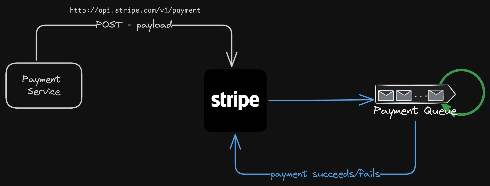
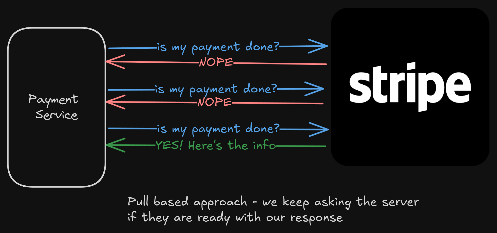
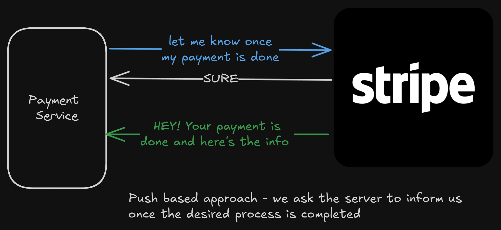
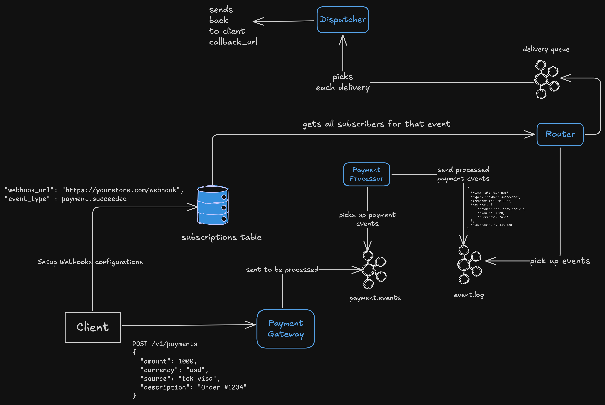

# Webhooks — The Push-Based Design Behind Async Communication

## How to get updates from an async process?

Let’s consider a scenario, and I believe it might be a common one.

```text
You are working on your new app, and you want to integrate payments into it. So, you use Stripe for payments.
Every time a user wants to pay, you call a Stripe API, and it returns a result as a confirmation of the payment, if it suceeded or failed.
```

Now, to truly understand what webhooks are, let’s forget about Stripe for now. Let’s assume we are building something like Stripe, and let’s look at a problem that our client might face while calling our gateway.



Here are the steps that might happen —

- Our PaymentService calls a Stripe endpoint with necessary information for payment.
- Now, Stripe on their end might have some queue for all the payments requests that they get, and they process it asynchronously (we will get in deep into this later in this article).
- Now, the payment is processed, and we want the result from Stripe. What do we do?

Let’s look at a couple of different ways of getting the information from an external vendor, like Stripe (for an async request).

### Pull Based Approach

If Stripe has that information, then maybe our PaymentService can call Stripe’s API to get the latest information whether that request is completed or not.
We can keep an expotential retry on a request, and keep calling Stripe until we get a confirmation from them that a payment is completed.



But, I think it consumes alot of resources. Every few second, our service has to make an external call, wait for their response, and the response can’t even be valuable.

On the other hand, Stripe’s API probably will get flooded with so many requests from their clients, asking them the information for their payment.

It’s not scalable in this case.

### Push Based Approach

Instead of PaymentService calling Stripe again and again to check the status, what if it does the following —

- Tell Stripe — “whenever you are ready with my payment request, just let me know”
- Now, Stripe can process the payment async, and whenever it’s done, it can call our PaymentService telling us the details of the payment



This is clean. None of the servers are loaded with frequent status check calls.

But there’s a caveat. How do we do something like this?

## Building Webhooks

But achieving something, at the scale of Stripe is a different thing altogether. There are a-lot of moving parts that needs to be handled when designing a webhook based system that works on a global scale.

But let’s think about it, one system at a time.

### Client registering the webhook call

That’s the first step.

Let’s say we have an endpoint — `https://api.stripe.com/v1/payment`

And we have asked our clients to do a POST call on this endpoint with some parameters. Let’s look at what those parameters could be —

- Payment info (amount to charge and few other details)
- Client id (to specify which client wants to get notified after the event)
- Callback URL (which endpoint should stripe call once the payment is done)

#### Ingress

Everything begins here. The core product (like Stripe Payments) emits internal events to a shared message bus typically Kafka or a message queue.

There are few properties of this:

- Each event = small object (event_id, type, payload, timestamp).
- Stored in a topic partitioned by tenant or event type.
- Ordered delivery per tenant (e.g. all events for one customer go to the same partition).

```text
Payment service
 ├─→ Kafka topic: payments.events
 │       - key: merchant_id
 │       - value: {”type”: “payment.succeeded”, ...}
 ├─→ Kafka topic: user.events
 │       - key: merchant_id
 │       - value: {”type”: “user.created”, ...}
```

#### Event router / subscription service

Now, we need some kind of a way to find who all to notify about an event. And that’s what we do here.
Every merchant registers their callback_url and their event_type.

When the router consumes from the event bus:

- It looks up all subscribers for that event type.
- Enqueues one “delivery job” per subscriber some kind of a delivery queue.

The delivery queue (Kafka) can now fan-out across multiples subscribers, it decouples event generation from delivery.

So, in this way one payment success event could become 10 delivery jobs (if 10 subscribers exist).

#### Dispatcher workers (the delivery layer)

This layer is the one that make sure that the process status is sent back to the web-hook clients.

Each worker process:

- Pulls jobs from the delivery queue.
- Sends the event via HTTP POST.
- Records result (success, failure, latency).
- Retries failed jobs with exponential backoff

#### Retries

But we can’t just retry a failed job blindly. If we do so, we might DDoS ourselves. We need to design the retry carefully.
So we can maybe separate main queue and retry queue, with different timeouts

We can do something like this —

- Retry #1 → after 1 min
- Retry #2 → after 5 min
- Retry #3 → after 15 min
- Retry #4 → after 1 hr
- Max retries → 24 hr, then dead-letter queue.

Here's what we have built



### Back-pressure and blocked consumer problem

If one of the consumer is slow, i.e., if it’s callback endpoints is slow, it could block our whole pipeline, and the dispatcher would keep retrying.

What to do to handle this? We can’t let one blocked consumer block our entire flow.

Let’s look at few of the options we have —

#### Tenant Sharding

We can partition the delivery queue by tenant or region. Something like this —

```text
delivery_queue_m123
delivery_queue_m124
...
```

Each worker pool processes a subset of these tenants, this prevents one slow customer from affecting others.

#### Rate limits per client

We can apply a configurable delivery concurrency per tenant (something like 5 in-flight requests max at a time).

#### Circuit breakers

If a tenant’s endpoint fails N times in a row, we can pause deliveries for that tenant for a cooldown period (it can be configured per tenant).