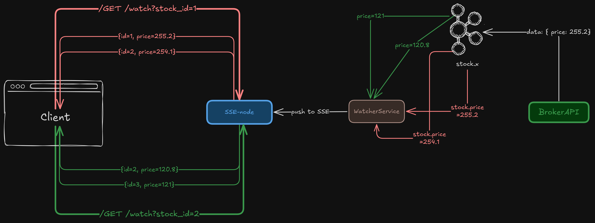

# Server send events

Server-Sent Events (SSE) is a spec defined on top of HTTP that allows a server to push many messages to the client over a single HTTP connection.

With most HTTP APIs you'd get a single, cohesive JSON blob as a response from the server that is processed once the whole thing has been received.

On the other hand, with SSE, the server can push many messages as "chunks" in a single response from the server:

```json
data: {"id": 1, "timestamp": "2025-01-01T00:00:00Z", "description": "Event 1"}
data: {"id": 2, "timestamp": "2025-01-01T00:00:01Z", "description": "Event 2"}
...
data: {"id": 100, "timestamp": "2025-01-01T00:00:10Z", "description": "Event 100"}
```

Each line here is received as a separate message from the server. The client can then process each message as it comes in. It's still one big HTTP response (same TCP connection), but it comes in over many smaller packets and clients are expected to process each line of the body individually to allow them to react to the data as it comes in.

## Where to Use It

You'll find SSE useful in system design interviews in situations where you want clients to get notifications or events as soon as they happen. SSE is a great option for keeping bidders up-to-date on the current price of an auction, for example.

---

# Why SSE Still Matters in a WebSocket World

## Persistent Connections

In webhooks, all we did was a POST call to a backend endpoint to notify about the event. But if we look closely, webhooks are not considered “real-time”.
There can be delays in determining when the event was triggered and when the event was sent as a webhook, as the whole system is event-driven.

```text
What if we want to design a system where the updates are from a single side?
Something like a trading app showing stock prices in real-time.
```

## Real-time communication options


If we are talking about something real-time, one of the main things that comes to mind is websockets. Yes, they are what we use generally to achieve real-time bi-directional communication. But let’s explore this more.

Here’s what I am thinking for our trading platform —

- The client (stock dashboard) wants to /GET events?stock_id=1
- Each StockWatcherService will be connected with a BrokerAPI and StockWatcherService will be responsible for pushing the real-time price of stocks

Now, the question arises —

“How to get the latest data from StockWatcherService to clients?”

### Can we use websockets?

Since the only updates that are sent are from the server side (StockWatcherService ), a WebSocket (enabling bi-directional communication) would be an overkill in my opinion.

Also, maintaining a huge no. of websocket connections is heavy on the server; it’s not easy to scale to millions.

### Can we use webhooks?

The main reason why we can’t use webhooks is that they are used for server-to-server communication.

As it requires a /POST call, an HTTP call can only be made to a server, and not a web/mobile client.

So, let’s look if we can use Server-Sent Events.

### Server Sent Events (SSE)

As the name states, it is the events that “server sends.” It’s uni-directional. The client opens a persistent HTTP connection, and the server streams text-based events over it.

Something like the following, client —

```javascript
const source = new EventSource(”/events”);
source.onmessage = (e) => console.log(”New event:”, e.data);
```

Server response —

```shell
HTTP/1.1 200 OK
Content-Type: text/event-stream
Cache-Control: no-cache
Connection: keep-alive

id: 1
event: message
data: {”type”:”stock.update”,”price”:122.9}

id: 2
data: {”type”:”stock.update”,”price”:123.2}
```

Notice that the connection stays open; new lines keep being flushed whenever there’s new data.

If we compare it with webhooks, instead of storing “who to POST to,” SSE stores “which TCP sockets are open for which user/session.”

Let’s look at each step and how they are handled for an SSE.

#### Connection Established

When a client calls /events, the load balancer routes the request to a backend service (let’s say, EventStreamService).

That service:

- Authenticates the client (JWT, cookie, etc.)
- Registers this connection in some kind of a Connection Registry, something like the following -

```shell
| stock_id | connection_id | last_heartbeat    |
| -------- | ------------- | ----------------- |
| STCK     | c_abc         | 2025-10-19T15:05Z |
```

This registry can live:

- In-memory on each node (for a smaller scale),
- Or in Redis / distributed KV store for large multi-node setups.

Each SSE connection is basically a long-lived HTTP response writer held open in memory. Something like the following —

```shell
HashMap[connection_id] -> Connection
```

So, whenever we know the connection_id, we can just send the desired response to that connection.

#### Event Happens

When our backend produces an event like “stock.update”.
This event is published to a message bus (Kafka, or internal pub/sub).
Then, a Stream Router consumes from that topic and looks up:

“Which clients are interested in this event?”

Lookup happens in the Connection Registry:

```sql
SELECT connection_id FROM connection_registry WHERE stock_id = ‘STCK’;
```

Then the Stream Router writes the event to each corresponding open socket’s buffer. Something like the following —

```javascript
func sendToClient(conn *Connection, evt Event) {
    fmt.Fprintf(conn.writer, “data: %s\n\n”, evt.JSON())
    conn.writer.Flush()
}

conn = HashMap[connection_id]

sendToClient(conn, event)
```

The TCP connection stays open; this write is streamed immediately.

#### Connection lifecycle & heartbeats

SSE is TCP-based, which means idle connections can die silently (due to NATs, proxies, and mobile networks).
So clients can do the following —

- Send heartbeat events every few seconds
- The server updates the last_heartbeat in the registry.
- We can have cleanup workers remove dead sockets and free up the memory.

##### Connection lost mid-way?

Let’s assume a client is monitoring the activity log, and it wants to update the UI according to what events happened. Something like —

Imagine a long form where the server pushes intermediate workflow states — “order accepted → verified → shipped”.

What if the client loses connection after the “verified” state?

If we start a new connection and start sending “new events”, we might miss the previous states. So, our servers need to keep data of what events have been sent till now.

We can do something like the following. When the client reconnects -

- Browser adds the header: Last-Event-ID: 342
- Server looks up the event stream
- Resends all messages with id > 342

Here's is what we have built till now



#### Scaling SSE

But the design we have come up with has some drawbacks when we start using it at scale. Let’s look at each of them 1-by-1, and brainstorm things we can improve.

##### Single Node System

There is only 1 SSE-node right now. When we are talking about large-scale production systems, clients can range from thousands to millions. And a single node can’t handle that many concurrent TCP connections.

So, we would need multiple SSE-nodes.

Let’s do the following —

- Keep multiple SSE-nodes. Put a load balancer in front of them, so the TCP connections can be balanced accordingly
- Each node will be responsible for a subset of clients, i.e., a subset of TCP connections
- Also, each SSE node will be streaming events for a subset of stocks

Simple right? Well.. not so much.

Keeping a load balancer is good, but since clients are connected to a particular node, it causes another problem.

- One Client is listening to stock=2, it’s connected with sse-node-2, and the other is listening to stock=2, but connected with sse-node-3
- How will the WatcherService pick the events for stock=2, and send to all the nodes that are currently streaming for stock=2?

Let’s tackle this problem, because it’s important for making SSE work at scale.

1. Centralized Subscription Registry (Redis)

Let’s store this mapping of —

```text
node_id | stocks_watching
------------------------------
1       |     [2, 5]
2       |     [8, 10, 15]
```

And the WatcherService will send the events to specific nodes listening to it.

Drawback - But this adds additional complexity to WatcherService. It’s not decoupled, and the SSE nodes will need to update their mapping in Redis as well.

2. Topic-based Fan-out via Kafka

Instead of querying a registry, each SSE-node subscribes to specific topics.
If each stock has its own Kafka topic or Redis channel:

```text
stock.2 → sse-node-1
stock.4 → sse-node-2
```

WatcherService just republishes events to their respective topic.

Drawback - Its greatest downside is that one topic per stock doesn’t scale well when we have millions of keys.

3. Consistent Hashing over Stock IDs

We completely remove dynamic routing and assign stocks to SSE clusters deterministically:

```shell
node = hash(stock_id) % num_nodes
```

Now:

- The WatcherService computes which node owns the stock_id.
- It forwards the event only to that node
- That node knows which clients care about it.

It makes our lives a little easier —

- This avoids maintaining dynamic subscription tables at the WatcherService level.
- It’s stateless, cheap, and consistent, but only works if the mapping can be determined purely by the event key (like stock_id).

Drawback - This also means that if one of the stocks is highly in demand, a server gets overloaded.

I was confused about which option to choose from the above. Then I went over some articles on how SSE is managed over scale, and this is what I came up with.

```text
Let’s push events to “all” the SSE-nodes and the nodes will be responsible to send events to the stocks which they have subscribed to.

It’s clean, its separated from other logic, and easier to maintain.

We can use redis channels, or just a Kafka topic to push the events, and each SSE-node can consume from that topic.
```

---