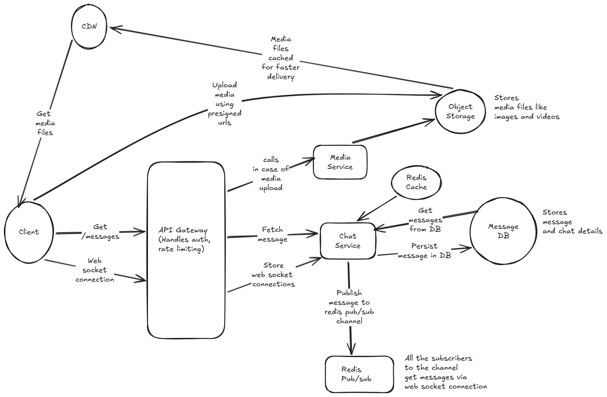

# Chat System

## Functional Requirements

- Users should be able to send 1-1 messages and also view messages in a chat.
- Users should be able to send media files in messages

Out of scope

- Users should be able to see online status and typing indicators
- Audio and video calls
- Ability to send voice messages

In a real interview we would discuss with the interviewer and bring the out of scope requirements to in scope if needed

## Non functional requirements

- Ultra low latency: System should support almost realtime sending of messages between users with a latency of lets say < 200ms
- Messages should be delivered reliably, in case the user is offline (internet connection off lets say), the messages should be delivered to the user once he/she comes back online
- We should expose a limit on size and type of media upload to prevent the users from uploading huge size of media files and prevent them from uploading malicious executable files. Media upload should be limited to image and video file formats
- System is almost equal in terms of read to write ratio closer to 1:1 where users view messages as much as they send messages. Users frequently open the app just to read past history. The ratio is closer to 1:1 or even slightly Read-Heavy (e.g., 1:2).

## Constraints

- Write to read ration of 1:1
- Daily Active Users (DAU): 50 Million
- Usage: On average, each user sends 40 messages per day.
- Message Size: Assume an average text message is 100 bytes.
- Media: For now, assume 10% of messages contain a media attachment (image/audio) averaging 1 MB.
- QPS: We have 50 million users, each user sends 40 messages per day which makes it 2000 million messages per day that boils down to 2000 / 24 * 60 * 60 = 0.023 million requests per second
- Storage: Each message is 100 bytes and with media it comes around 1MB. We have 2000 million messages per day which is 730 billion messages for one year. So total storage needed for one year would be 730000 * 1MB = 73 PB per year.

## Data model

Next up we will jot down the data model for our chat application

Note that here we will be adding some minimum attributes, we can always discuss with the interviewer in a real interview and add more attributes.

### Message

- id
- text
- timestamp
- chat_id (We can index this field as the get queries would be to fetch all messages for a chat)
- sender_id
- status (pending, delivered)
- media_urls

### Chat

- id
- participant_ids

### User

- id
- name
- password (Stored in hashed format in DB)

## Database selection

- For storing the media files we would be using an object storage like S3 or Azure blob storage. We would be storing the file url in the actual database.

- For chat data, since we would be receiving around 0.023 million requests per second for sending messages, we would be a needing a write optimized database like Cassandra. Cassandra uses log structured merge trees which provides faster writes as it appends write sequentially to disk instead of random IO. Tradeoff is that it provides slower reads as it needs to read from multiple files to get the latest data. But since our read to write ratio is 1:1, we can go with Cassandra for our chat data.

## APIs

### Get Messages API

```GET /chats/{chat_id}/messages```
This API would be used to fetch all messages for a chat. We can also add pagination parameters to this API to fetch messages in batches.

Returns 200 OK with list of messages for the chat

```json
[
  {
    "id": "message1",
    "text": "Hello",
    "timestamp": "2024-01-01T00:00:00Z",
    "chat_id": "chat1",
    "sender_id": "user1",
    "media_urls": []
  },
  {
    "id": "message2",
    "text": "Hi",
    "timestamp": "2024-01-01T00:01:00Z",
    "chat_id": "chat1",
    "sender_id": "user2",
    "media_urls": []
  }
]
``` 

### Send Message API

For sending messages, we will be using websockets to achieve ultra low latency. The client would establish a websocket connection with the server and send messages over the websocket connection. The server would then process the message and send it to the recipient(s) in real time.

e.g., {"action": "send_message", "chat_id": "123", "text": "Hello"}

## High level design



### Get Messages Flow

1. Client sends a GET request to the server to fetch messages for a chat.
2. Request is received by the API Gateway which forwards it to the chat service.
3. Chat service queries the Cassandra database to fetch messages for the chat and returns the response to the client.
4. Media files are served via CDN for faster delivery. When the client receives the message data with media URLs, it can directly fetch the media files from the CDN using the URLs provided in the message data.
5. We can also implement caching for this API to improve performance. We can use a distributed cache like Redis to cache messages for a chat. When a request comes in, we first check the cache for messages and if not found, we query the database.

### Send Message Flow

Core microservices involved in this flow are:

- Chat Service: Responsible for handling chat related operations like sending messages, fetching messages, etc. It also handles the websocket connections and uses Redis pub/sub to send messages in real time to recipients.
- Media Service: Responsible for handling media related operations like validating media urls, generating presigned urls for media upload, etc.
- User presence service: Responsible for tracking online/offline status of users and delivering messages to online users in real time.

1. When a client first opens the chat application, it establishes a websocket connection with the server. The API gateway authenticates the user and the chat service keeps track of the websocket connection for that user.
2. We would use redis pub/sub to send messages in real time. When a message is sent by a user, the chat service would publish the message to a Redis channel corresponding to the chat. All recipients of the chat would be subscribed to that channel and would receive the message in real time. Once the message is sent to the recipients, the chat service would update the message status to 'delivered' in the Cassandra database. This way we can ensure that messages are delivered in real time to online users while also maintaining durability and reliability by persisting messages in the database.
3. The chat service would also persist the message in the Cassandra database for durability and reliability.
4. If a recipient is offline, the message would be stored in the database with a pending status. When a user opens the app, their device establishes a new WebSocket connection. The very first thing the Chat Service does upon connection is query Cassandra: SELECT * FROM Messages WHERE recipient_id = X AND status = 'pending'. It immediately pushes those down the pipeline to the client and updates their status to 'delivered' in the database. This way, we ensure that messages are reliably delivered even if the user was offline when the message was sent.
5. For media messages, the client would first upload the media file to the object storage using presigned URLs and get the media URL. The client would then send the message with the media URL to the chat service which would validate the media URL and then publish the message to the Redis channel and persist it in the database.
6. We can also implement a retry mechanism for sending messages in case of transient failures. If the message fails to send, we can retry sending the message a few times before giving up and returning an error to the client.

## Deep dives

### Deep Dive 1: Connection Management & State. 

With 50 million Daily Active Users, we have millions of concurrent WebSocket connections. How does the Load Balancer handle millions of open TCP connections? And if User A is connected to Chat Server #12, and User B is connected to Chat Server #84, how does Server #12 know exactly where to route the message?

### Answer

We use a dedicated redis key value store to keep track of which user is connected to which chat server. When a message is sent by User A, the Chat server #12 looks up the recipient User B in the redis store to find out which chat server they are connected to (Chat Server #84 in this case) and then routes the message to that server using Rpc call. The server #84 then sends the message to User B over the websocket connection.

### Deep Dive 2: Message Ordering & Idempotency. 

User A has a flaky 3G connection. They send "Hello", get disconnected, reconnect, and send "Are you there?". How do we mathematically guarantee User B sees these exactly in order, and how do we prevent User A from accidentally sending "Hello" twice if their client automatically retries?

### Answer

To guarantee message ordering, we can use the id generated by Cassandra for the message which is a UUID which is a globally strictly increasing id called snowflake id. This way we can ensure that messages are ordered based on the time they were created. When User B receives the messages, they can order them based on the snowflake id to ensure they are displayed in the correct order.

To prevent user A from accidentally sending "Hello" twice, we can implement an idempotency mechanism. When User A sends a message, the client can generate a unique idempotency key for that message (e.g., a UUID). The server can store this idempotency key along with the message in the database. If the server receives another message with the same idempotency key, it can recognize it as a duplicate and ignore it, thus preventing duplicate messages from being sent to User B.
