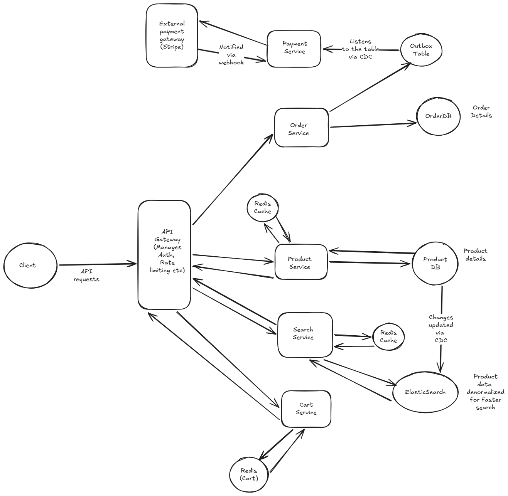

# Ecommerce System

## Functional Requirements

- Users should be able to search for products
- Users should be able to view products
- Users should be able to add product to cart
- Users should be able to place an order

Out of scope

- Users should be able to cancel an order
- Users should be able to track order
- Users should be able to view personalized recommendation of products

In an actual interview, we can always discuss with the interviewer and bring some out of scope requirements in scope.

## Non functional requirements

- System should have latency of approx < 100ms for viewing products and < 500 ms for creating orders.
- Viewing of product inventory has to be fast and highly available while order creation needs strict ACID consistency.
- System should support strong consistency in order functionality. Customer should not be double charged for any order and same item should not be sold to two different customers. We should favor consistency over availability in such scenarios and its okay if the system is slow, but it should be correct and consistent.
- System is read heavy with a read to write ratio of 500:10 as users spend most of their time viewing products than actually placing an order for them. In case of a flash sale the traffic is likely to increase 10 times the average traffic.

## Constraints

- Read write ratio of 500:10
- 10 Million daily active users on global scale
- This makes it 5000 Million daily read requests and 100 million daily write requests which makes it 5000 / 24 * 60 * 60 QPS for read and 100 / 24 * 60 * 60 QPS for writes.
- During a flash sale, user traffic is likely to increase 10 times the average traffic.

## Data Model

Next up, we will jot down the data models we will be needing for the ecommerce application. Note that here we will be adding some minimum attributes, we can always discuss with the interviewer in a real interview and add more attributes.

### Product

- id
- title
- description
- category
- price
- inventory_count
- image_urls

### User

- id
- name
- email
- password (Hashed and stored in DB)
- addresses

### Address

- id
- street
- city
- state
- country
- pincode

### Order

- id
- user_id
- total_amount
- order_items
- status
- created_time

### OrderItem

- order_id
- product_id
- price
- quantity

### Cart

- id
- userId
- cartItems
- total_amount

### CartItem

- cartId
- productId
- price
- quantity

For now, I feel these data models suffice the functional requirements we listed above. Lets next list down the APIs we will be needing

## API

### Search API

POST /products/search?title=""

Returns a paginated list of products matching the search query.

200 OK

```json
{
  "products": [
    {
      "id": "123",
      "title": "Product 1",
      "description": "Description of product 1",
      "category": "Category 1",
      "price": 100,
      "inventory_count": 10,
      "image_urls": ["url1", "url2"]
    },
    {
      "id": "124",
      "title": "Product 2",
      "description": "Description of product 2",
      "category": "Category 2",
      "price": 200,
      "inventory_count": 20,
      "image_urls": ["url3", "url4"]
    }
  ],
  "pagination": {
    "current_page": 1,
    "total_pages": 10,
    "next_page": 2,
    "prev_page": null,
    "total_items": 100
  }
}
```

### View Product API

GET /products/{id}

Returns the details of a product with the given id.

200 OK

```json
{
  "id": "123",
  "title": "Product 1",
  "description": "Description of product 1",
  "category": "Category 1",
  "price": 100,
  "inventory_count": 10,
  "image_urls": ["url1", "url2"]
}
```

### Add to Cart API

POST /cart/add

Request Body

```json
{
  "product_id": "123",
  "quantity": 2,
  "price":100
}
```

Returns the updated cart details after adding the product to the cart.
200 OK

```json
{
  "cart_items": [
    {
      "product_id": "123",
      "quantity": 2,
      "price":100
    },
    {
      "product_id": "124",
      "quantity": 1,
      "price":100
    }
  ],
  "total_amount": 200
}
```

### Place Order API

POST /orders/checkout

Request Body

```json
{
    "cartId": "123"
}
```

## Choice of Databases

- Product searches: Since we need blazing fast product searches, using a relational database is not a good choice as TSQL queries to fetch products matching a search term would be slow. Instead we would use a search engine like elastic search. Elastic search offers faster search as it stores an inverted index of term to document mapping which allows it to quickly fetch the relevant documents matching a search term. It also offers features like full text search, autocomplete, typo tolerance etc which makes it a good choice for product searches. Also since we have a read heavy system, we can use elastic search as the primary database for product searches and keep it in sync with the relational database which will be the source of truth for product data. We can also use elasict search for ranking the search results based on relevance and other factors like popularity, ratings etc. 
In addition to elastic search, we can also use a caching layer like redis to cache the popular products and search results to further improve the performance of product searches.

- Product details and inventory count: We will use a relational database as a source of truth for product details and inventory count since we want strong consistency for inventory count. FOr example we cannot show a user that a product is available even though it is out of stock. Relational databases support ACID properties and are a good choice for storing product inventory and details data.

- Order Data: For order data again, we need strong consistency and ACID properties, hence we will go with relational databases for storing order data.

- Cart Data: Adding to cart should be a fast operation and it is generally tied to a user session. So we can use a key value store like redis to store cart data. We can use user id as the key and cart details as the value. This will allow us to quickly fetch and update cart data for a user. We can also set an expiry time for the cart data in redis to automatically clear the cart after a certain period of inactivity.

## High Level Design

Here is the high level design diagram



Next I will jot down how each functional requirement works

### Searching products

- Client sends a POST call to /products/search?title=""
- API gateway receives the requests and forwards it to the search service.
- The search service first queries the cache and if not found calls elastic search to fetch the matching products
- The search service sends the responds back to the API gateway and back to the client.
- Elastic search is kept in sync with the product database via CDC events. Anytime the product data changes in the database, elastic search gets notified via CDC and it updates itself.

### Viewing product details

- Client sends a GET call to /products/{id}
- API gateway receives the requests and forwards it to the product service.
- The product service first queries the cache and if not found calls the product database to fetch the product details and inventory count.
- The product service sends the responds back to the API gateway and back to the client.


### Adding product to cart

- Client sends a POST call to /cart with product id and quantity in the request body.
- API gateway receives the requests and forwards it to the cart service.
- The cart service fetches the cart data for the user from redis cache and updates it with the new product and quantity. It also updates the total amount in the cart.
- The cart service sends the responds back to the API gateway and back to the client.

### Removing product from cart

- Client sends a DELETE call to /cart with product id in the request body.
- API gateway receives the requests and forwards it to the cart service.
- The cart service fetches the cart data for the user from redis cache and removes the product from the cart. It also updates the total amount in the cart.
- The cart service sends the responds back to the API gateway and back to the client.

### Placing an order

The order API call will be asynchronous as we need to perform multiple operations like checking inventory, creating order record, updating inventory count etc which can take time and we do not want the client to wait for all these operations to complete.

- Client sends a POST call to /orders with the list of products and their quantities in the request body.
- The client also generates a unique idempotency key for the order and sends it in the request header to ensure that duplicate orders are not created in case of retries.
- API gateway receives the requests and forwards it to the order service.
- In a single transaction, the order service checks the inventory count for each product in the order and if available, it creates an order record in the database with the statusof pending and updates the inventory count for each product. In the same transaction, the order service creates a record in the outbox table with the order details and the event type as order created along with the idempotency key. This outbox table will be used for event driven communication between the order service and the payment service.
- The order service sends the responds back to the API gateway and back to the client with the order id and status as pending and a callback url to check the order status.
- A separate payment service listens to the outbox table for any new events and when it finds an event with type order created, it processes the payment for the order. It calls the external payment gateway like stripe to process the payment and passes the idempotency key to ensure that duplicate payments are not made in case of retries.
- The gateway responds back via a webhook url to the payment service with the payment status. If the payment is successful, the payment service updates the order status to confirmed in the order database. If the payment fails, it updates the order status to failed and also updates the inventory count for each product in the order to reflect that the products are back in stock.
- In case the payment service does not receive a response from the payment gateway within a certain timeout period, it does not update the order status and the order remains in pending state. A separate reconciliation service can run periodically to check for any orders that are in pending state and calls the payment gateway to check the payment status and update the order status accordingly.
- The client can poll the order status using the callback url provided in the response of the order API call to check if the order is confirmed or failed.
- Even if the client retries the order API call due to network issues or any other reason, the idempotency key ensures that duplicate orders are not created and the client receives the same order id and status in the response.

### Flash Sale Scenario

In a flash sale scenario, we can expect a sudden surge in traffic which can put a lot of load on the system. Lets consider the scenario where 100000 users are trying to buy the last 10 iphones in a flash sale. In this scenario, we need to ensure that the system can handle the sudden surge in traffic and also ensure that only 10 users are able to buy the iphones and the rest of the users get a response that the product is out of stock.

- We would use a pessimistic locking for this scenario. The reason is that during a flash sale with extremely high contention, the likelihood of many transactions trying to update the same inventory record simultaneously is very high. Optimistic Concurrency Control could lead to a "Retry" storm, where many transactions fail and have to retry, causing significant delays and potentially overwhelming the database. Pessimistic Locking ensures that once a transaction locks the inventory record, no other transaction can modify it until the lock is released, thus preventing overselling.

The trade off here is that pessimistic locking can lead to increased wait times for users, but in this high-contention scenario, it is more important to maintain data integrity and prevent overselling. To mitigate wait times and avoid load on our database, we can implement a queuing mechanism to manage incoming requests. This way, users are processed in a controlled manner, reducing the likelihood of long wait times.

- For better user experience, we can use redis distributed semaphore or a counter. We can use `DECR` on a redis key like `available_inventory:xbox`. If the result >= 0, the user has successfully reserved one unit. They can then go ahead and fill in the shipping info and make the payment. If they timeout or cancel, we can simply `INCR` the redis counter back.

## Deep dives

### Deep Dive 1: The Database Sharding Dilemma (Data Partitioning)

In your estimation, you calculated a peak of 11,500 Write QPS during a flash sale. A standard, single-node PostgreSQL or MySQL database will start dropping connections or locking up long before it hits that number.

The Scenario:
You must shard (partition) the OrderDB across 10 different database servers.

- If you shard by user_id, all of a user's orders live on one machine. This makes it very fast for a user to view their "Order History."

- The L5 Challenge: If you shard by user_id, how does the system generate the "Daily Sales Report" for the seller/merchant? The merchant's orders are now scattered randomly across all 10 databases. How do you design your sharding strategy or data replication to support both the User's read path and the Merchant's read path without doing massive, slow cross-shard joins?

### Answer

To address the challenge of generating a 'Daily Sales Report' for the merchant when orders are sharded by user_id, we can use materialized views or a separate reporting database that aggregates data from all the shards. Here's how we can implement this:

1. **Sharding by user_id**: We continue to shard the OrderDB by user_id, ensuring that all orders for a particular user are stored on the same shard. This allows for fast retrieval of a user's order history.
2. **Event-Driven Data Replication**: Whenever an order is created or updated in any of the shards, we can publish an event to a message queue (like Kafka). This event will contain the necessary information about the order, such as the merchant_id, order_amount, and timestamp.
3. **Centralized Reporting Database**: We can have a separate reporting database that subscribes to the message queue and listens for order events. This database will be designed for read-heavy operations and can be optimized for generating reports.
4. **Materialized Views**: In the reporting database, we can create materialized views that aggregate the order data by merchant_id and date. For example, we can have a materialized view that calculates the total sales for each merchant for each day.

Now when the merchant requests the 'Daily Sales Report', the system can query the materialized view in the reporting database, which will return the aggregated sales data for that merchant without needing to perform any cross-shard joins. This approach allows us to maintain fast read performance for both user order history and merchant sales reports while keeping our sharding strategy intact.

---

### Deep Dive 2: Malicious Cache Penetration (Resilience)

You smartly placed a Redis cache in front of your ProductDB to handle the 58,000 Read QPS.

The Scenario:
A competitor or a malicious botnet starts sending millions of requests to GET /products/999999999 (a product_id that does not exist).

- Redis checks its cache. It's a cache miss (because the item doesn't exist).

- The API Gateway forwards the request to the SQL Database to check if it exists.

- The L5 Challenge: Your database is instantly slammed with millions of useless queries, burning up its CPU and bringing down the entire site for real users. You can't cache the result because you don't cache things that don't exist. How do you architect your caching layer to instantly reject queries for non-existent items without ever hitting the database?

### Answer

To prevent the caching layer to instantly reject queries for non-existent items without hitting the database, we can implement a "Bloom Filter" in front of our Redis cache. A Bloom Filter is a probabilistic data structure that can quickly determine if an item is definitely not in the set or may be in the set. 

Here's how we can implement this:

1. **Bloom Filter Creation**: We create a Bloom Filter that contains all the valid product_ids from our ProductDB. This Bloom Filter is stored in memory and can be quickly accessed.
2. **Request Handling**: When a request comes in for GET /products/{product_id}, the API Gateway first checks the Bloom Filter to see if the product_id is valid.
   - If the Bloom Filter indicates that the product_id is not valid (definitely not in the set), the API Gateway can immediately return a 404 Not Found response without hitting the Redis cache or the database.
   - If the Bloom Filter indicates that the product_id may be valid (may be in the set), the API Gateway proceeds to check the Redis cache as usual.
3. **Bloom Filter Maintenance**: Whenever a new product is added to the ProductDB, we also add its product_id to the Bloom Filter. This ensures that the Bloom Filter remains up-to-date with the valid product_ids.

By implementing a Bloom Filter, we can effectively filter out requests for non-existent product_ids at the API Gateway level, preventing unnecessary load on both the Redis cache and the SQL database. This approach allows us to maintain the performance and availability of our system even in the face of malicious traffic.

---

### Deep Dive 3: The CQRS "Ghost" Problem (Eventual Consistency UX)

The Scenario:
A merchant adds a new product: "Limited Edition Red Sneakers."

- The API writes the new product to the ProductDB (SQL). This is instant.
- Our system uses Change Data Capture (CDC) to asynchronously update Elasticsearch (our read-heavy catalog).
- The CDC pipeline takes 2 seconds to process and index the new sneakers.
- Immediately after the merchant clicks "Save," our frontend redirects them to their "My Products" dashboard, which pulls data from Elasticsearch.

The L5 Challenge:
The merchant searches their dashboard for the "Red Sneakers" and gets 0 results. They panic, think the system is broken, and click "Submit" five more times, creating duplicate listings.

How do you solve this "Read-Your-Own-Writes" consistency gap in an asynchronously updated system without abandoning the CQRS architecture?

### Answer

To solve this CQRS "Ghost" problem, we can use Read your own writes consistency mechanism.

Here's how we will implement this

1. **Create a new product**: Merchant sends API request to create the product. The API writes the new product to the products DB. Then the system uses Change Data Capture (CDC) to asynchronously update Elasticsearch (our read-heavy catalog). The CDC pipeline takes 2 seconds to process and index the new product.
2. **Redirect to my products**: Immediately after the merchant clicks "Save," our frontend redirects them to their "My Products" dashboard. Here instead of pulling data from the Elasticsearch we pull from the ProductsDB which will be having the correct status of the products. The system continues pulling the data from the ProductsDB for 2 seconds since last update for the merechant

**Tradeoff**: By reading from the ProductsDB, the API response time would be slow hence latency would be higher. Also it would increase the load on the main database. But it would ensure that the merchant sees the correct data and does not end up creating duplicate listings. After 2 seconds, we can switch back to reading from Elasticsearch for that merchant's dashboard to ensure faster response times for subsequent requests. This way we can maintain the CQRS architecture while also providing a better user experience for the merchant.

Another approach could be to show a loading state or a message like "Your product is being indexed, please check back in a few seconds" on the merchant's dashboard until the new product is indexed in Elasticsearch. This way we can avoid hitting the database for the merchant's dashboard and also provide a better user experience by informing them about the indexing delay.

---

### Deep Dive 4: The "Inventory Oversell" Problem (Distributed Transactions)

The Scenario:

Two customers, Alice and Bob, both see that there is 1 unit of "Limited Edition Red Sneakers" in stock.

- Alice adds the sneakers to her cart and proceeds to checkout.
- Bob does the same thing at the same time.
- Both Alice and Bob's checkout processes read the inventory count as 1 from the ProductDB.
- Both Alice and Bob's checkout processes proceed to create an order and reduce the inventory count by 1.

- The L5 Challenge: Both Alice and Bob successfully place an order for the same last unit of sneakers, resulting in an inventory oversell. How do you design your system to prevent this?

### Answer

The chronological flow should look exactly like this:

Alice and Bob both click "Pay" at the same time.

Alice's request reaches Redis first and runs DECR. Redis returns 0. (Alice is allowed to proceed).

Bob's request reaches Redis a millisecond later and runs DECR. Redis returns -1. (Bob is immediately rejected with an "Out of Stock" error. His request never touches the SQL database).

Alice's thread proceeds to the SQL database and executes SELECT ... FOR UPDATE.

Alice's thread updates the SQL inventory to 0, creates the Order record, and commits the transaction.

---

