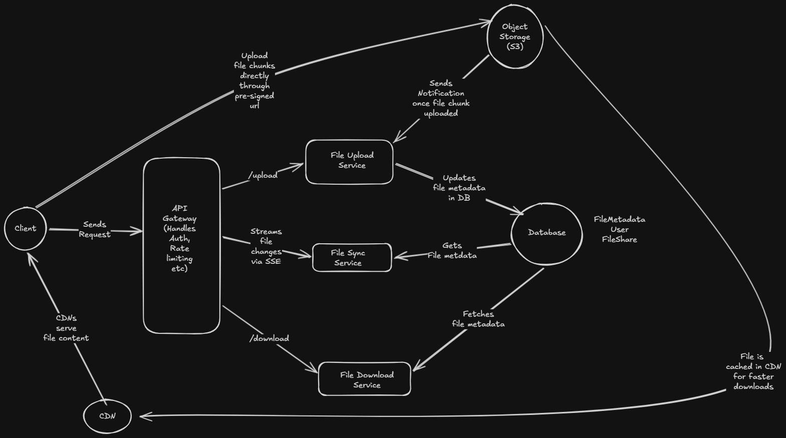

# File Sharing System Design: Google Drive

## Funtional Requirements

- Users should be able to upload files
- Users should be able to download files
- User should be able to share files
- Users should be able to sync changes across multiple devices

Out of scope

- Users should be able to control access (Read/Write etc)

In an actual interview, we can discuss with the interviewer and bring out of scope requirements in scope. We can also list more requirements as needed. 
For this practice sake, lets go with above requirements

## Non Functional Requirements

- System should be highly available
- Eventual consistency is acceptable, its fine for changes to take small time to sync across devices
- Read to Write ratio is mostly around 1:1, as users read and write data for alomost same amount of time
- Files can be of any size, from few KBs to few GBs
- System should be able to handle large number of users, say 1 billion users
- Once file is uploaded, it should be durable and should not be lost.

## Scale and Constraints

- 50 million daily active users
- Assume each user uploads 2 files per day
- Total uploads per day = 100 million uploads per day
- Total uploads per second = 100 million / (24 * 3600) = ~1157 uploads per second
- Assume each file is of 10 MB on average
- Total data uploaded per day = 100 million * 10 MB = 1 PB per day which is 365 PB per year

## Data Model

Next step is to design data model. We can have following data models:

### User

- id (primary key)
- name 
- email
- password_hash
- created_at

### File

- id (primary key)
- user_id (foreign key to User)
- name
- size
- created_at
- updated_at
- status (File upload status, e.g., "uploading", "uploaded", "failed")
- file_url (URL to access the file)

### SharedFile

- id (primary key)
- file_id (foreign key to File)
- shared_with_user_id (foreign key to User)
- shared_by_user_id (foreign key to User)

### FileChunk

- id (primary key)
- file_id (foreign key to File)
- chunk_index (index of the chunk, starting from 0)
- chunk_size
- status (Chunk upload status, e.g., "pending", "uploaded", "failed")

## API Design

### Upload File

```
POST /files/init
Request Body:
{
    "file_name": "document.pdf",
    "file_size": 10485760, // 10 MB
}
```

```
GET /files/{file_id}
Response Body:
{
    "file_id": "12345",
    "file_name": "document.pdf",
    "file_size": 10485760,
    "created_at": "2024-01-01T00:00:00Z",
    "updated_at": "2024-01-01T00:00:00Z",
    "file_url": "https://storage.googleapis.com/bucket_name/document.pdf"
}
```

### Share File

```
POST /files/{file_id}/share
Request Body:
{
    "shared_with_user_id": "67890"
}
```

## Choice of Database

- For user data and file metadata, we can use a relational database like PostgreSQL or MySQL. This will allow us to easily manage relationships between users, files, and shared files.
- For storing the actual file content, we can use a distributed object storage system like Amazon S3 or Google Cloud Storage. This will allow us to handle large files and provide durability and scalability.

## High Level Design



### File upload flow

For uploading large files, we would be using a chunked upload approach, so that we can resume uploads in case of network failures and also to handle large files efficiently.
Here is the high level flow for file upload:

- User sends a request to upload a file with file content and metadata.
- The client first divides the file into smaller chunks (e.g., 5 MB each).
- The client sends a request to the API Gateway which routes the request to the file upload service to initiate the upload, which creates a new file entry in the database and returns a unique file ID. All the metadata along with the chunks information is stored in the database. The status of the file is set to "uploading" and each chunk is marked as "pending".
- The client then requests a pre-signed URL for each chunk from the server, which generates a pre-signed URL for the chunk and returns it to the client. This pre-signed URL allows the client to upload the chunk directly to the object storage without going through the server, which helps in reducing the load on the server and also allows for faster uploads.
- The client uploads each chunk to the object storage using the pre-signed URL. Once a chunk is successfully uploaded, the object storage sends a notification to the server with the chunk information, which updates the status of the chunk to "uploaded" in the database.
- Once all chunks are uploaded, the client sends a request to the server to complete the upload, which verifies that all chunks are uploaded successfully and then updates the file status to "uploaded" in the database. The file URL is generated and stored in the database for future access.
- This chunked approach helps the client to resume uploads in case of network failures, as the client can simply re-upload the pending chunks without having to start the entire upload process from scratch. It also allows for efficient handling of large files, as the client can upload chunks in parallel, reducing the overall upload time.

### File sharing flow

- User sends a request to share a file with another user.
- The server verifies that the file exists.
- The server creates a new entry in the SharedFile table with the file ID, shared_with_user_id, and shared_by_user_id.
- The server returns a success response to the client.

### File download flow

- User sends a request to download a file.
- The server verifies that the file exists and that the user has permission to access it.
- The server generates a pre-signed URL for the file from the object storage and returns it to the client.
- The client uses the pre-signed URL to download the file directly from the object storage.
- We can also use a caching layer like CDN to cache frequently accessed files for faster downloads. The client instead of downloading the file directly from the object storage, can download it from the CDN which will reduce latency and improve performance.

### File sync flow

The file sync flow comprises of two main flows

- Local to Remote Sync: When a user makes changes to a file on their local device, the client application detects the change and initiates a sync process. The client sends the updated file content to the server, which updates the file in the object storage and updates the metadata in the database. The server then notifies all other devices that have access to the file about the update, so they can fetch the latest version of the file.

- Remote to Local Sync: We use SSE connections to notify clients about changes to files they have access to. When a file is updated, the server sends a notification to all connected clients that have access to the file. The clients can then fetch the latest version of the file from the server or directly from the object storage using the pre-signed URL. This ensures that all devices stay in sync with the latest version of the file.

## Deepdives

### Scenario 1: The 1GB Video Edit (Bandwidth Optimization)

The Environment: A user has a 1 GB video file saved in their local Google Drive folder on their laptop.

This file was successfully synced to the cloud yesterday.

Today, they open the video, trim exactly 5 seconds out of the middle, and hit "Save." The file is now 995 MB.

The Challenge:
If your desktop client blindly uploads 995 MB over a hotel Wi-Fi connection, the user's internet will crawl to a halt for an hour, and Google's S3 bandwidth bills will skyrocket.
How do you architect the system (both the desktop client and the backend) so that it only uploads the exact few megabytes that actually changed?

### The Solution: Block-Level Syncing

We will divide the file into fixed size chunks (e.g., 5 MB each). When the user edits the video and saves it, the desktop client calculates a hash for each chunk of the new file and compares it with the hashes of the original file's chunks. Only the chunks that have changed (in this case, the few megabytes around the trimmed section) will have different hashes. The client will then only upload the changed chunks to the server, which will update the corresponding chunks in the object storage. This way, we can significantly reduce the amount of data that needs to be uploaded, saving bandwidth and improving upload times.

One thing which we missed in the design is how the client will know the hashes of the original file's chunks. We can store the hashes of each chunk in the database when the file is first uploaded. The client can fetch these hashes when it needs to perform a sync operation, allowing it to compare and determine which chunks have changed.

### Deep Dive Scenario 2: The Airplane Edit (Conflict Resolution)

The Environment:

User A (in New York) and User B (in London) both have access to a shared folder containing a document: Project_Plan.txt.

User A gets on an airplane and loses Wi-Fi. User B goes into the London Underground subway and loses cell service.

While completely offline, both users open Project_Plan.txt and make different edits.

The Challenge:
User A's plane lands, they connect to Wi-Fi, and their client instantly uploads their new version of the document. Five seconds later, User B walks out of the subway, connects to cell service, and their client tries to upload their new version.

How do you protect the database from a "Lost Update" anomaly? How does the server mathematically know to reject User B's silent overwrite, and what should the system do instead so User B doesn't lose their work?

### Solution: Version numbers

We store version number in the File Metadata. When user A uploads their changes, the server checks the version number of the file. If it matches the version number that user A had when they started editing, the server accepts the update and increments the version number. However, when user B tries to upload their changes, the server sees that the version number has changed since user B started editing, indicating a conflict and sends 409 status back. User B then downloads the latest version of the file, merges their changes with the latest version, and then tries to upload again. This way, we can prevent lost updates and ensure that both users' changes are preserved.

