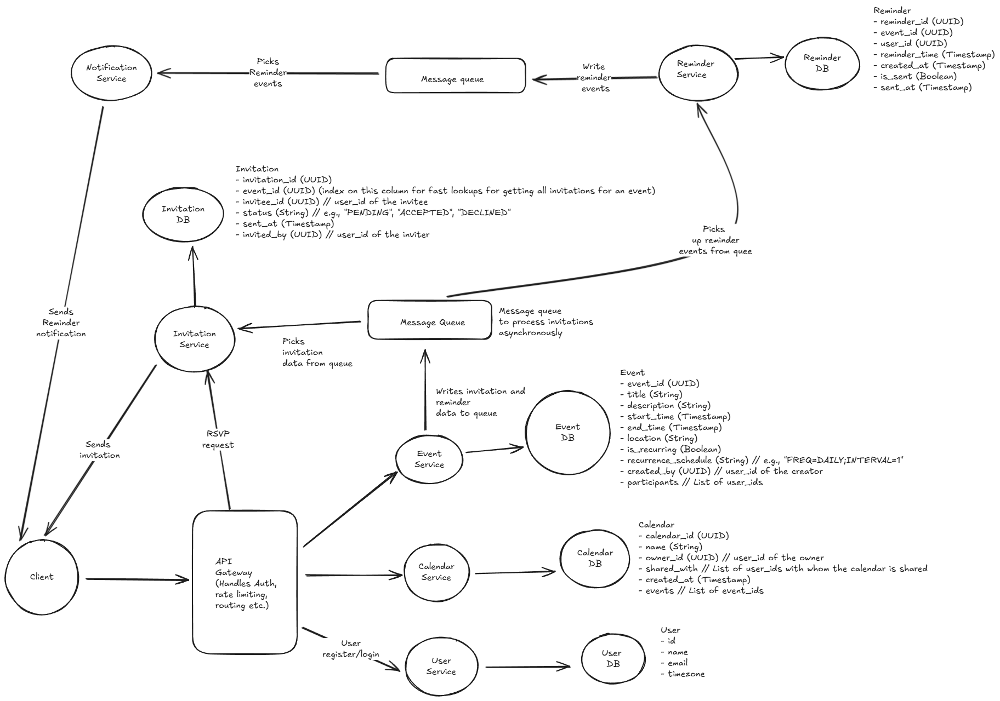

# Question: Calendar System Design

Design a calendar system like Google Calendar that allows users to:

- Create, edit, and delete events
- Set up recurring events with complex patterns (daily, weekly, monthly, yearly)
- Share calendars and collaborate on events with other users
- Send invitations and manage RSVPs
- Set reminders and notifications
- Handle multiple time zones
- Integrate with external calendar systems (CalDAV, Exchange)

The system should handle millions of users with thousands of events per user, support real-time collaboration, and provide fast query performance for calendar views (day, week, month, year).

---

## Answer

Before going ahead with the design, let's clarify some requirements and constraints:

### Functional Requirements

- Users should be able to create, edit, and delete events.
- Events can be one-time or recurring with complex patterns.
- Users can share calendars and collaborate on events.
- Invitations can be sent, and RSVPs managed.
- Reminders and notifications can be set for events.

Below the scope of this design, we will not cover:

- User authentication and authorization
- UI/UX design
- Billing and subscription management
- Integrate with external calendar systems (CalDAV, Exchange)

### Non-Functional Requirements

- Scale: The system should support millions of users, each with thousands of events. 
- Performance: The system should provide fast query performance for calendar views (day, week, month, year).
- Availability: The system should be highly available and fault-tolerant.
- Consistency: The system should ensure data consistency, especially for collaborative features.
- Real-time Collaboration: The system should support real-time updates for shared calendars and events.
- Latency: The system should have low latency for user interactions. (e.g., < 200ms for event creation, < 500ms for calendar view loading, and upto 1 minute for event send notifications)
- Time Zones: The system should handle multiple time zones effectively.

### Data models and Data Characteristics

Below are the main entities and their attributes:

#### User

- user_id (UUID)
- name (String)
- email (String)
- time_zone (String)
- created_at (Timestamp)

#### Event

- event_id (UUID)
- title (String)
- description (String)
- start_time (Timestamp)
- end_time (Timestamp)
- location (String)
- is_recurring (Boolean)
- recurrence_schedule (String) // e.g., "FREQ=DAILY;INTERVAL=1"
- created_by (UUID) // user_id of the creator
- participants // List of user_ids

#### Calendar

- calendar_id (UUID)
- name (String)
- owner_id (UUID) // user_id of the owner
- shared_with // List of user_ids with whom the calendar is shared
- created_at (Timestamp)
- events // List of event_ids

#### Invitation

- invitation_id (UUID)
- event_id (UUID) (index on this column for fast lookups for getting all invitations for an event)
- invitee_id (UUID) // user_id of the invitee
- status (String) // e.g., "PENDING", "ACCEPTED", "DECLINED"
- sent_at (Timestamp)
- invited_by (UUID) // user_id of the inviter

#### Reminder

- reminder_id (UUID)
- event_id (UUID)
- user_id (UUID)
- reminder_time (Timestamp)
- created_at (Timestamp)
- is_sent (Boolean)
- sent_at (Timestamp)

Data characteristics

- User data: User data is relatively static, with occasional updates to user profiles. We can go ahead and use a relational database for user data. No SQL Database can also be used if we want to store additional user metadata. But for simplicity, we will use a relational database like PostgreSQL.

- Event data: Events can be created, updated, and deleted frequently. Events can also have complex recurrence patterns. We can use a relational database for event data, but we need to ensure that our database can handle complex queries efficiently. For scalability, we can consider using a NoSQL database like MongoDB or Cassandra. Since we need flexibility in storing recurrence patterns, a NoSQL database might be more suitable. Also for high write throughput, we can use a NoSQL database like Cassandra.

- Calendar data: Calendar data is relatively static, with occasional updates when events are added or removed. We can use a relational database for calendar data as well like PostgreSQL. But for time-based queries, we can consider using a time-series database like InfluxDB or TimescaleDB. So for this use case to support time-based queries, we can use a time-series database like TimescaleDB.

- Invitation data: Invitation data is relatively static, with occasional updates when invitations are sent or RSVPs are managed. We can use a relational database for invitation data like PostgreSQL.

- Reminder data: Reminder data is relatively static, with occasional updates when reminders are created or sent. We can use a relational database for reminder data like PostgreSQL.

### API Design

#### Users APIs

- `POST /users/register`: Register a new user
- `POST /users/login`: User login
- `GET /users/{id}`: Get user details
- `PUT /users/{id}`: Update user details
- `DELETE /users/{id}`: Delete a user

#### Event APIs

- `POST /events`: Create a new event
- `GET /events/{id}`: Get event details
- `PUT /events/{id}`: Update event details
- `DELETE /events/{id}`: Delete an event
- `GET /events?user_id={user_id}&start_time={start_time}&end_time={end_time}`: Get events for a user within a time range
- `GET /events?calendar_id={calendar_id}&start_time={start_time}&end_time={end_time}`: Get events for a calendar within a time range

#### Invitation APIs

- `POST /invitations/{event_id}`: Send an invitation for an event
Body: { "invitee_id": "user_id" }
- `GET /invitations/{event_id}/{id}`: Get invitation details
- `PUT /invitations/{event_id}/{id}`: Update invitation status (RSVP)
Body: { "status": "ACCEPTED" | "DECLINED" | "PENDING" }

#### Calendar APIs

- `POST /calendars`: Create a new calendar
- `GET /calendars/{id}`: Get calendar details
- `PUT /calendars/{id}`: Update calendar details
- `DELETE /calendars/{id}`: Delete a calendar
- `POST /calendars/{id}/share`: Share a calendar with other users
- `GET /calendars/{id}/events`: Get events for a calendar
- `GET /calendars/{id}/view?view_type={day|week|month|year}&date={date}`: Get calendar view for a specific date
- `GET /calendars/{id}/collaborators`: Get list of collaborators for a calendar
- `POST /calendars/{id}/collaborators`: Add a collaborator to a calendar
- `DELETE /calendars/{id}/collaborators/{user_id}`: Remove a collaborator from a calendar

#### Reminder APIs

- `POST /reminders/{event_id}`: Create a new reminder for an event
Body: { "user_id": "user_id", "reminder_time": "timestamp" }
- `GET /reminders/{event_id}/{id}`: Get reminder details

### High-Level System Architecture

The system can be designed using a microservices architecture as shown in the diagram below:

#### Components

- **Client Applications**: Web and mobile applications that interact with the calendar system via RESTful APIs.

- **API Gateway**: A single entry point for all client requests, responsible for request routing, authentication, and rate limiting.

- **User Service**: Manages user registration, authentication, and profile management.

- **Event Service**: Handles event creation, editing, deletion, and retrieval. Manages recurring events and complex recurrence patterns.

- **Calendar Service**: Manages calendar creation, sharing, and collaboration. Provides calendar views (day, week, month, year).

- **Invitation Service**: Manages event invitations and RSVP tracking.

- **Reminder Service**: Handles reminder creation, scheduling, and notification sending.

- **Notification Service**: Sends notifications for reminders and event updates via email, SMS, or push notifications.

- **Database Layer**: 
  - Relational Database (e.g., PostgreSQL) for user, invitation, and reminder data.
  - NoSQL Database (e.g., MongoDB or Cassandra) for event data.
  - Time-Series Database (e.g., TimescaleDB) for calendar data.

### Addressing Scalability and Reliability

- **Load Balancing**: Use load balancers to distribute incoming traffic across multiple instances of each service.

- **Database Sharding**: Implement database sharding to distribute data across multiple database instances for better performance and scalability.

- **Caching**: Use caching (e.g., Redis or Memcached) to store frequently accessed data, such as calendar views and event details, to reduce database load and improve response times.

- **Asynchronous Processing**: Use message queues (e.g., RabbitMQ or Kafka) for handling background tasks, such as sending notifications and processing reminders.

- **Auto-scaling**: Implement auto-scaling for services based on traffic patterns to handle peak loads.

- **Complex recurring event queries at scale**: Precompute occurrences of recurring events and store them in a separate table or collection to optimize read performance. Use efficient algorithms to generate occurrences on-the-fly for less common patterns.

- **Real-time Collaboration**: Use WebSockets or similar technologies to provide real-time updates for shared calendars and events.

- **Time Zone Handling**: Store all timestamps in UTC and convert to the user's local time zone on the client side. Use libraries like `moment-timezone` or `date-fns-tz` for accurate time zone conversions.

- **Notification delivery reliability**: Implement retry mechanisms and dead-letter queues for failed notification deliveries to ensure reliability.

### Addressing failure scenarios

- **Service Failures**: Implement health checks and circuit breakers to detect and isolate failing services. Use retries with exponential backoff for transient failures.

- **Database Failures**: Use database replication and automated failover mechanisms to ensure high availability. Regularly back up databases and test restore procedures.

- **Failed Notifications**: Implement retry mechanisms and dead-letter queues for failed notification deliveries to ensure reliability.

- **Failures in sending invitations**: Implement retries and logging for failed invitation sends. Notify the inviter of any issues. Also provide a way to manually resend invitations.

- **Failures in real-time collaboration**: Implement reconnection logic for WebSocket connections. Notify users of any connectivity issues and provide a way to manually refresh the calendar view.

---
