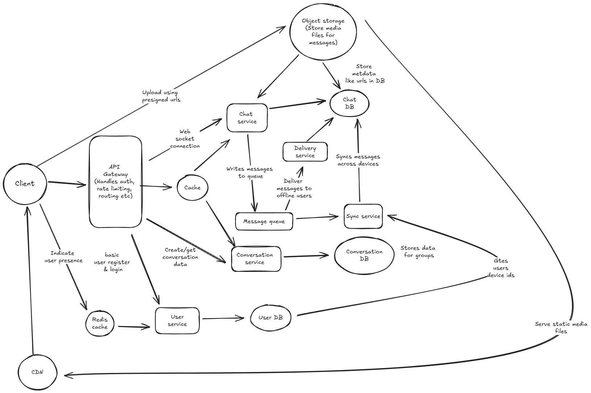

# Question: Chat/Messaging System Design

Design a chat/messaging system like WhatsApp or Slack that allows users to:

- Send and receive messages in real-time
- Create group chats with multiple participants
- See message delivery and read receipts
- Sync messages across multiple devices
- Send multimedia messages (images, videos, files)
  
The system should handle millions of users with thousands of messages per second and provide reliable message delivery even when users are offline.

---

## Answer

Before going into the solution, lets first re iterate the problem. Here we have to design a chat/messaging system where users can perform actions like:

- Send and receive messages in real-time
- Create group chats with multiple participants
- See message delivery and read receipts
- Sync messages across multiple devices
- Send multimedia messages (images, videos, files)

## Functional Requirements

Before we go ahead, lets first focus on what we are building here. This will help clarify the functional requirements of the app

- Users should be able to send and receive messages in real time, including multimedia messages
- Users should be able to create group chats with multiple participants (limit 100).
- Users should be able to see message delivery and read receipts.
- Users should be able to sync messages.
- Users should be able to receive messages even when offline, when they come online

Out of scope for now

- Audio/Video calling
- Profile management
- Online/offline and typing indicators

## Non functional requirements

Once we have outlines the functional requirements, we will go ahead and define the non functional requirements

- Scale: 10 Million daily active users, each user sends 100 messages daily which makes it 1000 Million messages/day.
- Latency: Messages delivered in real time with low/minimal latency (< 100ms)
- Availability: System should be highly available, in terms of CAP theorem, we should favor availability over consistency when failures happen in terms of message sending.
- Message ordering: Message ordering should support strong consistency that messages should appear in chronological order in time.
- Message delivery: System should guarantee at least once delivery of messages, even when users are offline.
- Performance: System should be able to handle thousands of messages per second.

## Data Characteristics and data models

After defining the requirements, we will go ahead and define the data characteristics and data models

### Data models

Here are the data models for the app

#### User

- id
- name
- email
- username
- contact no
- list of device ids
- online/offline status

#### Message

- id
- content
- conversation_id
- sender_id
- created_at
- image_urls
- video_urls
- read_receipts (list of user ids who have read the message)

#### Conversation

- id
- name
- list of participant ids
- creator_id
- created_at

#### ReadReceipt

- id
- message_id
- user_id
- read_at
- delivered_at
- created_at

### Data characteristics

- User data: User data is relatively small and can be stored in a relational database. It is read frequently but updated infrequently. We can use a relational database like MySQL or PostgreSQL for user data to allow for strong consistency and support complex queries.

- Message data: Message data is large and can grow quickly. It is read frequently and updated infrequently. We can use a NoSQL database like DynamoDB or Cassandra for message data to allow for more flexibility in the schema and to handle the large volume of data. As message data will be written more frequently than read, we will use a NoSQL database for message data that can handle high write throughput like Cassandra or DynamoDB.

- Conversation data: Conversation data is relatively small and can be stored in a relational database. It is read frequently but updated infrequently. We can also use a NoSQL database like MongoDB for conversation data to allow for more flexibility in the schema. But for now we will use a relational database.

- Read receipt data: Read receipt data is relatively small and can be stored in a relational database. It is read frequently but updated infrequently. We can also use a NoSQL database for read receipt data to allow for more flexibility in the schema. But for now we will use a relational database as we need consistency for read receipts and delivery status.

- Multimedia data: Multimedia data (images, videos, files) is large and can grow quickly. It is read frequently and updated infrequently. We can use a distributed file system or object storage service (like AWS S3) to store multimedia data. We will store the URLs of the multimedia files in the message data.

- Search data: If we want to implement search functionality, we can use a search engine like Elasticsearch to index the message data and allow for fast searching.

- Real time data synchronization: For real time data synchronization, we can use WebSockets or a real-time messaging service like Firebase or Pusher to allow for real-time communication between the client and server.

## API Design

Here are some of the APIs for the app

### User APIs

- Create User: `POST /users`
- Get User: `GET /users/{user_id}`
- Update User: `PUT /users/{user_id}`
- Delete User: `DELETE /users/{user_id}`

### Conversation APIs

- Create Conversation: `POST /conversations`
- Get Conversation: `GET /conversations/{conversation_id}`
- Add Participant: `POST /conversations/{conversation_id}/participants`
- List Conversations: `GET /users/{user_id}/conversations`
- Get Messages in Conversation: `GET /conversations/{conversation_id}/messages`

### Message APIs

- Send Message: `POST /conversations/{conversation_id}/messages`
- Get Message: `GET /messages/{message_id}`
- List Messages: `GET /conversations/{conversation_id}/messages`

### Read Receipt APIs

- Create Read Receipt: `POST /messages/{message_id}/read_receipts`
- Get Read Receipts: `GET /messages/{message_id}/read_receipts`
  
## High Level Architecture

Here's a high level architecture of the app

### Components

- Client: The client is the app that users interact with. It can be a web app, mobile app, or desktop app. The client communicates with the server via REST APIs and WebSockets for real-time communication.

- API Gateway: The API Gateway is the entry point for all client requests. It handles authentication, rate limiting, and routing requests to the appropriate microservices.

- User Service: The User Service is responsible for managing user data. It handles user creation, retrieval, updating, and deletion. It communicates with the User Database to store and retrieve user data.

- Conversation Service: The Conversation Service is responsible for managing conversations. It handles conversation creation, retrieval, adding participants, and listing conversations. It communicates with the Conversation Database to store and retrieve conversation data.

- Chat Service: The Chat Service is responsible for managing messages. It handles sending messages, retrieving messages, and listing messages in a conversation. It communicates with the Message Database to store and retrieve message data. We will be having a web socket server in the chat service to handle real-time communication.

- Sync Service: The Sync Service is responsible for syncing messages across multiple devices. It ensures that messages are delivered to all devices associated with a user. It communicates with the Message queue to get new messages and deliver them to the appropriate devices. It takes list of device ids from user service.

- Message Queue: The Message Queue is used for asynchronous communication between microservices. It allows the Chat Service to send messages to the Sync Service for delivery to multiple devices. We can use a distributed message queue like Kafka or RabbitMQ for this. Is also helps in ensuring message delivery even when users are offline.

- Databases: The app uses multiple databases to store different types of data. We can use a combination of relational and NoSQL databases based on the data characteristics defined earlier. For example, we can use MySQL for user and conversation data, DynamoDB for message data, and S3 for multimedia data.

- Load Balancer: The Load Balancer distributes incoming client requests across multiple instances of the microservices to ensure high availability and scalability. We can use a cloud-based load balancer like AWS ELB or GCP Load Balancing for this.

- Cache: The Cache is used to store frequently accessed data in memory to reduce latency and improve performance. We can use a distributed cache like Redis or Memcached for this.
We can cache frequently accessed messages and conversations to reduce latency.

- CDN: The CDN is used to deliver multimedia content (images, videos, files) to users with low latency and high availability. We can use a cloud-based CDN like AWS CloudFront or GCP Cloud CDN for this.

### Real-time messaging

For real-time messaging, we can use WebSockets to establish a persistent connection between the client and server. This allows for low-latency communication and real-time updates. The Chat Service will have a WebSocket server that handles incoming messages and broadcasts them to the appropriate clients.

When a user sends a message, the Chat Service will store the message in the Message Database and then send the message to the Message Queue. The Sync Service will then pick up the message from the Message Queue and deliver it to all devices associated with the recipient user(s) via their respective WebSocket connections.

### Message delivery and read receipts

To implement message delivery and read receipts, we can use the ReadReceipt data model defined earlier. When a message is sent, the Chat Service will create a ReadReceipt entry for each recipient user with the delivered_at timestamp. When a user reads a message, the client will send a request to the Read Receipt API to update the ReadReceipt entry with the read_at timestamp.

### Offline message delivery

To ensure reliable message delivery even when users are offline, we can use the Message Queue to store messages that need to be delivered. When a user comes online, the Sync Service will check the Message Queue for any undelivered messages and deliver them to the user's devices via their respective WebSocket connections.

## Addressing scalability and reliability

### Message delivery guarantees

To ensure at least once delivery of messages, we can use the Message Queue to store messages that need to be delivered. The Chat Service will send messages to the Message Queue, and the Sync Service will pick up messages from the Message Queue and deliver them to the appropriate devices. If a message fails to be delivered, it will remain in the Message Queue and the Sync Service will retry delivery until it is successful.

### Handling offline users

To handle offline users, we can use the Message Queue to store messages that need to be delivered. When a user comes online, the Sync Service will check the Message Queue for any undelivered messages and deliver them to the user's devices via their respective WebSocket connections.

### Message ordering in group chats

To ensure message ordering in group chats, we can use a combination of timestamps and sequence numbers. Each message will have a created_at timestamp and a sequence number that is incremented for each message sent in a conversation. The client will use these values to order messages in the correct chronological order.

### Real time presence at scale

To handle real-time presence at scale, we can use a distributed in-memory data store like Redis to store user presence information. Each time a user connects or disconnects, the client will send a request to the User Service to update the user's presence status in Redis. The User Service can then broadcast presence updates to all connected clients via WebSockets.

### Load balancing and auto-scaling

To ensure high availability and scalability, we can use a cloud-based load balancer to distribute incoming client requests across multiple instances of the microservices. We can also use auto-scaling to automatically add or remove instances based on traffic patterns. This will help ensure that the system can handle thousands of messages per second and provide reliable message delivery even during peak usage times.

### Caching

To improve performance and reduce latency, we can use a distributed cache like Redis or Memcached to store frequently accessed data in memory. We can cache frequently accessed messages and conversations to reduce the number of database queries and improve response times.

### Cross device synchronization

To ensure messages are synced across multiple devices, we can use the Sync Service to deliver messages to all devices associated with a user. When a user sends a message, the Chat Service will send the message to the Message Queue, and the Sync Service will pick up the message from the Message Queue and deliver it to all devices associated with the recipient user(s) via their respective WebSocket connections. The Sync Service will also handle message delivery when a user comes online after being offline

---
