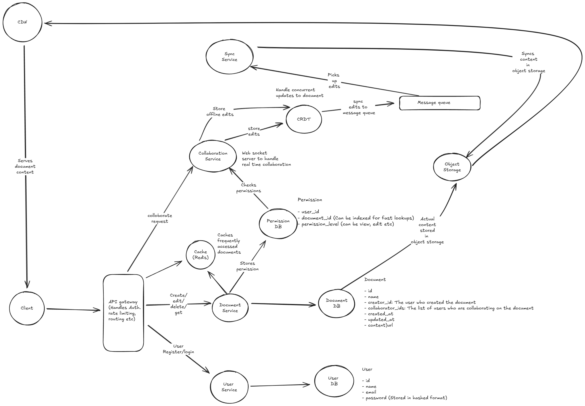

# Question: Collaborative Document Editor Design (Google Docs)

Design a collaborative document editor like Google Docs that allows users to:

- Create, edit, and share documents in real-time
- Support multiple users editing simultaneously with live cursors and selections
- Handle text formatting (bold, italic, fonts, colors, etc.)
- Provide version history and revision tracking
- Support comments and suggestions
- Offer offline editing with sync when reconnected
- Handle different permission levels (view, comment, edit)
- Export documents in various formats (PDF, Word, etc.)

The system should handle millions of documents with thousands of concurrent editors per document, provide sub-second latency for edits, and ensure consistency across all collaborators.

---

## Answer

Before we go ahead and design the solution, we should first clarify the functional and non-functional requirements of the app

### Functional requirements

Before going any further, we should first specify and focus on "What" we are planning to design. Below are the functional requirements of the app:

- Users should be able to create, edit and share documents in real-time
- Multiple users should be able to edit the document simultaneously
- Users should be able to edit when offline and then sync when reconnected
- Handle different permission level like (View, edit etc)

#### Below the scope

For the sake of this design we will not be considering these requirements in scope. These can always be discussed with the interviewer and brought to scope if needed. For now lets ignore these

- Provide version history and revision tracking
- Support comments and suggestions
- Export documents in various formats (PDF, word etc)
- Text formatting (bold, italic, stc)
- User profile management

### Non functional requirements

After we have listed the functional requirements, we will next list down the non functional requirements

- Scale: System should support 1 million daily users who edit 10 documents daily which makes it 10 million documents being edited daily. Also there can be around 100 concurrent users per document.
- Performance: System should be highly performant and able to provide sub second latency for edits
- Latency: System should be able to provide sub second latency for edits
- Consistency: System should be eventually consistent across all collaborators, meaning that all users should see the same document state after a short period of time
- Availability: System should be highly available and should be able to handle failures gracefully.
- Durability: System should be able to persist data and should not lose any data in case of failures.
- Security: System should be secure and should be able to handle different permission levels. A user with view permission should not be able to edit the document.
  
### Data models and Data characteristics

Once we have the non functional requirements listed down, we can next discuss on the data models for the app along with the data characteristics for them. We will be choosing different databases for different types of data models.

#### Data models

Below are the main data models for our app

##### User

- id
- name
- email
- password (Stored in hashed format)

##### Document

- id
- name
- creator_id: The user who created the document
- collaborator_ids: The list of users who are collaborating on the document
- created_at
- updated_at
- content_url: URL to document content in object storage (S3/GCS)

#### Permission

- user_id
- document_id (Can be indexed for fast lookups)
- permission_level (can be view, edit etc)

#### Data characteristics

- User data: This data is relational in nature and can be stored in a relational database like MySQL or PostgreSQL. This data is not very large in size and can be easily indexed for fast lookups.

- Document data: This data is semi-structured in nature and can be stored in a NoSQL database like MongoDB or DynamoDB. This data can be large in size and can be stored as a string or a more complex data structure like a tree for rich text.

- Permission data: This data is relational in nature and can be stored in a relational database like MySQL or PostgreSQL. This data is not very large in size and can be easily indexed for fast lookups.

- Searchable data: If we want to provide search functionality for documents, we can use a search engine like Elasticsearch or Solr. This data can be indexed for fast lookups and can be used to provide full-text search capabilities.

- Document content: Stored in Object Storage (S3/GCS) for cost efficiency and global access via CDN

#### How do we store data for collaborative editing

For collaborative editing, we can use a CRDT (Conflict-free Replicated Data Type) or OT (Operational Transformation) based approach to handle concurrent edits and ensure eventual consistency. OT requires a central server to manage the transformations, while CRDTs can be more decentralized. For this reason we will be using CRDT for our design as it will be more scalable and fault tolerant.

### API design

Once we have the data models listed, we will next up discuss on the API end points for the app.

#### User APIs

- POST /users/register: Register a new user
- POST /users/login: Login a user and return an authentication token
- GET /users/{user_id}: Get a user with user id.

#### Document APIs

- Post /documents: Create a new document
Body : {details of documents like name etc}

- GET /documents/{id}: Get a particular document with id
- POST /documents/{id}/collaborators : Add collaborators to a document with collaborator ids and permission in request body
- GET /documents/{id}/collaborators: Get list of collaborators for a document
- DELETE /documents/{id}: Delete a document

#### Real-time collaboration APIs

WS /docs/{docId}
  SEND {
    type: "insert"
    ....
  }

  SEND {
    type: "updateCursor"
    position: ...
  }

  SEND { 
    type: "delete"
    ...
  }

  RECV { 
    type: "update"
    ...
  }
  
#### Sync APIs

- POST /documents/{id}/sync: Sync the document changes when a user comes back online
Body: {changes: "list of changes made while offline"}

### High level architecture

Below is the high level architecture diagram

#### Components

- **Client:** The mobile app or website which users use to communicate with the system

- **API Gateway:** Entrypoint for our system, handles auth, rate limiting and routing the request to different microservices in the system

- **User Service:** Manages user registration, authentication, and profile management.

- **Document Service:** Manages document creation, retrieval, updates, and deletion. It also handles permission checks for document access.

- **Collaboration Service:** Handles real-time collaboration using CRDTs to manage concurrent edits and ensure eventual consistency across all collaborators.

- **Sync Service:** Manages offline edits and syncs changes when users come back online. It handles merging changes made while offline with the current document state.

- **Message Queue:** Facilitates asynchronous communication between services, especially for real-time updates and sync operations. The collaboration service can publish changes to a message queue which can then be consumed by the sync service to update the changes to the database.

- **Object Storage (e.g., AWS S3, Google Cloud Storage):** Stores actual document content as CRDT snapshots, enabling cost-effective storage and global CDN distribution.

- **CDN (Content Delivery Network):** Distributes document content globally to reduce latency and improve access speed for users worldwide.

- **Databases:**
  - **Relational Database (e.g., PostgreSQL):** Stores user data and permissions.
  - **NoSQL Database (e.g., MongoDB):** Stores document data, which can be large and semi-structured.
  - **Search Engine (e.g., Elasticsearch):** Indexes documents for full-text search capabilities.

- **Cache (e.g., Redis):** Caches frequently accessed documents and user sessions to reduce database load and improve performance.

#### Addressing Scalability and reliability

- **Load Balancers:** Distribute incoming requests across multiple instances of each service to ensure no single instance is overwhelmed.

- **Auto-scaling:** Automatically scale services up or down based on demand to handle varying loads.

- **Real-time collaboration at scale:** Use CRDTs to allow multiple users to edit documents simultaneously without conflicts. Changes are propagated in real-time to all collaborators. We use WebSockets or similar technologies for low-latency communication between clients and the collaboration service. In case of peak loads, we can use a message queue to buffer changes and process them asynchronously.

- **Conflict resolution:** CRDTs inherently handle conflicts by merging changes in a way that ensures eventual consistency. Each client maintains its own copy of the document and applies changes locally before syncing with the server. The collaboration service ensures that all changes are propagated to all clients.

- **Offline editing and synchronization**: CRDTs also facilitate offline editing by allowing users to make changes locally. When the user comes back online, the CRDTs write the changes to the message queue which are then processed by the sync service to merge with the current document state.

- **Permission management and security:** The document and collaboration services enforce permission checks to ensure users can only access documents they have rights to. Users not having edit permissions will only receive updates but won't be able to make changes.

- **Monitoring and logging:** Implement monitoring and logging for all services to track performance, errors, and usage patterns. This helps in identifying bottlenecks and ensuring the system is running smoothly. In case of failures, services can be designed to retry operations or fall back to a safe state.

#### Failure scenarios and handling

- **Network partitions during collaborative editing**: If a network partition occurs, users may not see real-time updates from other collaborators. To handle this, the collaboration service can buffer changes locally and attempt to sync them once the connection is restored. CRDTs will help in merging these changes without conflicts.

- **Server failures when users are actively editing**: If a server handling real-time collaboration fails, users may lose their connection. To mitigate this, we can have multiple instances of the collaboration service behind a load balancer. If one instance fails, users can be redirected to another instance. Additionally, clients can periodically save their local state to the server to minimize data loss.

- **Conflicting edits from multiple users**: CRDTs are designed to handle conflicting edits by merging changes in a way that ensures eventual consistency. Each client maintains its own copy of the document and applies changes locally before syncing with the server. The collaboration service ensures that all changes are propagated to all clients.

- **Real time sync failures**: If a real time sync fails, we may not see the correct state of the document. For this we can use a message queue to buffer changes and process them asynchronously. This way even if the real time sync fails, the changes will be eventually processed and the document will be updated. This comes with a trade off of users seeing stale data for a short period of time. In case of persistent failures, we can notify users that there is a network issue and they may not see real-time updates and we will store their changes locally until the issue is resolved.

---
