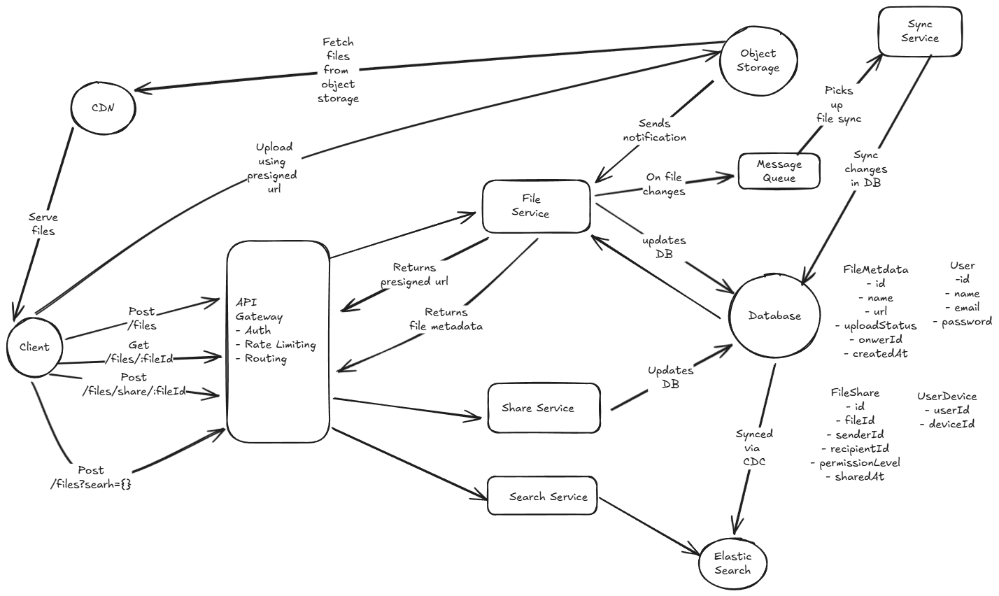

# Google Drive File Storage System

Design a cloud storage system like Google Drive that:

- File Management: Upload, download, delete, and organize files in folders
- Cross-Device Sync: Automatically sync files across multiple devices and platforms
- File Sharing: Share files and folders with other users with different permission levels
- Version Control: Track file versions and allow restoration to previous versions
- Storage Optimization: Handle large files efficiently with chunking and deduplication
- Search: Find files by name, content, metadata, and tags
- Offline Access: Download files for offline use and sync when reconnected

Out of scope:

- Real-time collaborative editing (Google Docs functionality)
- Advanced document processing and conversion
- Third-party integrations and APIs
- Mobile app-specific features
- Detailed billing and payment systems

The system should handle petabytes of data, support millions of concurrent users, provide fast file operations, and ensure data durability and availability across global regions.

---

## Solution

Before going ahead and discussing the design lets take a moment first to understand the requirements for the app we are going to design. Thats is lets first note down "What" we need to design rather than the "How" and "Whys".

### Functional Requirements

In scope for this design

- Users should be able to upload, download and delete files
- Users should be able to sync files across different devices
- Users should be able to share files with other users with different permissions level
- Users should be able to find files by name, metadata and tags etc.

Out of scope for this design (We can always bring them back to scope by discussing with the interviewer)

- Version control
- User Profile management
- Offline access
- Real-time collaborative editing (Google Docs functionality)
- Advanced document processing and conversion
- Third-party integrations and APIs
- Mobile app-specific features
- Detailed billing and payment systems

### Non Functional Requirements

- Scale: System should support around 1M daily users, if each user creates 10 files on average, there are around 10 Million files per day.
- Available: System should be highly available and favour availability over consistency when failures happen.
- Durable: System should be durable to persist the files permanently even in times of failures.
- Latency: System should support low latency around (< 500 ms) for file operations and sync.
- Storage Optimization: Handle large files efficiently with chunking and deduplication

### Core Entities

Next up after we have described the functional and non functional requirements, we will go ahead and discuss the core entities of the system.

#### User

- id
- name
- email
- password (Stored as hash)
- devices: List of devices

#### UserDevice

- userId
- deviceId

#### FileMetadata

- id: Id of the file
- name: Name of the file
- url: URL of the actual file stored in object store
- createdAt: Time when file is created
- ownerId: Id of the user who created the file
- fileShares: List of file share objects
- tags: key value tags
- uploadStatus: File upload status, can be pending, completed, failed

#### FileShare

- id: Unique Id of the file share
- senderId: User Sharing the file
- recipientId: Recipient with whom the file is shared
- fileId: File id which is shared
- permissionLevel: Can be view, edit etc
- sharedAt: Time at which file is shared

### Data Characteristics

- Actual file will be huge in size, so we will not be storing in the file in our database, we will store the actual file in an object storage like S3 and just store the reference to the file in the actual database.
- User, FileMetadata, FileShare, DeviceData can be stored in the database. Here we can choose any of relational or non relational database. For simplicity we can use a relational database like PostgreSQL here.
- Since we will be using a relational database here, this means we cannot embed nested data. E.g We will need to create a separate table for mapping FileMetadata with FileShare table data. When we will be fetching data for files we will need to join the tables and return the data. This is a tradeoff with non relational databases like MongoDB where we can embed nested documents and we do not need to join and return. But for non relational database, writes become complex as we need to update the nested fields as well. For this design we can go with simplicity and go with PostgreSQL here as the database.
- Since we are going with PostgreSQL here, we can index the columns in the middle tables to speed up read queries and reduce read latency.

### API

Next up we will discuss on the APIs we need for the system

- Upload a File

```json
POST /files
Request:
{
  File, 
  FileMetadata
}
```

- Download a file

```json
GET /files/{fileId} -> File & FileMetadata
```

- Delete a file with fileId

```json
DELETE /files/{fileId} -> File & FileMetadata
```

- Share a file

```json
Post /file/:fileId/share: Share file with other users
{
    userIds[]
}
```

- Search a file with a given name, metadata etc.

```json
Get /files?searchTerm={}
```

### High Level Architecture

Below is the high level architecture of the system



#### System flow

##### File upload

- Client sends a request to the API server to upload a file
- The request is received by the API Gateway which does auth, rate limiting etc and forwards the request to the File Service
- The file service creates an entry for the file in the database with upload status as pending
- It generates a pre signed URL for the object storage and returns back to the client.
- The file service also enforces content type and file size limits in the presigned url so as to prevent abuse.
- The client uploads the file directly to object storage using presigned url. For large files, the client uploads the file in chunks so that if any failure happens, upload can be retried from the failed chunk and not from the start.
- Once upload is completed, the object storage sends a notification to the File service and the file service updates the file upload status to completed.

##### File download

- Client sends a request to the API server to download a file.
- The request is received by the API Gateway which does auth, rate limiting etc and forwards the request to the File Service
- The file service first checks if user has appropriate permissions, it then returns the metadata of the file from the database.
- The actual file is served to the user from CDN to reduce latency.

##### File share

- Client sends a request to the API server to share a file.
- The request is received by the API Gateway which does auth, rate limiting etc and forwards the request to the Share Service.
- The Share service updates the DB to add in details for the file share

##### File Sync

- Whenever the user makes any changes to and existing file, the file service places an event in message queue like kafka. The message includes the fileId which was changed
- The sync service picks up the event and applies changes to file to make sure the file data is synced across users devices. For this it uses the UserDevice table to get the list of devices for the user and then sends a push notification to the devices to pull the latest changes.
- The client on receiving the push notification, pulls the latest changes from the file service.
- This way the file is synced across devices.

##### File Search

- Client sends a request to the API server to search for files.
- The request is received by the API Gateway which does auth, rate limiting etc and forwards the request to the Search Service.
- The Search Service queries elasticsearch to get the list of files matching the search criteria and returns back to the user.
- Elasticsearch is kept in sync with the main database using a change data capture mechanism.
- Whenever there is a change in the main database, a change event is placed in kafka which is picked up by a separate service which updates elasticsearch index.
- This way the search index is kept in sync with the main database.

### Addressing Scalability and Reliability

- Massive file storage: Use distributed object storage like Amazon S3 or Google Cloud Storage to handle petabytes of data with redundancy and durability.
- High throughput file operations: Implement load balancing and auto-scaling for API servers to manage millions of concurrent users and ensure low latency.
- Cross device synchronization at scale: Use message queues like Kafka to handle sync events and ensure eventual consistency across devices. WebSockets or push notifications can be used for real-time updates.
- Global file distribution and CDN Strategies: Use CDNs to cache frequently accessed files closer to users, reducing latency and improving download speeds.
- Storage optimization: Implement file chunking for large files and deduplication to save storage space. Use compression techniques to reduce file sizes.

### Handling Failure Scenarios

- File upload failures: Implement retry mechanisms for file uploads, especially for large files. Use chunked uploads to allow resuming from the last successful chunk.
- Sync Conflicts: Use versioning and conflict resolution strategies to handle sync conflicts when multiple devices modify the same file.
- Storage node failures: Ensure data replication across multiple nodes in the object storage to prevent data loss. Use health checks and automatic failover mechanisms.
- Metadata corruption: Implement regular backups and integrity checks for the database. Use transaction logs to recover from corruption.
- Network issues: Use retries and exponential backoff for network requests. Implement offline access features to allow users to work with files even when offline, syncing changes when reconnected.
- Large file handling: Use chunking to upload/download large files in smaller parts, allowing for retries on failed chunks without restarting the entire process.

---