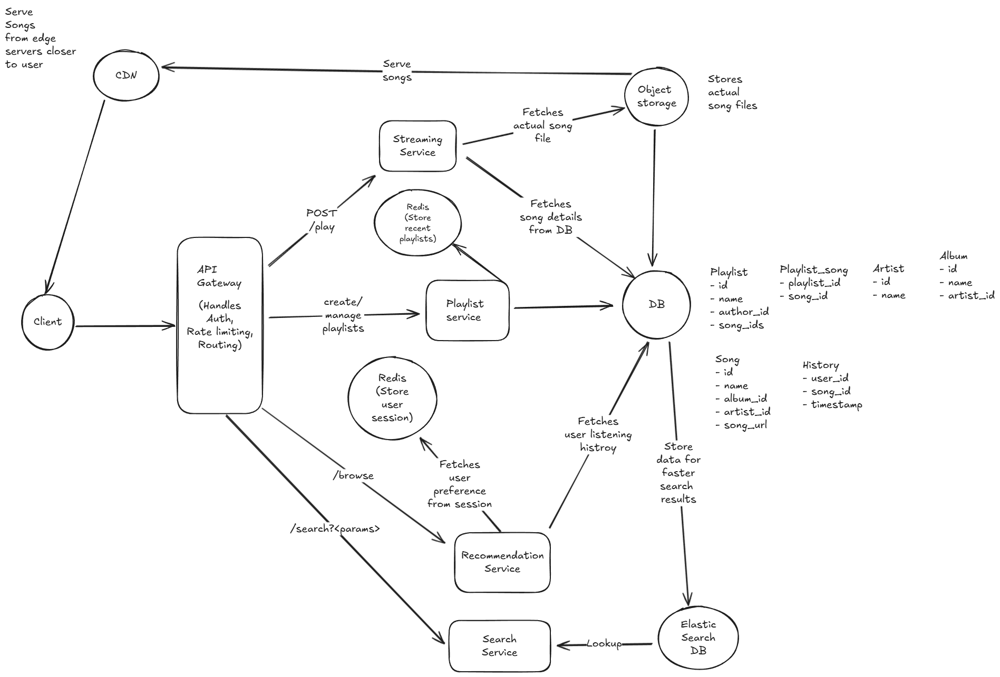

# Question: Music Streaming System Design

Design a music streaming system like Spotify that allows users to:

- Stream music tracks with high audio quality
- Search for songs, artists, albums, and playlists
- Create and manage personal playlists
- Follow artists and other users
- Get personalized music recommendations
- Download songs for offline listening
- Social features (share songs, see what friends are listening to)
  
The system should handle millions of users streaming simultaneously, support various audio quality levels, provide low-latency playback, and manage a catalog of millions of songs with efficient content delivery.

---

## Solution

Before going ahead and discussing the design lets take a moment first to understand the requirements for the app we are going to design. Thats is lets first note down "What" we need to design rather than the "How" and "Whys".

### Functional requirements

Lets first walkthrough the functional requirements of the app

**Core requirements:**

- Users should be able to stream music tracks with high audio quality
- Users should be able to search for songs, artists, albums, and playlists
- Users should be able to create and manage playlists
- Users should be able to get personalized music recommendations

**Out of scope for this design:**

- Follow artists and other users
- Download songs for offline listening
- Social features (share songs, see what friends are listening to)
- User auth and profile management
- Premium/Free memberships

I have kept above features out of scope for now. In an interview, we can always discuss with the interviewer and prioritize these features.

### Non functional requirements

- Scale: Around 1 Million daily users with 1k concurrent users. Each user listen to 100 songs a day which makes it 100 million daily songs and 1K concurrent songs. Expected catalog size is around 10 million songs.
- Low latency: Less than 200ms to start playing a song
- High availability: 99.9% uptime
- Audio quality: Support for various audio quality levels (e.g., 128kbps, 256kbps, 320kbps). Also if internet speed is low, app should be able to adjust the quality of the song being played
- Content delivery: Efficient content delivery to users across the globe
- Consistency: If a user adds a song to a playlist, it should be reflected immediately, but eventual consistency is acceptable for non-critical features like recommendations.

### Core Entities

Now that we have the requirements listed down, we will go ahead and next list down the core entities of the app.

#### User

- id
- name
- email
- username
- phone
- password (Stored in hash format)

#### Artist

- id
- name
- email

#### Albums

- id
- name
- artist_id (We can index this column, to speed up queries to fetch all albums for artist)

#### Song

- id
- name
- song_url
- artist_id (We can index this column, to speed up queries to fetch all songs for artist)
- album_id (We can index this column, to speed up queries to fetch all songs for albums)

#### Playlist

- id
- name
- author_id (We can index this column, to speed up queries to fetch all songs for artist in a playlist)

#### Playlist_Song (To model many to many relationship between playlist and song)

- playlist_id
- song_id

#### Listening History

- id
- user_id
- song_id
- timestamp

These are the data models and the attributes. I have not gone ahead and listed all attributed. I think its fine for now. We can always come back and refine these later.

### Data characteristics

- User: User data will be relatively static, with very few updates and changes. We can use a relational database like postgreSQL to store user data here.

- Artist: For artist data as well, I feel a relational database like postgreSQL can suffice.
  
- Album: Album data as well can be stored in a relational database like postgreSQL, with foreign keys to the artist and song tables. We can also index the artist_id column to speed up queries to fetch all albums for an artist.

- Song: Song data can be stored in a relational database like postgreSQL, with foreign keys to the artist and album tables. We can also index the artist_id and album_id columns to speed up queries to fetch all songs for an artist or album.

- Playlist: Playlist data can be stored in a relational database like postgreSQL, with foreign keys to the user and song tables. We can also index the author_id column to speed up queries to fetch all playlists for a user.
  
- Song files: The actual song files will be stored in a distributed file system like Amazon S3 or Google Cloud Storage. We can use a CDN to cache the song files closer to the users for low latency playback. Also the URL to the song file will be stored in the song table.

- Search: For search functionality, we can use a search engine like Elasticsearch or Solr. We can index the song, artist, album, and playlist data in the search engine to enable fast and efficient search queries.

### API design

Now that we have the data models and the attributes listed down, we will go ahead and design the APIs for the app.

#### User APIs

- POST /users/register: To register a new user
- POST /users/login: To login a user
- GET /users/{user_id}: To get user details

#### Artist APIs

- GET /artists/{artist_id}: To get artist details
- GET /artists/{artist_id}/albums: To get all albums for an artist
- GET /artists/{artist_id}/songs: To get all songs for an artist
- GET /artists?name={artist_name}: To search for artists by name
- GET /artists: To get all artists

#### Album APIs

- GET /albums/{album_id}: To get album details
- GET /albums/{album_id}/songs: To get all songs for an album
- GET /albums?name={album_name}: To search for albums by name
- GET /albums: To get all albums
- POST /albums: To create a new album

#### Song APIs

- GET /songs/{song_id}: To get song details
- GET /songs?name={song_name}: To search for songs by name
- GET /songs: To get all songs
- POST /play/{song_id}: To play a song

#### Playlist APIs

- POST /playlists: To create a new playlist
- GET /playlists/{playlist_id}: To get playlist details
- GET /playlists/{playlist_id}/songs: To get all songs in a playlist
- POST /playlists/{playlist_id}/songs: To add a song to a playlist
- DELETE /playlists/{playlist_id}/songs/{song_id}: To remove a song from a playlist
- GET /users/{user_id}/playlists: To get all playlists for a user
- GET /playlists?name={playlist_name}: To search for playlists by name

#### Recommendation APIs

- GET /users/{user_id}/recommendations: To get personalized music recommendations for a user

### High level architecture

Here is the high level architecture for the app

#### Components

- Client: The client can be a web app, mobile app, or desktop app. The client will communicate with the backend services via REST APIs.

- API Gateway: The API Gateway will be the entry point for all client requests. It will route the requests to the appropriate backend services. It will also handle authentication, rate limiting, and caching.

- Playlist Service: The Playlist Service will handle all playlist related operations. It will communicate with the relational database to store and retrieve playlist data.

- Streaming Service: The Streaming Service will handle all song streaming related operations. It will communicate with the distributed file system to fetch the song files and stream them to the client. It will also handle audio quality adjustments based on network conditions.

- Search Service: The Search Service will handle all search related operations. It will communicate with the search engine to perform search queries and return the results to the client.

- Recommendation Service: The Recommendation Service will handle all recommendation related operations. It will use machine learning algorithms to generate personalized music recommendations for users based on their listening history and preferences.

- Object Storage: The Object Storage will store the actual song files. We can use a distributed file system like Amazon S3 or Google Cloud Storage for this purpose. We can also use a CDN to cache the song files closer to the users for low latency playback.

- Relational Database: The Relational Database will store all the metadata related to users, artists, albums, songs, and playlists. We can use a relational database like PostgreSQL or MySQL for this purpose.

- Redis Cache: The Redis Cache will be used to cache frequently accessed data to reduce the load on the relational database and improve performance. We can use Redis or Memcached for this purpose. We also store the user sessions in redis. This will help us in recommending songs based on user sessions and listening history.
  
#### Flow

##### Playlist operations

1. Client sends a request to create/update/delete a playlist to the API Gateway.
2. API Gateway routes the request to the Playlist Service.
3. Playlist Service processes the request and stores the playlist data in the relational database.
4. Playlist Service sends a response back to the API Gateway.
5. API Gateway forwards the response to the client.

##### Song streaming operations

1. Client sends a request to play a song to the API Gateway.
2. API Gateway routes the request to the Streaming Service.
3. Streaming Service fetches the song file from the Object Storage.
4. Streaming Service streams the song file to the client using CDN for low latency playback.
5. Streaming Service sends a response back to the API Gateway.
6. Streaming Service also logs the listening history in the relational database.

#### User recommendation operations

1. Client sends a request to get personalized music recommendations to the API Gateway.
2. API Gateway routes the request to the Recommendation Service.
3. Recommendation Service fetches the user's listening history from the relational database and the previous recommendations from the Redis Cache. Also it fetches the user session from redis cache for preference based recommendations.
4. Recommendation Service generates personalized recommendations using machine learning algorithms.
5. Recommendation Service sends the recommendations back to the API Gateway.
6. API Gateway forwards the recommendations to the client.

### Addressing scalability and reliability

- Global content distribution for low-latency streaming: Use a CDN to cache song files closer to users. This reduces latency and improves playback speed. We can use services like Cloudflare, Akamai, or AWS CloudFront for this purpose. We can also use edge locations of AWS S3 to store the song files closer to the users.

- Handling millions of concurrent streams: We can use hierarchical load balancing with multiple layers of load balancers to distribute the load evenly across the streaming servers. We can also use auto-scaling groups to automatically scale the number of streaming servers based on the current load. Also we can use hierarchical caching to cache the song files at multiple levels (CDN, edge locations, streaming servers) to reduce the load on the Object Storage. Hierarchical CDN servers will help us in reducing the load on the main server and also help in reducing the latency while streaming the songs.

- Managing large audio file catalogs: Use a distributed file system like Amazon S3 or Google Cloud Storage to store the song files. This allows us to scale the storage capacity as needed and provides high availability and durability for the song files.

- Real-time recommendation updates: Use a combination of batch processing and real-time streaming to update the recommendation models. We can use Apache Spark or Hadoop for batch processing and Apache Kafka or AWS Kinesis for real-time streaming. We can also use Redis or Memcached to cache the recommendations for fast retrieval.

- Sharding: For the scale we are targeting, a single database instance may not be sufficient. We can use sharding to distribute the data across multiple database instances. We can shard the data based on user_id or song_id to ensure that related data is stored together.

### Handling failures

- Audio streaming failures (network issues, CDN outages): Implement retry mechanisms and fallback strategies. If a CDN node is down, the streaming service can fetch the song file from the next closest CDN node or directly from the Object Storage. We can also use multiple CDNs to ensure high availability and reliability.

- Search service failures (how to maintain discoverability): Implement redundancy and failover mechanisms. We can use multiple instances of the search service and a load balancer to distribute the load. If one instance fails, the load balancer can route the requests to the other instances. We can also use a backup search engine to ensure that search functionality is still available in case of a failure.

- Recommendation engine failures: If recommendation service fails, we can fall back to a default set of popular songs or recently played songs. We can also use a backup recommendation service to ensure that recommendations are still available in case of a failure.

- Playlist service failures: Implement redundancy and failover mechanisms. We can use multiple instances of the playlist service and a load balancer to distribute the load. If one instance fails, the load balancer can route the requests to the other instances. We can also use a backup playlist service to ensure that playlist functionality is still available in case of a failure.

- Database failures: Implement database replication and failover mechanisms. We can use a primary-secondary replication setup where the primary database handles all write operations and the secondary database handles read operations. If the primary database fails, we can promote the secondary database to be the new primary database. We can also use a backup database to ensure that data is not lost in case of a failure.

- CDN failures: Use multiple CDNs to ensure high availability and reliability. If one CDN fails, the streaming service can fetch the song file from the next closest CDN node or directly from the Object Storage.

---

## Diving Deep into Key Components (From online solutions)

### Music Streaming Service

The Streaming Service is at the heart of Spotify’s architecture, responsible for delivering music content efficiently, securely, and reliably to millions of users in real time.

The actual delivery of music files is managed by a Content Delivery Networks (Cloudflare, AWS CloudFront). This ensures that music is served from geographically distributed servers close to the user, minimizing latency and bandwidth consumption.

#### Request Workflow:

- Client sends a streaming request (e.g., /stream/{song_id}).
- The API gateway authenticates the user and routes the request to the Streaming Service.
- If the song is not in the CDN, the Streaming Service retrieves the audio file’s location (from the blob storage) and pushes the file to the nearest CDN edge server. The CDN returns a URL to the streaming service to stream the audio.
- The CDN URL is returned to the client, allowing the client to stream the audio.

### Recommendation Service

The recommendation system analyzes the user's listening habits, likes, and playlists. It uses a combination of collaborative filtering (based on users with similar preferences) and content-based filtering (based on song metadata).

#### Collaborative Filtering

Collaborative filtering is one of the most commonly used techniques in recommendation systems. This method leverages the behavior of users with similar music tastes to generate recommendations.

- User-Based Collaborative Filtering: This technique groups users based on their listening history. For example, if User A and User B both frequently listen to the same set of artists and songs, the system may recommend songs that User A has listened to but User B hasn’t.

- Item-Based Collaborative Filtering: In this technique, songs are recommended based on their similarity to songs the user has previously liked. If many users who like Song X also like Song Y, the system recommends Song Y to users who have listened to Song X.

#### Content-Based Filtering

Content-based filtering focuses on the attributes of the songs themselves. The system analyzes song metadata such as genre, artist, tempo, and mood to recommend similar tracks.

- Song Attributes: Spotify collects metadata on each song, including genre, tempo, mood, and instruments. This data is used to recommend songs with similar attributes to what the user has already liked or listened to.

- Artist Similarity: If a user listens to multiple songs from a particular artist, the system may recommend songs from similar artists, based on shared attributes (e.g., genre, style).

### Search Service

The Search Service in Spotify allows users to find songs, artists, albums, playlists, and podcasts from a vast catalog efficiently.

The architecture of Search Service can be broken down into the following key components:

- Query Parser: Interprets and normalizes the user’s search query.

- Search Index: A dynamically updated index that contains metadata for all songs, artists, albums, and playlists. A search engine like Elasticsearch or Apache Solr can be used to build and manage this index.

- Ranking Engine: Once the search index returns matching results, the Ranking Engine sorts the results to ensure that the most relevant results appear at the top.

- Personalization Layer: Customizes search results based on the user’s listening history, preferences, and demographic information.

- Search Autocomplete: Provides users with suggestions as they type their queries, speeding up the search process.

- Cache Layer: Caches frequently searched queries to improve performance and reduce the load on the backend.

- Search Index Updater: Ensures that the search index stays up to date with new content being added to Spotify’s catalog.

---