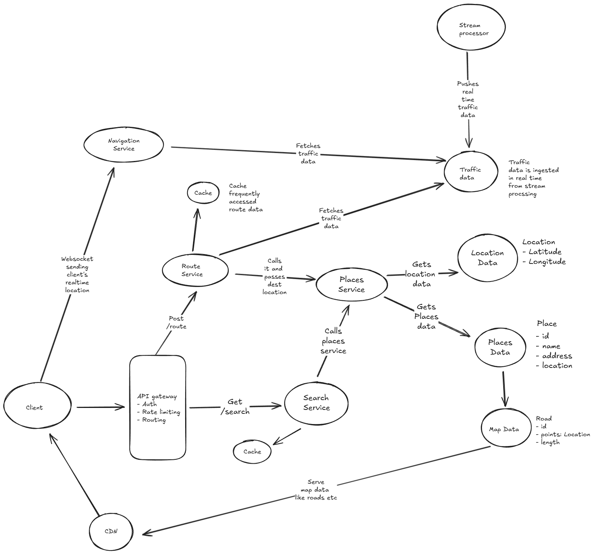

# Navigation System

Design a navigation system like Google Maps that allows users to:

- Search for locations and points of interest (POIs)
- Get turn-by-turn navigation with optimal route calculation
- View real-time traffic conditions and route adjustments
- Estimate travel time for different transportation modes (driving, walking, public transit)
- Get alternative route suggestions
- Share location and ETA with others
- Save favorite locations and recent searches
- Work in offline mode for downloaded map areas

The system should handle millions of users requesting routes simultaneously, provide real-time traffic updates, support global map data, and deliver sub-second route calculations with accurate ETAs.

## Solution

Before going ahead and discussing the design lets take a moment first to understand the requirements for the app we are going to design. Thats is lets first note down "What" we need to design rather than the "How" and "Whys".

### Functional Requirements

- Users should be able to search for locations and points of interest (POIs)
- Users should be able to put in destination location, and get route details along with ETA.
- Users should be able to get turn-by-turn navigation with optimal route calculation with real-time traffic conditions and route adjustments
- Users should be able to get an estimate travel time for different transportation modes.

Out of scope requirements

- Get alternative route suggestions
- Share location and ETA with others
- Save favorite locations and recent searches
- Work in offline mode for downloaded map areas

We can always work with the interviewer to bring these to scope.

### Non functional requirements

- Scale: Millions of users requesting routes simultaneously
- Latency: Sub-second route calculations with accurate ETAs.
- Real time updates to routes as user navigates.
- Availability: System should be highly available in case of failures.

### Core Entities

Once we have the requirements listed down, we will go ahead and list down the core entities of the system.

#### Location

- latitude
- longitude

#### Place

- id
- address
- location: Location

#### Route

- id
- eta
- source: Location
- destination: Location
- roads: Road[]
- distance: number
- travelMode: can be an enum which stores travel modes like walk, car, bike etc

#### Navigation

- id
- currentLocation: Location
- destination: Location
- route: Route
- startTime
- estimatedEndTime

#### Road

- id
- points: Location[]
- length

#### Map

- id
- roads: Road[]
- places: Place[]

### Data characteristics

- Map data is mostly read-heavy with occasional updates for new roads, places, and traffic conditions.
- Route calculations are read-heavy, especially during peak hours. We can use a noSQL database for storing map data and a graph database for route calculations.
- Road and place data is relatively static, we can use a NoSQL database like MongoDB or Cassandra for storing this data.
- Location data is dynamic and needs to be updated frequently. We can use a write-optimized database like PostgreSQL with PostGIS extension for storing location data.
- Route data is dynamic and needs to be updated frequently. We can use a graph database like Neo4j or Amazon Neptune for storing route data.

### API Design

#### Search API

- GET /search?{query}
  returns Places []

#### Route Calculation API

- Post /route
  {
    source: Location,
    destination: Location
  }

  Returns Route details

#### Navigation API

- ws /navigation
  {
    currentLocation: Location,
    destination: Location,
    route: Route
  }

  Returns Navigation details

This will be a request over websockets as we want real time updates to routes as user location changes.

I feel these APIs suffice for now. We can always come back and add more or update them as we go deep in the design.

### High level architecture

We will start very basic and have the requirements working and then work on deep dives.

1. Users should be able to search for locations and points of interest (POIs)

- Users input destination place and send GET request to /search API
- The request is received by the API gateway which does some sanity checks and routes the request to search service.
- The search service calls the places service to get the details of the the places which match the query params passed.
- The places service gets data from places and location data, compute the results and sends it back to search service.
- The results are then routed back to the API gateway which then sends it back to the client.

2. Users should be able to put in destination location, and get route details along with ETA.

- Users input the destination location and send a POST request to /route API, passing the source and destination location in the request body.
- The request is received by the API gateway which does some sanity checks and routes the request to route service.
- The route service calls the places service to get details about the destination place.
- The route service fetches traffic data and computes the best route along with eta and sends it back to API gateway which forwards it to the client.
- The route service uses uses route optimization to compute the best and shortest route. We will not go into the details of the algorithm.

3. Users should be able to get turn-by-turn navigation with optimal route calculation with real-time traffic conditions and route adjustments

- Users select the route suggested by the system and then select start button
- This establishes a websocket connection with the server. The user sends real time location via the connection. They also send the destination details and route selected.
- The navigation service fetches real time data, and uses route optimization algorithms to compute the navigation details and send it back to the users in real time.

Here's the high level diagram of the architecture. Note that this is a very basic architecture and we will be handling deep dives in the next section.



### Addressing Scalability and Reliability

- Global map data distribution and updates: We can use a CDN to distribute map data globally. We can also use a pub-sub system to push updates to map data to all the regions.

- Real-time traffic updates: We can use a pub-sub system to push real-time traffic updates to all the regions. We can also use a stream processing system like Apache Kafka or AWS Kinesis to process real-time traffic data.

- Efficient route calculation at scale: We can use a graph database like Neo4j or Amazon Neptune to store route data. We can also use a caching layer like Redis or Memcached to cache frequently accessed routes. We will be using route optimization algorithms to compute the best and shortest route. We use a stream processing system to process real-time traffic data and update the routes accordingly.

- Sub-second response times: We can use a caching layer like Redis or Memcached to cache frequently accessed routes. We can also use a load balancer to distribute the load across multiple instances of the route service.

- Map tile caching and CDN usage: We can use a CDN to distribute map tiles globally. We can also use a caching layer like Redis or Memcached to cache frequently accessed map tiles.

---

## Enhanced Solution with Deep Dives

### Functional Requirements (Enhanced)

- Search: Location/POI search with autocomplete and ranking
- Route Calculation: Multi-modal routing with real-time traffic
- Navigation: Turn-by-turn guidance with re-routing
- Map Rendering: Dynamic map tiles with different zoom levels
- Traffic Integration: Real-time traffic data from multiple sources

### Non-Functional Requirements (Enhanced)

- Scale: 100M+ users, 1M+ concurrent navigation sessions
- Latency: <100ms search, <200ms route calculation, <50ms map tiles
- Availability: 99.99% uptime with global distribution
- Accuracy: <5m location precision, 95% ETA accuracy

### Core Entities (Enhanced)

#### Road Segment

```json
{
  "id": "road_123",
  "start_node": "node_456",
  "end_node": "node_789",
  "geometry": [[lat1, lon1], [lat2, lon2]],
  "road_type": "highway|arterial|local",
  "speed_limit": 65,
  "length_meters": 1500,
  "one_way": false,
  "toll": true
}
```

#### Traffic Data

```json
{
  "road_segment_id": "road_123",
  "timestamp": "2025-10-03T14:30:00Z",
  "speed_kmh": 45,
  "congestion_level": "moderate",
  "incidents": ["accident", "construction"]
}
```

### Enhanced Architecture components

1. Geocoding Service

- Forward geocoding (address → coordinates)
- Reverse geocoding (coordinates → address)
- POI search with Elasticsearch
- Autocomplete with trie data structures

2. Routing Engine

- Preprocessing: Contraction Hierarchies for highway networks
- A* algorithm with traffic-aware weights
- Route caching with Redis (popular origin-destination pairs)
- Multi-modal routing (driving, walking, transit)

3. Map Tile Service

- Vector tiles for efficient rendering
- Multiple zoom levels (0-18)
- Real-time style updates
- CDN distribution with edge caching

4. Traffic Data Pipeline

- Real-time ingestion from GPS probes, traffic cameras, incidents
- Stream processing with Apache Kafka + Apache Flink
- Machine learning for traffic prediction
- Historical traffic patterns storage

5. Navigation Service

- WebSocket connections for real-time updates
- Route re-calculation when off-route
- Turn-by-turn instruction generation
- ETA updates based on current traffic

### Deep Dive Interview Questions & Answers

#### How would you handle route calculation for millions of concurrent requests?

1. **Preprocessing**: Use Contraction Hierarchies to precompute shortcuts
   - Reduces graph size by 1000x for highway queries
   - Allows sub-millisecond routing for long distances

2. **Caching Strategy**:
   - Popular routes cached in Redis (airport to city center)
   - Cache key: hash(origin, destination, travel_mode, time_of_day)
   - TTL based on traffic volatility (5min for city, 30min for highways)

3. **Load Balancing**:
   - Geographically partition routing servers
   - Route local queries to local servers (data locality)
   - Fallback to global servers for cross-region routes

4. **Algorithmic Optimizations**:
   - Bidirectional A* for faster convergence
   - Early termination when good-enough route found
   - Batch processing for similar queries
  
#### How do you ensure real-time traffic data accuracy and handle data source failures?

1. **Multi-Source Data Fusion**:
   - GPS probes from users (anonymized)
   - Government traffic feeds
   - Third-party providers (Waze, Here)
   - IoT sensors and cameras

2. **Data Quality & Validation**:
   - Outlier detection (speed > speed_limit * 1.5)
   - Temporal consistency checks
   - Cross-validation between sources
   - Machine learning models to detect anomalies

3. **Failure Handling**:
   - Graceful degradation to historical patterns
   - Weighted averaging when some sources fail
   - Circuit breakers for unreliable data sources
   - Fallback to crowd-sourced data

4. **Real-time Processing**:
   - Kafka for data ingestion (partitioned by geographic region)
   - Flink for stream processing and aggregation
   - Update road segment speeds every 30 seconds
   - Push updates to active navigation sessions

#### How would you optimize map tile serving for global users?

1. **Tile Generation Strategy**:
   - Pre-generate tiles for zoom levels 0-12 globally
   - On-demand generation for 13-18 in populated areas
   - Vector tiles for smaller size and dynamic styling

2. **CDN Architecture**:
   - Multi-tier CDN: Global → Regional → Edge
   - Tile caching with smart eviction (LRU + geographic relevance)
   - Pre-warming cache for popular areas

3. **Geographic Partitioning**:
   - Tile servers co-located with user bases
   - Regional tile storage for local optimizations
   - Cross-region replication for disaster recovery

4. **Performance Optimizations**:
   - HTTP/2 for multiplexed tile requests
   - Compression (gzip for vector tiles)
   - Progressive loading (low-res first, then high-res)
   - Predictive pre-fetching based on user movement

#### How would you handle graph data structure for road networks

1. **Graph Representation**:
   - Nodes: Intersections and road junctions
   - Edges: Road segments with weights (time, distance, toll)
   - Adjacency list storage for memory efficiency

2. **Database Choice**:
   - Neo4j for complex routing queries
   - Custom graph storage for performance-critical paths
   - PostgreSQL with graph extensions for metadata

3. **Graph Preprocessing**:
   - Contraction Hierarchies for highway networks
   - Bidirectional search preprocessing
   - Landmark-based routing for long distances

4. **Updates & Versioning**:
   - Incremental updates for road closures/openings
   - Version control for graph changes
   - Blue-green deployment for major updates
   - Real-time edge weight updates for traffic

#### How would you handle different transportation modes in route calculation?

1. **Multi-Modal Graphs**:
   - Separate graphs for driving, walking, cycling
   - Transit graph with schedules and transfers
   - Accessibility graph for wheelchair routing

2. **Mode-Specific Optimizations**:
   - Driving: highways preferred, avoid residential
   - Walking: pedestrian paths, stairs, crosswalks
   - Cycling: bike lanes, elevation considerations
   - Transit: schedules, transfers, real-time delays

3. **Combined Journey Planning**:
   - Park-and-ride combinations
   - Multi-modal transfers (drive to station, then train)
   - Dynamic mode switching based on conditions

---