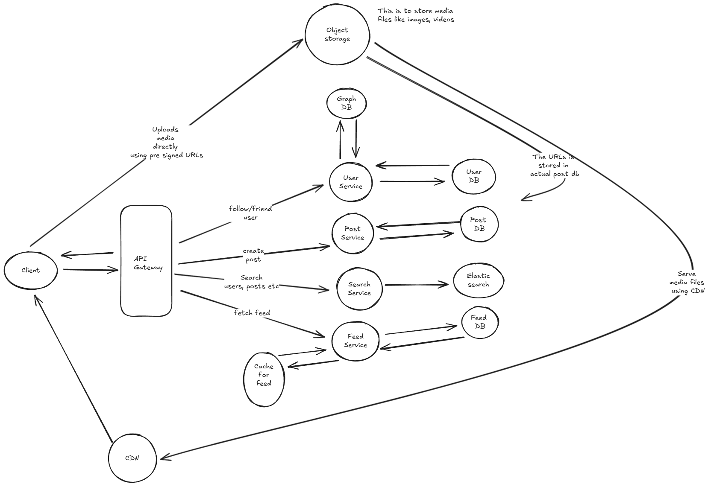

# Question: News Feed System Design

Design a news feed system like Facebook or Twitter that allows users to:

- Post content (text, images, videos)
- Follow/friend other users
- View a personalized feed of content from followed users
- Interact with posts (like, comment, share)

The system should handle millions of users, with thousands of posts per second, and provide a near real-time feed experience.

---

## Answer

Before proceeding with the design, lets first re iterate the problem statement again. We want to design a news feed system like facebook or twitter that allows users to post content, follow/friend others, view feed from followed users, and interact with posts (likes, comment, share)

## Functional requirements

We will first begin with deciding on what we will be building instead of going ahead and designing stuff. Here are the functional requirements of the app

- Users should be able to post contents (text, images, videos)
- Users should be able to follow/friend other users
- Users should be able to view a personalized feed of content from followed users
- Users should be able to like and comment on posts

Below the line scope

- Basic users profile management
- Users authentication and registration
- Users can send messages to each other.

## Non functional requirements

After we have listed down the functional requirements of the app, we will go ahead and list down the non functional requirements of the app

- Scale: 10 Million daily users, Each user can post 10 content per day which makes about 100 Million posts per day.
- Performance: System should provide near real time feed experience
- Latency: System should have low latency (< 500ms) for post creation, feed loading and like/comments etc
- Availability: System should be highly available. In terms of CAP theorem, we will favour availability over consistency when failures occur
- Read/Write Heavy: System is read heavy as users see feed more than they post something

## Data models and data characteristics

After we have listed the non functional requirements, we will go ahead and list down the data models and data characteristics of different types of data along with what database we will prefer for the data models.

### Data models

Here are the data models for our app

#### User

- id
- name
- username
- password (Stored as hash format)
- bio
- email

#### Post

- id
- title
- description
- image_urls
- video_urls
- author_id
- likes (Embedded list of user ids who liked the post)
- comments (Embedded list of comment objects)
- tags
- created_at

Now here we have a trade off to make. We can either embed likes and comments in the post object or we can have separate collections for likes and comments. If we embed likes and comments in the post object, it will be faster to fetch the post along with likes and comments but it will be slower to add a like or comment as we will have to update the entire post object. On the other hand, if we have separate collections for likes and comments, it will be slower to fetch the post along with likes and comments but it will be faster to add a like or comment as we will only have to update the likes or comments collection. Since our system is read heavy, we will prefer embedding likes and comments in the post object.

### Data characteristics

- User data: Relational data, requires strong consistency, frequent reads and writes. We will use a relational database like MySQL or PostgreSQL for user data.

- Post data: Semi-structured data, requires eventual consistency, frequent reads and writes. We will use a NoSQL database like MongoDB or Cassandra for post data.

- Feed data: Semi-structured data, requires eventual consistency, frequent reads and writes. We will use a NoSQL database like MongoDB or Cassandra for feed data.

- Followers/Following data: Highly connected data, requires eventual consistency, frequent reads and writes. We will use a graph database like Neo4j or Amazon Neptune for followers/following data.

- Searchable data: Requires full-text search capabilities. We will use a search engine like Elasticsearch or Solr for searchable data. Here searchable data includes posts, users, tags etc.

- Images/Videos: Requires high throughput and low latency. We will use a distributed file system like Amazon S3 or Google Cloud Storage for storing images and videos. We will also use a CDN like Cloudflare or Akamai for serving images and videos. We will store the URLs of the images and videos in the post object.

Before we go ahead with the API design, we will discuss the approach we will take to generate the feed for a user as it is one of the most important part of the system. There are two main approaches to generate the feed for a user - Pull model and Push model.

### Pull model (Fan out on read)

In the pull model, when a user requests their feed, we will fetch the latest posts from the users they follow and sort them by timestamp to generate the feed. This approach is simple to implement and requires less storage as we don't have to store the feed for each user. However, it can be slow to generate the feed as we have to fetch posts from multiple users and sort them.

### Push model (Fan out on write)

In the push model, when a user creates a new post, we will immediately push that post to the feeds of all their followers. This approach can provide a faster feed generation experience for users, as the feed is pre-populated with the latest posts. However, it requires more storage and can be more complex to implement, as we have to manage the feeds for all users and ensure they are updated in real-time.

### Hybrid model

In the hybrid model, we can use a combination of both pull and push models. For example, we can use the push model for users with a small number of followers and the pull model for users with a large number of followers. This way, we can balance the trade-offs between storage, complexity, and performance. So we will use the hybrid model for our app.

For generating the feed, for the push model, we will need to store the feed for each user. We can use a NoSQL database like MongoDB or Cassandra for storing the feed data. The feed data model can be as follows:

#### Feed

- user_id
- posts (Embedded list of post objects)
- updated_at
- created_at

## API Design

After we have discussed the data models and data characteristics, we will go ahead and design the APIs for our app. Here are the APIs for our app

### User APIs

- POST /users/register: Register a new user
- POST /users/login: Login a user
- GET /users/{user_id}: Get user details
- PUT /users/{user_id}: Update user details
- DELETE /users/{user_id}: Delete a user
- POST /users/{user_id}/follow: Follow a user
- POST /users/{user_id}/unfollow: Unfollow a user

Think this is enough for user APIs. We can add more APIs later if needed.

### Post APIs

- POST /posts: Create a new post
- GET /posts/{post_id}: Get post details
- PUT /posts/{post_id}: Update post details
- DELETE /posts/{post_id}: Delete a post
- POST /posts/{post_id}/like: Like a post
- POST /posts/{post_id}/comment: Comment on a post
- GET /posts/{post_id}/comments: Get comments for a post

### Feed APIs

- GET /feed: Get the feed for the logged in user

Think this is enough for the APIs. We will focus on the main APIs while developing and designing the high level architecture of the app.

## High level architecture

After we have the API design, we will next focus on the high level system design of the app. We will start with a simple architecture diagram to satisfy the functional requirements of the app.

### Components

- Client: The client can be a web app or a mobile app that interacts with the backend services via REST APIs.

- API Gateway: The API Gateway is responsible for routing the requests from the client to the appropriate backend services. It also handles authentication and rate limiting.

- User Service: The User Service is responsible for managing user data, including registration, login, profile management, and following/unfollowing other users. It interacts with the relational database to store and retrieve user data.

- Post Service: The Post Service is responsible for managing post data, including creating, updating, deleting, liking, and commenting on posts. It interacts with the NoSQL database to store and retrieve post data.

- Feed Service: The Feed Service is responsible for generating and serving the personalized feed for each user. It uses a hybrid approach (pull and push model) to generate the feed and interacts with the NoSQL database to store and retrieve feed data.

- Search Service: The Search Service is responsible for providing full-text search capabilities for posts, users, and tags. It interacts with the search engine to perform search queries.

- Databases: We will use a combination of relational and NoSQL databases to store different types of data. For user data, we will use a relational database like MySQL or PostgreSQL. For post and feed data, we will use a NoSQL database like MongoDB or Cassandra. For followers/following data, we will use a graph database like Neo4j or Amazon Neptune. For searchable data, we will use a search engine like Elasticsearch or Solr.

- Object Storage: We will use a distributed file system like Amazon S3 or Google Cloud Storage to store images and videos. We will also use a CDN like Cloudflare or Akamai for serving images and videos.

- Load Balancer: The Load Balancer is responsible for distributing incoming requests across multiple instances of the backend services to ensure high availability and scalability. We will be replicating the services to handle the load and ensure high availability. So we will use a load balancer like AWS ELB or Nginx to distribute the requests.

- CDN: We will use a CDN like Cloudflare or Akamai to serve static assets like images and videos to reduce latency and improve performance.

- Cache: We will use a caching layer like Redis or Memcached to cache frequently accessed data and reduce the load on the databases. Here we will be caching user sessions, frequently accessed posts, and feed data.

## Addressing Scalability and Reliability

To ensure the system can handle millions of users and thousands of posts per second, we will implement the following strategies:

- Horizontal Scaling: We will horizontally scale the backend services by adding more instances as the load increases. This can be achieved using container orchestration tools like Kubernetes or Docker Swarm.

- Database Sharding: We will shard the databases to distribute the data across multiple servers. This will help in handling large volumes of data and improve read/write performance.

- Load Balancing: We will use load balancers to distribute incoming requests across multiple instances of the backend services. This will help in handling high traffic and ensure high availability.

- Caching: We will implement caching strategies to store frequently accessed data in memory. This will help in reducing the load on the databases and improve response times. We can use redis or memcached for caching.

- Asynchronous Processing: We will use message queues like RabbitMQ or Apache Kafka to handle asynchronous tasks like sending notifications, processing images/videos, and updating feeds. This will help in decoupling the services and improve overall system performance.

- Monitoring and Alerting: We will implement monitoring and alerting mechanisms to track the performance and health of the system. This will help in identifying and resolving issues before they impact users. We can use tools like Prometheus, Grafana, or Datadog for monitoring.

- System failures: We will design the system to be resilient to failures by implementing strategies like data replication, failover mechanisms, and regular backups. This will help in ensuring data integrity and availability in case of hardware or software failures. For example, we can use database replication to ensure that data is not lost in case of a database failure. We can also implement failover mechanisms to automatically switch to a backup server in case the primary server goes down. Regular backups will help in recovering data in case of accidental deletions or data corruption.

- Traffic spikes: We will design the system to handle traffic spikes by implementing auto-scaling mechanisms. This will help in dynamically adjusting the number of instances based on the current load. We can use cloud services like AWS Auto Scaling or Google Cloud Autoscaler to automatically scale the instances based on predefined metrics like CPU usage, memory usage, or request count. We can also use caching to reduce the load on the backend services during traffic spikes.

- Feed personalization at scale: We will implement a hybrid approach (pull and push model) to generate the feed for users. For users with a small number of followers, we will use the push model to immediately push new posts to their feeds. For users with a large number of followers, we will use the pull model to fetch the latest posts from the users they follow when they request their feed. This way, we can balance the trade-offs between storage, complexity, and performance.

- Content delivery: We will use a CDN to serve static assets like images and videos. This will help in reducing latency and improving performance for users across different geographical locations. The CDN will cache the static assets at edge locations, which are closer to the users, thereby reducing the time taken to load the assets.
