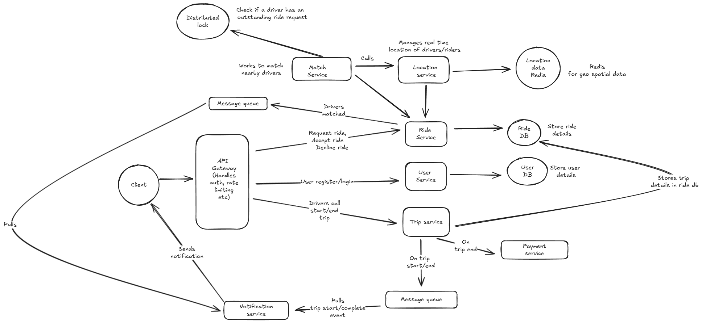

# Question: Ride-Sharing System Design

Design a ride-sharing system like Uber or Lyft that allows:

- Riders to request rides and get matched with nearby drivers
- Drivers to accept/decline ride requests and navigate to pickup/destination
- Real-time location tracking for both riders and drivers
- Dynamic pricing based on demand and supply
- Trip management (start trip, end trip, payment processing)
- Rating and review system for drivers and riders

The system should handle millions of users across multiple cities, with thousands of concurrent ride requests and real-time location updates.

---

## Answer

Before going ahead and designing the solution, lets first re iterate what we are planning to build here. The ask here is to design a ride-sharing system like Uber or Lyft that allows:

- Riders to request rides and get matched with nearby drivers
- Drivers to accept/decline ride requests and navigate to pickup/destination
- Real-time location tracking for both riders and drivers
- Dynamic pricing based on demand and supply
- Trip management (start trip, end trip, payment processing)
- Rating and review system for drivers and riders

### Functional requirements

Before going ahead with the design, lets first focus on the functional requirements of the app we are going to design, i.e. focus on "what" of the system and not "how"

These are the core functional requirements we will be focussing on:

- Riders should be able to input a start location and a destination and get a fare estimate.
- Riders should be able to request a ride based on the estimated fare.
- Upon request, riders should be matched with a driver who is nearby and available.
- Drivers should be able to accept/decline a request and navigate to pickup/drop-off.
- Real-time location tracking for both riders and drivers
- Trip management (start trip, end trip, payment processing) (Can be optional, but lets take it for this design)

Below the scope

- Dynamic pricing based on demand and supply
- Rating and review system for drivers and riders
- Multiple stops
- User Profile management
- Schedule rides
- Different types of vehicles like XL, Sedan and dynamic fares

### Non functional requirements

Once we have listed the functional requirements, we will go ahead and list down the non functional requirements of the app

- Scale: 1 Million daily active users, each user can request max 10 rides a day which takes to 10 Million rides a day. Also lets say 100 concurrent users, so this makes it 100 concurrent rides at one point in time. This means system should be scalable to support this much traffic and load

- Availability: System should be highly available, In terms of CAP theorem, we favor availability over consistency when failures happen.

- Performance: System should be highly performant, the driver matching algorithm should be near accurate

- Latency: System should support low latency (< 100ms) for location updates or real time location monitoring. Also driver matching should be of low latency (< 500 ms)

- Consistency: System should be eventually consistent, for example, if a user requests a ride, it should be reflected in the driver's app within a few seconds.
We need strong consistency for driver matching, i.e. a driver should not receive multiple ride requests at the same time.

### Data models and data characteristics

Once we have the functional and non functional requirements, we will go ahead and design the data models for the app.

Data models:
Below are the core data models we will be using, we can add more to the list, but this suffices for now

#### User

- user_id (Primary Key)
- name
- email
- phone_number
- user_type (Rider/Driver)
- vehicle_info (if user_type is Driver)
- password (Stored securely, hashed and salted)
- created_at

#### Location

- location_id (Primary Key)
- latitude
- longitude

#### Ride

- ride_id (Primary Key)
- rider_id (Foreign Key to User)
- driver_id (Foreign Key to User)
- start_location (foreign key to Location)
- end_location (foreign key to Location)
- status (enum: PENDING, IN_PROGRESS, COMPLETED, CANCELLED)
- created_at
- updated_at
- fare_estimate

#### Payment

- payment_id (Primary Key)
- ride_id (Foreign Key to Ride)
- amount
- payment_method (enum: CREDIT_CARD, DEBIT_CARD, PAYPAL, WALLET)
- status (enum: PENDING, COMPLETED, FAILED)
- created_at
  
Data characteristics:

- User data: Relatively static, changes infrequently (e.g., profile updates). We can use a relational database for this.

- Location data: Highly dynamic, changes frequently (e.g., real-time location updates). We can use a NoSQL database or in-memory store for this. For real time location tracking, we can use a pub-sub system like Kafka or Redis Pub/Sub.

- Ride data: Semi-static, changes during the ride (e.g., status updates). We can use a relational database for this.

- Payment data: Relatively static, changes infrequently (e.g., payment status updates). We can use a relational database for this as we want strong consistency here.

### API design

Once we have the data models, we will go ahead and design the APIs for the app.

#### User APIs

- POST /users/register: Register a new user (rider or driver)
- POST /users/login: Login a user and return an authentication token

#### Ride APIs

- POST /rides/request: Request a new ride (rider)
- PATCH /rides/{rideId}: Update ride status (driver)
Body: {
  status: "accepted" | "declined" | "started" | "ended"
}
- GET /rides/{ride_id}: Get ride details (rider/driver)
- GET /rides/history: Get ride history (rider/driver)

#### Payment APIs

- POST /payments/process: Process payment for a ride (rider)
- GET /payments/{payment_id}: Get payment details (rider)
- GET /payments/history: Get payment history (rider)

#### Real-time location tracking

- POST /location/update: Update real-time location (driver)
- GET /location/track/{driver_id}: Track real-time location (rider)
- GET /location/nearby: Get nearby drivers (rider)

### High level architecture

### Component design

- Client: Mobile apps (iOS/Android) for riders and drivers to interact with the system.

- API Gateway: Entry point for all client requests, handles authentication, rate limiting, and routing to appropriate services.

- User Service: Manages user registration, authentication, and profile management.

- Ride Service: Handles ride requests, driver matching, ride status updates, and trip management.

- Payment Service: Manages payment processing, transaction history, and payment methods.

- Location Service: Handles real-time location updates and tracking for drivers and riders.

- Notification Service: Sends notifications to users (e.g., ride request, ride status updates).

- Trip service: Manages the lifecycle of a trip from start to end, including fare calculation and trip history.

- Matching Service: Implements the driver matching algorithm based on proximity and availability. This service can use spatial indexing (like R-trees) to efficiently find nearby drivers. It can also consider factors like driver ratings and estimated time of arrival (ETA).

- Database: Stores user data, ride data, payment data, and location data. We can use a combination of relational databases (e.g., PostgreSQL) for structured data and NoSQL databases (e.g., MongoDB) for unstructured or semi-structured data.

- Location Store: A high-speed in-memory store (e.g., Redis) to handle real-time location updates and queries. This store can use geospatial indexing to efficiently query nearby drivers.

- Message Queue: A message broker (e.g., Kafka, RabbitMQ) to handle asynchronous communication between services, especially for real-time location updates and notifications. E.g. When a driver is matched, the ride service can publish a message to a topic that the notification service subscribes to, which then sends a notification to the driver. Also when trip status changes, the trip service can publish a message to a topic that the notification service subscribes to, which then sends a notification to the rider.

- Load Balancer: Distributes incoming requests across multiple instances of services to ensure high availability and reliability.

- Caching Layer: A caching layer (e.g., Redis, Memcached) to store frequently accessed data, such as user profiles and ride history, to reduce database load and improve performance.

### Addressing scalability and reliability

- Horizontal Scaling: Each service can be scaled independently based on demand. For example, during peak hours, we can scale the Ride Service and Location Service to handle increased ride requests and location updates.

- Database Sharding: For databases, we can implement sharding to distribute data across multiple database instances. For example, we can shard the Ride table based on ride_id or user_id to ensure that no single database instance becomes a bottleneck.

- Caching: Implement caching for frequently accessed data to reduce database load and improve response times. For example, we can cache user profiles and ride history.

- Load Balancing: Use load balancers to distribute incoming requests across multiple instances of services to ensure high availability and reliability.

- Real time location updates at scale: For real time location tracking we can use kafka or redis pub/sub to handle high throughput of location updates. For Redis, we can use its geospatial indexing capabilities to efficiently query nearby drivers. For Kafka, we can partition the topic based on driver_id to ensure that location updates for a specific driver are handled by the same consumer instance. This ensures that location updates are processed in order and reduces the chances of data inconsistency. For scaling, we can run multiple instances of the location service and use a load balancer to distribute incoming location updates across these instances. We can also use a combination of Redis and Kafka, where Redis is used for real-time querying of nearby drivers, and Kafka is used for processing and storing location updates.

- Matching algorithm at scale: For the matching algorithm, we can use spatial indexing (like R-trees) to efficiently find nearby drivers. We can also consider factors like driver ratings and estimated time of arrival (ETA). To scale the matching service, we can run multiple instances of the service and use a load balancer to distribute incoming ride requests across these instances. We can also implement caching for frequently accessed data, such as driver locations, to reduce database load and improve performance.

- Handling peak demand in different geographical areas: To handle peak demand in different geographical areas, we can implement a dynamic scaling strategy based on real-time demand. For example, we can monitor the number of ride requests in different areas and scale the Ride Service and Location Service instances accordingly. We can also implement a priority queue for ride requests, where requests from high-demand areas are prioritized for matching with available drivers.

- Ensuring trip consistency and payment reliability: To ensure trip consistency and payment reliability, we can implement a two-phase commit protocol for critical operations, such as starting and ending a trip, and processing payments. This ensures that either all operations succeed or none do, maintaining data integrity. We can also implement retries and dead-letter queues for failed payment transactions to ensure that payments are eventually processed.

### Trade-offs and considerations

- Consistency vs. Availability: In a distributed system, we often have to choose between consistency and availability. For example, in the case of a network partition, we may choose to prioritize availability over consistency, allowing users to continue using the app even if some data is temporarily inconsistent.

- Latency vs. Throughput: We may have to choose between low latency and high throughput for certain operations. For example, real-time location updates may prioritize low latency, while ride requests may prioritize high throughput.

---

### Some deep dive question and answers

#### How do we handle frequent driver location updates and efficient proximity searches on location data?

Managing the high volume of location updates from drivers and performing efficient proximity searches to match them with nearby ride requests is a difficult task, and our current high-level design most definitely does not handle this well. There are two main problems with our current design that we need to solve:

- High Frequency of Writes: Given we have around 10 million drivers, sending locations roughly every 5 seconds, that's about 2 million updates a second! Whether we choose something like DynamoDB or PostgreSQL (both great choices for the rest of the system), either one would either fall over under the write load, or need to be scaled up so much that it becomes prohibitively expensive for most companies.

- Query Efficiency: Without any optimizations, to query a table based on lat/long we would need to perform a full table scan, calculating the distance between each driver's location and the rider's location. This would be extremely inefficient, especially with millions of drivers. Even with indexing on lat/long columns, traditional B-tree indexes are not well-suited for multi-dimensional data like geographical coordinates, leading to suboptimal query performance for proximity searches. This is essentially a non-starter.

Solution

We can address all the limitation of the previous solutions by using an in-memory data store like Redis, which supports geospatial data types and commands. This allows us to handle real-time driver location updates and proximity searches with high throughput and low latency while minimizing storage costs with automatic data expiration.

Redis is an in-memory data store that supports geospatial data types and commands. It uses geohashing to encode latitude and longitude coordinates into a single string key, which is then indexed using a sorted set. This allows for efficient storage and querying of geospatial data.

Redis provides geospatial commands like GEOADD for adding location data and GEOSEARCH for querying nearby locations within a given radius or bounding box. These commands are highly optimized for geospatial data and can be used to efficiently handle real-time driver location updates and proximity searches. The GEOSEARCH command, introduced in Redis 6.2, replaces and enhances the functionality of the older GEORADIUS and GEORADIUSBYMEMBER commands, offering more flexibility and performance improvements.

Additionally, Redis automatically expires data based on a specified time-to-live (TTL), which allows us to retain only the most recent location updates and avoid unnecessary storage costs.

#### How do we prevent multiple ride requests from being sent to the same driver simultaneously?

We defined consistency in ride matching as a key non-functional requirement. This means that we only request one driver at a time for a given ride request AND that each driver only receives one ride request at a time. That driver would then have 10 seconds to accept or deny the request before we move on to the next driver if necessary. If you've solved Ticketmaster before, you know this problem well -- as it's almost exactly the same as ensuring that a ticket is only sold once while being reserved for a specific amount of time at checkout.

Solution

To solve the timeout issue, we can use a distributed lock implemented with an in-memory data store like Redis. When a ride request is sent to a driver, a lock is created with a unique identifier (e.g., driverId) and a TTL set to the acceptance window duration of 10 seconds. The Ride Matching Service attempts to acquire a lock on the driverId in Redis. If the lock is successfully acquired, it means no other service instance can send a ride request to the same driver until the lock expires or is released. If the driver accepts the ride within the TTL window, the Ride Matching Service updates the ride status to "accepted" in the database, and the lock is released in Redis. If the driver does not accept the ride within the TTL window, the lock in Redis expires automatically. This expiration allows the Ride Matching Service to consider the driver for new ride requests again.

#### How can we ensure no ride requests are dropped during peak demand periods?

During peak demand periods, the system may receive a high volume of ride requests, which can lead to dropped requests. This is particularly problematic during special events or holidays when demand is high and the system is under stress. We also need to protect against the case where an instance of the Ride Matching Service crashes or is restarted, leading to dropped rides.

Solution

To address this issue, we can introduce a queueing system with dynamic scaling. When a ride request comes in, it is added to the queue. The Ride Matching Service then processes requests from the queue in a first-come, first-served manner. If the queue grows too large, the system scales horizontally by adding more instances of the Ride Matching Service to handle the increased load. This allows us to scale the system dynamically based on demand, ensuring that no requests are dropped. We can also partition the queues based on geographic regions to further improve efficiency.

We could use a distributed message queue system like Kafka, which allows us to commit the offset of the message in the queue only after we have successfully found a match. This way, if the Ride Matching Service goes down, the match request would still be in the queue, and a new instance of the service would pick it up. This approach ensures that no ride requests are lost due to service failures and provides fault tolerance to our system.

Challenges

While this approach addresses the issue of dropped requests, it introduces new challenges. The queueing system itself must be highly available and scalable to handle the increased load during peak periods. Additionally, we need to ensure that the Ride Matching Service can process requests from the queue efficiently to avoid long wait times for riders. This may require optimizing the matching algorithm and ensuring that the service instances are properly load-balanced.

Also prioritizing requests in the queue based on factors like rider rating or estimated wait time could be considered to improve user experience during peak times. 

#### What happens if a driver fails to respond in a timely manner?

If a driver fails to respond to a ride request within the specified time window (e.g., 10 seconds), the system should automatically move on to the next available driver. This ensures that riders are not left waiting indefinitely for a response and helps maintain a smooth user experience.

A more robust solution is to use a durable execution framework like Temporal or AWS Step Functions. These systems provide built-in support for timeouts, retries, and state management in a way that survives service crashes and restarts.

With durable execution, the entire ride matching workflow is modeled as a durable workflow that can handle complex business logic, including driver timeouts, retries, and fallback mechanisms. The workflow maintains its state persistently, so even if the service crashes, the workflow can be resumed from where it left off.

For example, a Temporal workflow would:

- Send the ride request to the first driver
- Set a 10-second timeout
- If the driver accepts, complete the workflow
- If the driver declines or times out, automatically move to the next driver
- Continue this process until a driver is found or all drivers are exhausted
- The entire process is fault-tolerant and can handle service failures, network issues, and other disruptions without losing state or dropping ride requests.

Challenges
The main challenge with this approach is the additional complexity of introducing a workflow orchestration system. It requires teams to learn new concepts and tools, and adds another component to the system that needs to be monitored and maintained.
However, the benefits of guaranteed execution, built-in fault tolerance, and simplified business logic often outweigh these challenges, especially for mission-critical systems like ride-sharing platforms where dropped requests directly impact revenue and user experience.
