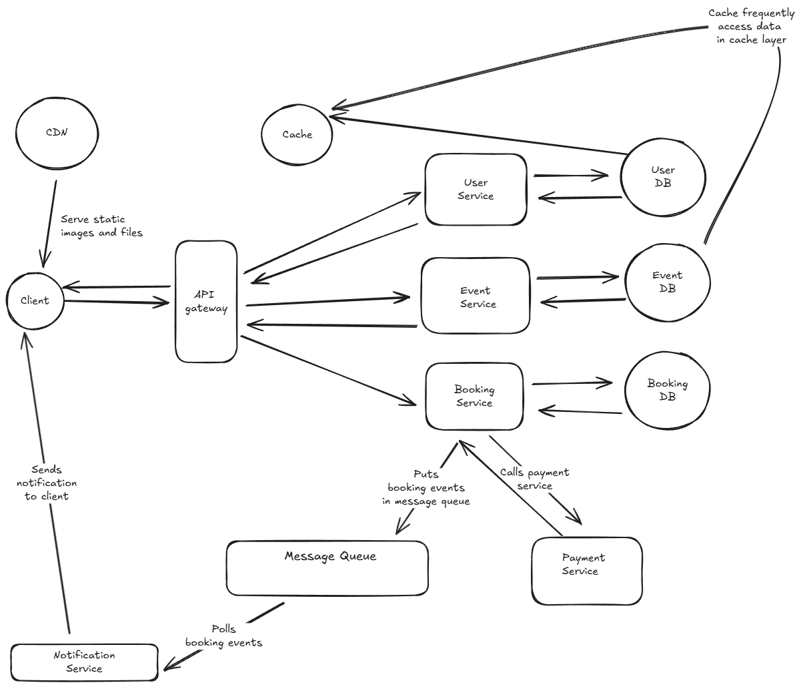

# Question: Ticketmaster System Design

Design a ticket booking system like Ticketmaster that allows users to browse events, select seats, and purchase tickets. The system should handle high-concurrency scenarios like popular concert ticket sales where thousands of users try to book tickets simultaneously.

---

## Answer

Before proceeding with the design, lets first re iterate the problem statement again. We will be designing a ticket booking system where users can browse events, select seats and purchase tickets.  The system should handle high-concurrency scenarios like popular concert ticket sales where thousands of users try to book tickets simultaneously.

## Functional requirements

We will first begin with deciding on what we will be building instead of going ahead and designing stuff. Here are the functional requirements of the app

- Users should be able to browse for events.
- Users should be able to select seats.
- Users should be able to buy tickets.
- Users should be able to cancel bookings.

We can add more advanced features but this is a good list to start

## Non functional requirements

Once we have figured out the functional requirements, we will next be focussing on list the non functional requirements. Here are the non functional requirements of the app

- Scale: Around 10K concurrent users during peak time trying to book tickets
- Performance: System should support low latency
- Availability: System should be up and highly available around 99.9% of time. However in case of failures, system should favor consistency over availability in terms of CAP theorem, as we want to avoid situations like double booking, money deducted but no booking made etc.
- Consistency: System should be strongly consistent
- For transaction handling, system should support ACID properties and be robust enough to handle failures and favor consistency over availability.
- Read to write: The system will have more reads than writes, as users will be browsing events more often than booking tickets.

## Data models and data characteristics

After we have laid down the non functional requirements, we will focus next on listing the data models for our app along with the data characteristics of the types of data in the system.

The data models are listed below, we will start simple and just lay down enough data models to satisfy the functional requirements of the app

### User

User model of the app, it will have below set of attributes

- id
- name
- email
- username
- password (Stored in hash form)
- bookings (List of booking ids)

### Event

Event model of the app

- id
- title
- description
- event_time
- venue
- total_seats
- available_seats
- price_per_seat

### Booking

- id
- user_id
- event_id
- seat_number
- booking_time
- status (booked, cancelled)

Now since we have the data models, we will next focus on the data characteristics of the data in the system

- User data: This data will be mostly read and less frequently written. Users will be created when someone signs up, and updated when they change their details. However, reads will be more frequent as users will be browsing events.
We can use a relational database like PostgreSQL or MySQL to store user data. We can also use a NoSQL database like MongoDB if we want to store more flexible data. We will go ahead and use a relational database for this as we want to store user data in a structured format.

- Event data: This data will be mostly read and less frequently written. Events will be created when an event is added, and updated when event details change. However, reads will be more frequent as users will be browsing events.
We can use a relational database like PostgreSQL or MySQL to store event data. We can also use a NoSQL database like MongoDB if we want to store more flexible data. For event data we can use a noSQL database as event data can be more flexible and we might want to store additional details in future and no SQL databases are more flexible in terms of schema. Event data can eventually be consistent as we can afford to have some delay in updating event details.

- Booking data: This data will be written frequently as users book tickets. However, reads will also be frequent as users will want to view their bookings.
We can use a relational database like PostgreSQL or MySQL to store booking data as we want to store booking data in a structured format and we also want to ensure ACID properties for transactions. Booking data needs to be strongly consistent to avoid double bookings.

- Search data: We will also need to store search data to allow users to search for events. This data will be mostly read and less frequently written. We can use a search engine like Elasticsearch or Solr to store search data. Search data can be eventually consistent as we can afford to have some delay in updating search index.

- Cache data: We will also need to store cache data to improve performance. This data will be mostly read and less frequently written. We can use a caching solution like Redis or Memcached to store cache data. Cache data can be eventually consistent as we can afford to have some delay in updating cache. We can cache frequently accessed data like event details, user details etc.

## API design

Next we will focus on the API design of the app. We will start with a simple set of APIs to satisfy the functional requirements of the app

### User APIs

- POST /users: Create a new user
- GET /users/{id}: Get user details
- PUT /users/{id}: Update user details
- DELETE /users/{id}: Delete a user
- GET /users/{id}/bookings: Get all bookings for a user
- GET /users/{id}/payments: Get all payments for a user
- POST /users/login: Login a user
- POST /users/logout: Logout a user

### Event APIs

- POST /events: Create a new event
- GET /events: Get all events
- GET /events/{id}: Get event details
- PUT /events/{id}: Update event details
- DELETE /events/{id}: Delete an event
- GET /events/search: Search for events
- GET /events/{id}/seats: Get available seats for an event
- GET /events/{id}/bookings: Get all bookings for an event
- GET /events/{id}/payments: Get all payments for an event

### Booking APIs

- POST /bookings: Create a new booking
- GET /bookings/{id}: Get booking details
- PUT /bookings/{id}: Update booking details
- DELETE /bookings/{id}: Cancel a booking
- GET /bookings/{id}/payment: Get payment details for a booking
- GET /bookings/user/{user_id}: Get all bookings for a user
- GET /bookings/event/{event_id}: Get all bookings for an event
- GET /bookings: Get all bookings

### Payment APIs

- POST /payments: Create a new payment
- GET /payments/{id}: Get payment details
- PUT /payments/{id}: Update payment details
- DELETE /payments/{id}: Delete a payment
- GET /payments/booking/{booking_id}: Get payment details for a booking

## High level system design

After we have the API design, we will next focus on the high level system design of the app. We will start with a simple architecture diagram to satisfy the functional requirements of the app.

Here is a brief description of the components in the architecture diagram

- Client: The client can be a web app or a mobile app that allows users to interact with the system. The client will make API calls to the backend services to perform various operations like browsing events, booking tickets etc.

- API Gateway: The API Gateway will act as a single entry point for all the client requests. It will route the requests to the appropriate backend services. It will also handle authentication, rate limiting, caching etc.

- User Service: The User Service will handle all user related operations like creating a new user, updating user details, deleting a user etc. It will interact with the User Database to store and retrieve user data.

- Event Service: The Event Service will handle all event related operations like creating a new event, updating event details, deleting an event etc. It will interact with the Event Database to store and retrieve event data.

- Booking Service: The Booking Service will handle all booking related operations like creating a new booking, updating booking details, cancelling a booking etc. It will interact with the Booking Database to store and retrieve booking data. It will also interact with the Payment Service to handle payments for bookings.

- Payment Service: The Payment Service will handle all payment related operations like creating a new payment, updating payment details, deleting a payment etc. It will interact with the Payment Database to store and retrieve payment data. It will also interact with third party payment gateways to process payments.

- Message Queue: The Message Queue will be used to decouple the services and allow them to communicate asynchronously. For example, when a booking is completed, the booking service can send a message to the notification service to send a confirmation email to the user.

- Notification Service: The Notification Service will handle all notification related operations like sending confirmation emails, SMS etc. It will interact with the Message Queue to receive messages from other services.

- User Database: The User Database will store all user related data. We can use a relational database like PostgreSQL or MySQL to store user data.

- Event Database: The Event Database will store all event related data. We can use a NoSQL database like MongoDB to store event data.

- Booking Database: The Booking Database will store all booking related data. We can use a relational database like PostgreSQL or MySQL to store booking data.

- Cache: The Cache will be used to store frequently accessed data to improve performance. We can use a caching solution like Redis or Memcached to store cache data.

- CDN: The CDN will be used to serve static assets like images, CSS, JS etc. to improve performance.

- Search Engine: The Search Engine will be used to store search data to allow users to search for events. We can use a search engine like Elasticsearch or Solr to store search data.

## Addressing Scalability and Reliability

Next we will focus on how to address scalability and reliability in the system. Here are some strategies to address scalability and reliability

- System failures: We can use load balancers to distribute the load across multiple instances of the services. We can also use auto scaling to automatically scale up or down the number of instances based on the load. We can also use health checks to monitor the health of the services and automatically replace unhealthy instances.

- Database failures: We can use database replication to create multiple copies of the database to ensure high availability. We can also use database sharding to distribute the data across multiple database instances to improve performance. We can also use database backups to restore the database in case of failures.

- Idempotency: We can use unique identifiers for each request to ensure that the same request is not processed multiple times. We can also use database transactions to ensure that a series of operations are either all completed or none are completed. Usually the booking service will be responsible for ensuring idempotency. We can use a idempotency key for each booking request to ensure that the same booking request is not processed multiple times.

- Caching: We can use caching to store frequently accessed data to improve performance. We can use a caching solution like Redis or Memcached to store cache data. We can also use a CDN to serve static assets like images, CSS, JS etc. to improve performance.

- Handling payment processing: We can use third party payment gateways to process payments. We can also use a message queue to decouple the payment service from the booking service to ensure that the booking service is not blocked while waiting for the payment to be processed. We can also use database transactions to ensure that a booking is only confirmed if the payment is successful.

- Traffic spikes: We can use load balancers to distribute the load across multiple instances of the services. We can also use auto scaling to automatically scale up or down the number of instances based on the load. We can also use caching to store frequently accessed data to improve performance.

- Prevent overselling: We can use database transactions to ensure that a seat is only booked if it is available. We can also use optimistic locking to ensure that multiple users do not book the same seat at the same time. We can also use a distributed lock to ensure that only one user can book a seat at a time.

- Seat locking and prevent double booking: We can use a distributed lock to ensure that only one user can book a seat at a time. We can also use optimistic locking to ensure that multiple users do not book the same seat at the same time. We can also use database transactions to ensure that a seat is only booked if it is available. We can set a timeout for the lock to ensure that the lock is released if the user does not complete the booking process within a certain time frame.

- Monitoring and logging: We can use monitoring tools like Prometheus, Grafana etc. to monitor the health of the services and databases. We can also use logging tools like ELK stack, Splunk etc. to collect and analyze logs from the services and databases.
