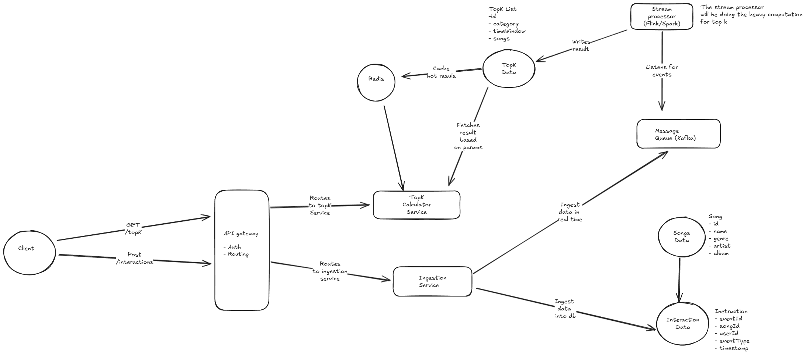

# Top K Content Ranking System

Design a system like Spotify's "Top 50 Global" or YouTube's "Trending Videos" that:

- Tracks user interactions (plays, likes, shares, comments) in real-time
- Calculates trending/popular content across different time windows (hourly, daily, weekly)
- Generates Top K lists for different categories (genre, region, age group)
- Updates rankings in near real-time as new data arrives
- Provides APIs for different Top K queries (global, regional, categorical)

Out of scope

- User authentication and profile management
- Content recommendation algorithms
- Content delivery and streaming infrastructure
- User interface and front-end design
- Supports historical trend analysis and comparison

The system should handle massive event volumes, provide sub-second query responses for Top K lists, support multiple ranking algorithms, and maintain accuracy even with high data velocity.

## Solution

Before diving into the design, let's clarify some requirements and constraints:

### Functional Requirements

Before we start designing the system, let's clarify the functional requirements:

- The system should track user interactions such as plays, likes, shares, and comments in real-time.
- It should calculate trending/popular content across different time windows (hourly, daily, weekly).
- The system should generate Top K lists for different categories (genre, region, age group).
- Rankings should be updated in near real-time as new data arrives.
- The system should support historical trend analysis and comparison.
- APIs should be provided for different Top K queries (global, regional, categorical).
- Here we will focus on the Top K songs for spotify.

### Non-Functional Requirements

- Scale: The system should handle millions of events per second from global users.
- Latency: The system should provide sub-second query responses for Top K lists.
- Accuracy: The system should maintain accuracy even with high data velocity.
- Real time: The system should update rankings in near real-time as new data arrives.

### Core Entities

After we have clarified the requirements, we can identify the core entities involved in the system:

#### User

- Attributes: UserID, Location, AgeGroup, Preferences

#### Song

- Attributes: SongID, Genre, Artist, Album, ReleaseDate

#### InteractionEvent

- Attributes: EventID, UserID, SongID, EventType (Play, Like, Share, Comment), Timestamp

#### TopKList

- Attributes: ListID, Category (Global, Regional, Genre, AgeGroup), TimeWindow (Hourly, Daily, Weekly), Songs (List of SongIDs with ranks)

### Data characteristics

- User Data: User data is mostly static with very few changes. We can use a relational database like PostgreSQL for storing user data.

- Song Data: Song data is also mostly static with occasional changes. We can use a relational database like postgreSQL as well for it.

- Interaction Event: Interaction event changes a lot. We need a write heavy database for this. For this case, we can use a NoSQL database like cassandra which allows fast writes. We can also use a time series database for this one. But lets stick with Cassandra for now.

- TopKList Data: This data also changes frequently based on time window. We can again use a write heavy database like cassandra for this one as well.

### API Design

- POST /interactions
  - Description: Record a user interaction event.
  - Request Body: { UserID, SongID, EventType, Timestamp }
  - Response: { Status, EventID }

- GET /topk
- Description: Retrieve the Top K list for a specific category and time window.
  - Query Parameters: { Category, TimeWindow, K }
  - Response: { ListID, Songs (List of SongIDs with ranks) }

### High-Level Architecture

Here is the high level architecture of the system

#### Components

- Clients: Users interact with the system through web or mobile applications.
- API Gateway: Handles incoming API requests and routes them to appropriate services.
- Interaction Service: Processes user interaction events and stores them in the Interaction Event Database and also sends the events to the Message Queue for real-time processing.
- Message Queue: A distributed message queue (like Kafka) to handle high throughput of interaction events and ensure reliable delivery to the Real-Time Processing Service.
- Top K Calculation Service: Consumes events from the Message Queue, updates real-time counts, and recalculates Top K lists using efficient algorithms and data structures.
- Databases:
  - User Database: Stores user information (PostgreSQL).
  - Song Database: Stores song metadata (PostgreSQL).
  - Interaction Event Database: Stores user interaction events (Cassandra).
  - Top K List Database: Stores precomputed Top K lists for fast retrieval (Cassandra).
- Cache: An in-memory cache (like Redis) to store frequently accessed Top K lists for sub-second query responses.
- Stream processing: A stream processing framework (like Apache Flink or Spark Streaming) to handle real-time data processing and aggregation.

#### Data Flow

1. Users interact with the system through web or mobile applications, generating interaction events.
2. The Interaction Service receives these events via the API Gateway and stores them in the Interaction Event Database. It also sends the events to the Message Queue for real-time processing.
3. The Top K Calculation Service consumes events from the Message Queue, updates real-time counts, and recalculates Top K lists using efficient algorithms and data structures. We will not focus on the algorithm here.
4. The recalculated Top K lists are stored in the Top K List Database and also updated in the Cache for fast retrieval.
5. When users request Top K lists via the API Gateway, the request is routed to the Top K Calculation Service, which first checks the Cache for the requested list. If not found, it retrieves the list from the Top K List Database and returns it to the user.
6. For historical trend analysis, the system can periodically aggregate and store historical Top K lists in a separate database for comparison and analysis.

#### Addressing Scalability and Reliabilty

- Massive event ingestion: Use a distributed message queue (like Kafka) to handle high throughput of interaction events and ensure reliable delivery to the Real-Time Processing Service.

- Real time ranking computation at scale: We will use a stream processing framework (like Apache Flink or Spark Streaming) to handle real-time data processing and aggregation. We will also use efficient algorithms and data structures to maintain Top K lists.

- Efficient top K queries with subsecond response: Use an in-memory cache (like Redis) to store frequently accessed Top K lists for sub-second query responses. We will also precompute Top K lists and store them in a write heavy database (like Cassandra) for fast retrieval. Algorithm will also play a key role here. I honestly I am not sure which algorithm to use here. We can use a combination of min-heap and hash map to maintain the top K songs and other advanced data structures like Count-Min Sketch for approximate counting. I do not know how to implement these algorithms, but will study them later.

- Handling data skew and hot items: We can use techniques like consistent hashing to distribute load evenly across servers. We can also implement rate limiting and backpressure mechanisms to prevent overload on any single component.

- Global distribution and regional rankings: We can deploy the system in multiple regions and use geo-distributed databases to store regional data. We can also use a CDN to cache frequently accessed data closer to users. I personally do not know how to implement this. Will need to study more.

### Handling failure Scenarios

- Event ingestion failure: Implement retries and dead-letter queues in the Message Queue to handle transient failures. Use monitoring and alerting to detect and respond to persistent failures.

- Ranking computation failure: Use checkpointing and state recovery mechanisms in the stream processing framework to recover from failures. Implement monitoring and alerting to detect and respond to failures.

- Stream processing failures(lag in real time updates): Use backpressure mechanisms in the stream processing framework to handle overload situations. Implement monitoring and alerting to detect and respond to processing delays. We can also scale up the stream processing framework to handle higher loads or tune them for better performance.

- Data skew handling: Use techniques like consistent hashing to distribute load evenly across servers. Implement rate limiting and backpressure mechanisms to prevent overload on any single component.

- Cache failures: Implement cache replication and failover mechanisms to ensure high availability. Use monitoring and alerting to detect and respond to cache failures. In beginning we can also fall back to the database if cache is down as cache will need time to get warm again.

---