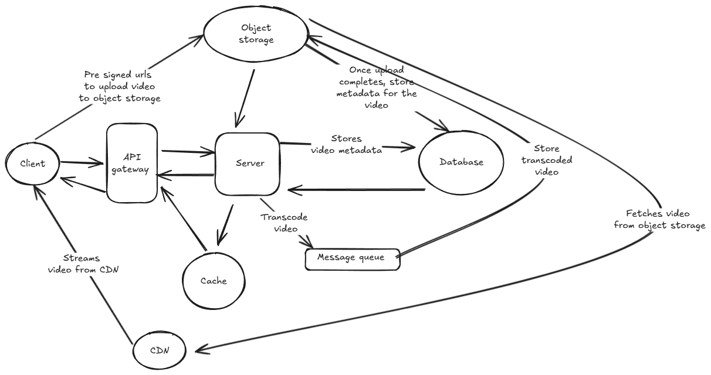

# Question 1: Video Streaming Platform

Design a video streaming platform like YouTube that allows users to upload videos, view content, and interact with videos (likes, comments, subscriptions).

---

## Answer

So I will first iterate the problem statement here, we have to design a video streaming platform like YouTube that allows users to upload videos, view content and interact with videos (likes, comments, and subscriptions)

We will begin with clarifying the functional requirements first, as we need to be clear on what needs to be built before proceeding

### Functional requirements

- Users should be able to upload videos
- Users should be able to view videos
- Users should be able to like, comment on videos
- Users should be able to subscribe to channels (Advanced, can discuss if in scope)
- Users should be getting notifications for new videos (Again advanced, can avoid for now)
- Basic User registration and login
- Videos can be viewed in different resolutions (480P, 720P, 1080P, etc)

### Non functional requirements

Once functional requirements are laid down, we will next focus on non functional requirements

- Scale: 1 Million daily active users, with 10K concurrent viewers
- Availability: System should have high availability like 99.9 % uptime
- Read to write ratio: System is read heavy as users view videos more than they upload or interact with it.
- Latency: System should support low latency for video streaming, if network is bad or if congestion is there, videos can be streamed in lower resolution.

### Data models and data characteristics

Once we have both the functional and non functional requirements laid down, we will decide on data models for our app and also on the data characteristics.

Next up, we will list down the data models for our app with minimal set of attributes.

1. User: User for our app, it will have these attributes

- id
- name
- email
- username
- password: This will stored in hashed form in the database

2. Video: The video entity for our app.

- id
- title
- likes (Here we will simply store like counts, instead of who liked, if needed we can store like objects with userid as well)
- comments: (Comments for the video, it can be a object with two fields, user and content of comment)
- upload_date
- url: URL of the video file stored in some storage service
- views: Number of views for the video
- resolution: Different resolutions available for the video
- author_id: User id of the user who uploaded the video
- description: Description of the video
- channel_id: Channel id to which the video belongs to

Now if we want to add subscriptions, we can have a Subscription model as well

1. Subscription: To store subscriptions of users

- id
- subscriber_id: User id of the subscriber
- channel_id: User id of the channel being subscribed to
- subscription_date
- is_active: To check if subscription is active or cancelled
- subscription_type: Free or paid subscription
- expiry_date: Expiry date for paid subscriptions

Next up we can have channel model as well

4. Channel: To store channel information

- id
- name
- description
- created_at
- owner_id: User id of the channel owner
- subscribers_count: Number of subscribers for the channel
- videos_count: Number of videos in the channel

Next up we will discuss the data characteristics of the data in our system

1. User data: User data will be relational in nature, as we will have relations between users and videos (like which user uploaded which video, which user liked which video, etc). So we can use a relational database like MySQL or PostgreSQL for storing user data or we can use a NoSQL database like MongoDB if we want to have more flexibility in schema design. Here I would prefer a relational database as we have clear relations between different entities and need strong consistency for user data.

2. Video data: Video data will be unstructured in nature, as videos are large files and can be in different formats. So we can use a object storage service like Amazon S3 or Google Cloud Storage for storing video files. Metadata of the videos can be stored in a relational database or a NoSQL database depending on the access patterns. Here I would prefer a NoSQL database like MongoDB or Cassandra for storing video metadata as we can have more flexibility in schema design and can easily scale horizontally. For relationship with user like the author of the video, we can store the user id in the video metadata as we mentioned in the requirements above that we need high read to write ratio and NoSQL databases are better suited for such scenarios. Also we can use a CDN (Content Delivery Network) like Cloudflare or Akamai for delivering videos to users with low latency and high availability.

3. Comments data: Comments data will be relational in nature, as we will have relations between users and comments (like which user commented on which video). So we can use a relational database for storing comments data or a NoSQl database if we want to have more flexibility in schema design. Here I would prefer a noSQL database like MongoDB or Cassandra for storing comments data as we can have more flexibility in schema design and can easily scale horizontally.

4. Subscription data: Subscription data will be relational in nature, as we will have relations between users and subscriptions (like which user subscribed to which channel). So we can use a relational database for storing subscription data or a NoSQL database if we want to have more flexibility in schema design. Here I would prefer a relational database as we need strong consistency for subscription data.

5. Channel data: Channel data will be relational in nature, as we will have relations between users and channels (like which user owns which channel). So we can use a relational database for storing channel data or a NoSQL database if we want to have more flexibility in schema design. Here I would prefer a relational database as we need strong consistency for channel data.

6. Searchable data: If we want to have a search functionality for our app, we can use a search engine like Elasticsearch or Solr for storing searchable data. Here I would prefer Elasticsearch as it is more popular and has better community support. Mostly users will be searching for videos based on title, description, and tags. So we can store this data in Elasticsearch for fast and efficient search. We can have a separate service for handling search functionality and it can sync data from the main database to Elasticsearch.

7. Caching: We can use a caching layer like Redis or Memcached for caching frequently accessed data like video metadata, user data, etc. This will help in reducing the load on the main database and improve the performance of the app. Here I would prefer Redis as it is more popular and has better community support. Also we can use CDN for caching video files and delivering them to users with low latency and high availability.

### High level system design

Once we have data models and data characteristics laid down, we will move to high level system design. We will first list down the main components of the system and then discuss each component in detail. We will start simple and then go into depth and more details.

- Client: The client can be a web app or a mobile app that users will use to interact with the system. The client will be responsible for rendering the UI and making API calls to the backend services.

- Server: The server will be responsible for listening to API requests, storing data in the database and responding back to the users.

- Cache: The cache layer like Redis will be caching frequently accessed data like video metadata, user data, etc. This will help in reducing the load on the main database and improve the performance of the app.

- Database: The databases we discussed above will be storing the data for our App and responding to calls from server to return back the data needed.

- CDN: The CDN (Content Delivery Network) like Cloudflare or Akamai component will be delivering videos to users with low latency and high availability. CDN will cache video files and deliver them to users from the nearest edge location.

- Message Queue: The message queue like Kafka or RabbitMQ component will be used for handling asynchronous tasks like sending notifications, processing video uploads, etc. This will help in decoupling different components of the system and improve the scalability of the app. One such use case can be transcoding of videos, when a user uploads a video, it can be put in a message queue and a separate service can be responsible for processing the video and transcoding it to different resolutions. This will help in improving the performance of the app as the user will not have to wait for the video to be processed before they can view it.

### High level architecture diagram

Here is a high level architecture diagram for the video streaming platform

### Addressing scalability and reliability

Once we have the high level architecture laid down, we will discuss how to address scalability and reliability of the system.

#### System failures

- We will first discuss how to handle system failures. We will have multiple instances of each component running in different availability zones. This will help in ensuring high availability of the system. 

- We will also have a load balancer in front of the server instances to distribute the load evenly among the instances. This will help in ensuring that no single instance is overwhelmed with requests.

- We will also shard and replicate the databases to ensure high availability and scalability. This will help in ensuring that the database can handle a large number of requests and also ensure that data is not lost in case of a failure.

- We will also have a monitoring system in place to monitor the health of the system and alert the team in case of any failures. This will help in ensuring that the team can quickly respond to any issues and minimize the downtime of the system.

#### Traffic spikes

- We will also discuss how to handle traffic spikes. We will use auto-scaling to automatically scale the number of instances of each component based on the load. This will help in ensuring that the system can handle a large number of requests during traffic spikes.

- We will also use a CDN to cache video files and deliver them to users from the nearest edge location. This will help in reducing the load on the server and improve the performance of the app during traffic spikes.

- We will also use a caching layer like Redis to cache frequently accessed data like video metadata, user data, etc. This will help in reducing the load on the main database and improve the performance of the app during traffic spikes.

#### Content distribution across regions

- We will also discuss how to handle content distribution across regions. We will use a CDN to cache video files and deliver them to users from the nearest edge location. This will help in reducing the latency for users in different regions and improve the performance of the app.

- We will also have multiple instances of each component running in different regions. This will help in ensuring high availability of the system and also improve the performance of the app for users in different regions.

- We will also use a multi-region database setup to ensure that data is replicated across different regions. This will help in ensuring that data is not lost in case of a failure and also improve the performance of the app for users in different regions.

---
