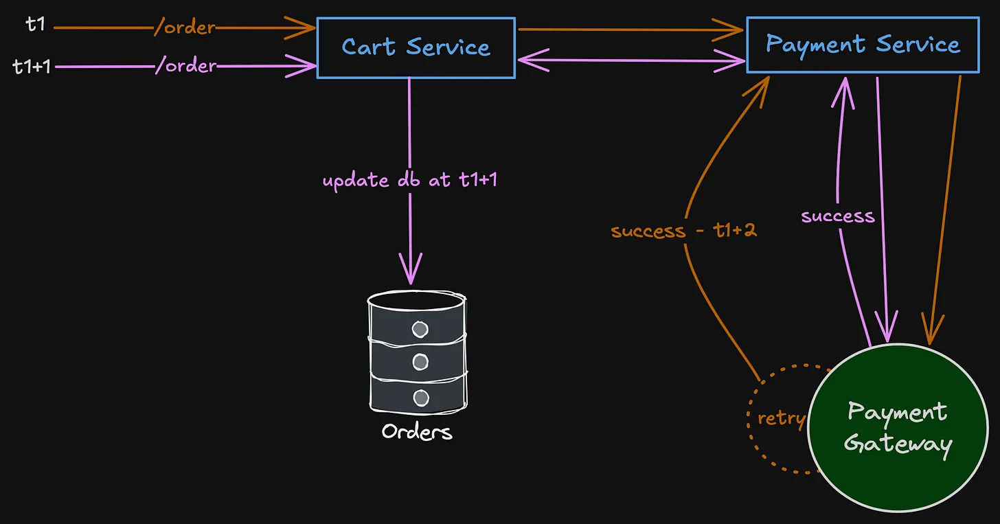
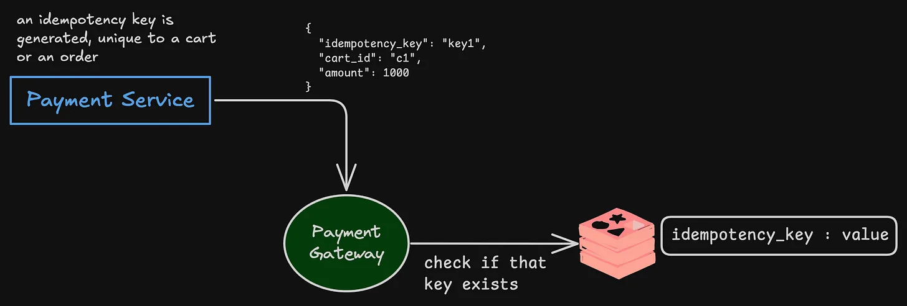
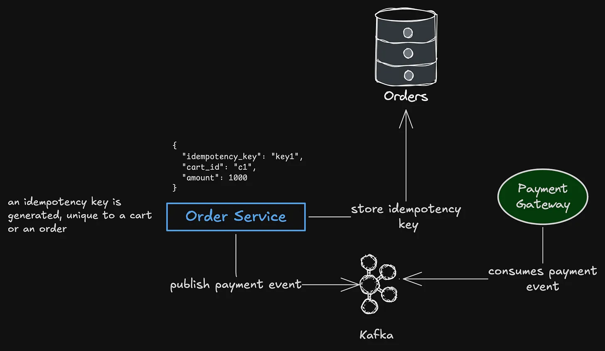
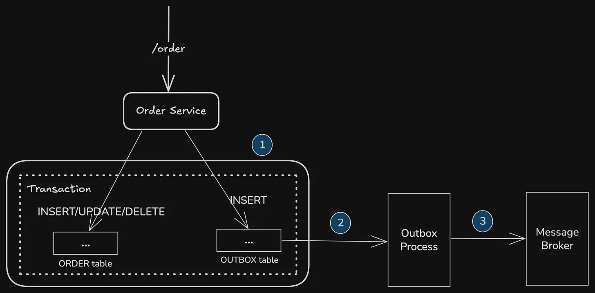

# The Magic Behind One-Click Checkout: Understanding Idempotency

While making a payment, if we end up submitting it twice, we don’t get charged twice.
While ordering something on e-commerce website, if we click on “buy” multiple times, we don’t get multiple orders.
While pressing the elevator call button multiple times, it doesn’t come fast or change the request.

All the above examples are for systems that are “idempotent”.

Idempotent operations are operations that produce the same result regardless of how many times they are executed.

## Why idempotency keys?

Imagine this scenario.

```text
You are shopping on Amazon, and you have a few items in the cart. You want to checkout and make payment. You clicked on “Checkout”, made your payment but for some reason the screen kept loading.

You reloaded the page, and went back to your cart. You still see your items there, that means the “Checkout” was not successful. So you clicked on “Checkout” again, and this time, the payment got succeeded, and your orders are placed.

Now, what happened to the first time you made payment? Will you get doubly charged? But that doesn’t seem to be so, you don’t see multiple transactions in your card.
```



Let’s brainstorm few ways in which we can design something like this.

## The Core Idea - Idempotency Key

We need some kind of “key”, which will always be unique for a particular order, or cart. So that, no matter how many times we send that key, that particular order can always be uniquely identified based on that “idempotency key”.

The Payment Service can generate that key, and attach it to the request sent to the Payment Gateway. It can be something like this —

```json
{
  “idempotency_key”: “key1”,
  “cart_id”: “c1”,
  “amount”: 1000
}
```

## Storage Gateway

Most gateways implement this as:

- Maintain a persistent store (usually Redis/DB) keyed by idempotency_key.
- Value = {request payload hash, result status}.
- On new request:
    - If key doesn’t exist → process & store.
    - If key exists:
        - If payload differs (same key but amount=2000 instead of 1000) → error (Idempotency key reuse with mismatch).
        - If payload matches → return stored result.

This prevents both accidental duplicates and malicious replay attacks.



### Choice of Database

- Redis: It’s fast, great for low-latency checks. But what if the Redis cluster fails? What if a node goes down right after a payment request is initiated but before the result is stored? This can lead to a “lost” state, where a user sees the payment succeed but a service sees no record of it, potentially triggering a re-payment attempt on the user’s end.

- Database: A relational database offers strong ACID guarantees. A SELECT ... FOR UPDATE or a unique constraint on the idempotency_key can provide the atomicity needed to prevent the race condition. The trade-off is higher latency compared to Redis. The most robust systems often use a hybrid approach: Redis for a fast initial check, with a fallback to a durable, transactional database for a true record.

## Generating Idempotency Keys

We saw that we need some kind of idempotency keys generated that can identify a piece of object uniquely. So normally, the problem becomes, “how to generate such keys, and what should such key consist of?”

Let’s look at what we need for our idempotency keys —

- An order should be uniquely identified from it
- Let’s say, if there is a change in some items of that cart (e.g., the quantity is changed), then it should be a new key
- The keys should be generated fast, because there are a lot of orders happening at the same time

First, let’s look at where should this idempotency key can be generated?

### Generating keys at Payment Service

Let’s look at some pros and cons for generating keys at the Payment Service.

#### Pros

- Centralized at payment layer.
- Can reuse across retries since Payment Service is the one communicating to the gateway.

#### Cons

- Payment Service doesn’t really know business logic (cart vs order changes).
- If it generates just a random UUID, we will lose the “order uniqueness.”

### Generating keys at Order Service

Let’s look at some pros and cons for generating keys at the Order Service.

#### Pros

- Order Service knows the business logic: when a cart changes into a “new order state,” it should force a new key.
- It can tie directly to order_id or even a hash of cart_id + items + quantities + total_amount (something like that)
- Order Service is also the naturally responsible for “what is being purchased.”

#### Cons

- It’s more complex (need a deterministic way to decide key boundaries).

### What should the key contain ?

As discussed earlier, it should be —

- Unique per order version (so retries map to same order)
- Sensitive to cart changes (so updated cart → new key)
- Fast to generate

What if we use something like the following —

```shell
idempotency_key = hash(cart_id + cart_state + amount)
```

Where:

- cart_id = unique cart identifier.
- cart_state = serialized, sorted list of items + their quantities.
- amount = total charge (some kind of checksum to avoid mismatched retries with different amount).

We can store the idempotency keys along with the order_id in our DB.

---

# Building Truly Idempotent Systems

Above we saw how idempotency keys are generated, how they are handled, and how it gets rid of “double payments” by looking at an e-commerce order system.

Let’s look at few issues we might face while making idempotent systems.

## The Race Condition

Consider this sequence of events in a distributed system, without proper synchronization:

- Request 1 arrives with idempotency_key = ‘abc’.
- The payment service checks its store for ‘abc’. It doesn’t exist.
- A fraction of a second later, Request 2 arrives with the same key.
- Request 2 also checks the store for ‘abc’. It still doesn’t exist because Request 1 hasn’t committed yet.
- Both requests proceed to call the payment gateway.
- Both payment calls succeed, and the customer is double-charged.

This is the classic double-submit problem. The “simple check” if key doesn’t exist → process & store is an atomic operation on a single thread or a single process, but it falls apart in a distributed system where multiple services can process the same request concurrently.

The solution is not just a GET followed by a SET, but a single, atomic operation like SETNX (Set if Not Exists) in Redis, which is guaranteed to succeed only for the first caller.

The winning instance then processes the request, while the others fail the SETNX and immediately return an error or a stored result.

But this only solves the request level synchronization, let’s look at the event level problem we might face in our design.

## Generating a Key and Sending Event

Let’s recall something we did above for handling idempotent payment system.

- Create idempotency_key at OrderService (it could be deterministic or a random key)
- Store that idempotency_key along with orders in the table
- Send the payment event with idempotency_key to a message broker to be consumed by PaymentService



There are 2 major things that needs to be done here, across different services and databases.

- Store the idempotency_key in the database
- Send the payment event to Kafka

Let’s look at a couple of ways we can achieve this.

### Store in Database first, then send event

Fine, let’s make sure that the database transaction is committed before we send event. This way, we make sure that at least the key is stored in the database.

But there is a problem — what happens if the service crashes before sending the event to Kafka?

If that happens, the payment would not be initiated, and since we already stored the idempotency_key for the associated order in our database, we would be in an inconsistent state.

```javascript
idempotency_key = keystore.Generate()

event = {
    idempotency_key
}

resp, err = db.Insert(tx, idempotency_key)
if err != nil {
    return HTTP.Status500
}

// what if service crash happens here?
event, err = publisher.Publish(event)
```

### Send event first, then store in database

I think you might have guessed what the problem here is — what happens if the transaction didn’t commit? We already sent the event with the key, but we failed to update the database with the order.

```javascript
idempotency_key = keystore.Generate()

event = {
    idempotency_key
}

event, err = publisher.Publish(event)
if err != nil {
    return err
}

// what if service crashes after sending event?

resp, err = db.Insert(tx, idempotency_key)
if err != nil {
    return HTTP.Status500
}
```

Again, inconsistent state. So, what are the options?

### Can we use distributed transactions?

Since we are working with distributed systems, we need a distributed transaction kind of a thing, right? I mean, it makes sense. That if one of the 2 operations failed, we can be sure to just rollback to the previous state.

But let’s see, if are trying to use a 2PC (Two phased commit) as a method for distributed transaction, we should notice that we are essentially using a 2PC between a database and service, which might not be viable. They won’t necessarily support 2PC.

But let’s look at something clever.

### The Transactional Outbox Pattern

Let’s store the event data in some other table, let’s call it outbox table for now. Now, it becomes simple —

- In the same transaction, first update the order table, and then outbox table.
- If any of the update fails, the whole transaction would be rolled back.
- A separate outbox process will listen to the outbox table, and pick entries from there, in the same order as they came, and send to Kafka

And what happens if outbox process fails? Well, we can just spin up a new process instead, and they can pick from where we left earlier.



The Outbox process that handles the publishing typically works in one of two ways:

- Either a Polling Publisher that periodically scans the table for new records
- Change Data Capture (CDC) tool that reads the database’s commit log directly, a near real-time publishing with minimal overhead

#### Drawback

The Outbox process might publish a message more than once. It might crash after publishing a message but before recording the fact that it has done so.

When it restarts, it will then publish the message again.

As a result, a message consumer must be idempotent, maybe by tracking the IDs of the messages that it has already processed.

### At-least once vs Exactly once

As we saw above, when using a message broker, the events are delivered “at-least once”. And this means that the consumers will have to be designed in an idempotent way.

We make a consumer idempotent by having it record the IDs of processed messages in the database. When processing a message, a consumer can detect and discard duplicates by querying the database.

After starting the database transaction, the message handler inserts the message’s ID into the processed_message table. Since the idempotency_key is the processed_message table’s primary key the INSERT will fail if the message has been already processed successfully. The message handler can then rollback the transaction and ignore the message.

## Wrapping Up

So where does this leave us?

Idempotency at scale is never simple. We need layers:

- Request-level deduplication so that two services don’t face race conditions
- Transactional outbox to make sure events and database writes move together, no matter what
- Idempotent consumers to safely handle the “at-least once” reality of distributed messaging

---