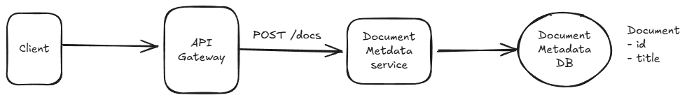
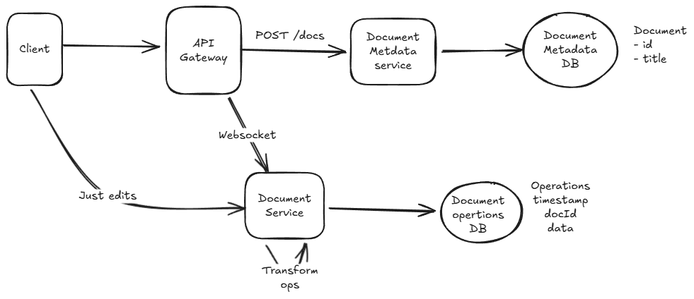
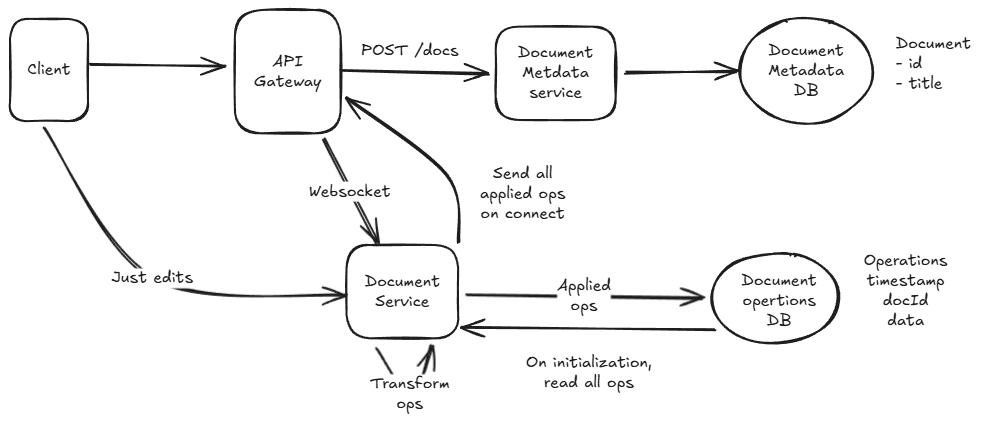

# Google docs

In this writeup we'll design a system that supports the core functionality of Google Docs, dipping into websockets and collaborative editing systems. We'll start with the requirements (like a real interview), then move on to complete the design 

## Functional Requirements

Core Requirements

- Users should be able to create new documents.
- Multiple users should be able to edit the same document concurrently.
- Users should be able to view each other's changes in real-time.
- Users should be able to see the cursor position and presence of other users.

Below the line (out of scope)

- Sophisticated document structure. We'll assume a simple text editor.
- Permissions and collaboration levels (e.g. who has access to a document).
- Document history and versioning.

## Non-Functional Requirements

Core Requirements

- Documents should be eventually consistent (i.e. all users should eventually see the same document state).
- Updates should be low latency (< 100ms).
- The system should scale to millions of concurrent users across billions of documents.
- No more than 100 concurrent editors per document.
- Documents should be durable and available even if the server restarts.

## Core entities

- Editor: A user editing a document.
- Document: A collection of text managed by an editor.
- Edit: A change made to the document by an editor.
- Cursor: The position of the editor's cursor in the document (and the presence of that user in a document).

## API design

Next, we can move to the APIs we need to satisfy which will very closely track our functional requirements. For this problem, we probably want some REST APIs to manage the document itself. We also know we're going to need lots of bi-directional communication between each editor and the document they're collectively editing. In this case it makes sense to assume we'll need some sort of websocket-based approach for the editor experience, so we'll define a few of the messages that we'll send over the wire.

```json
POST /docs
{
  title: string
} -> {
  docId
}

WS /docs/{docId}
  SEND {
    type: "insert"
    ....
  }

  SEND {
    type: "updateCursor"
    position: ...
  }

  SEND { 
    type: "delete"
    ...
  }

  RECV { 
    type: "update"
    ...
  }
```

**When your API involves websockets, you'll be talking about messages you send over the websocket vs endpoints you hit with HTTP. The notation is completely up to you, but having some way to describe the protocol or message schema is helpful to convey what is going over the wire.**

## High Level Design

With a sketch of an API we'll move to our high-level design. Tactically, it can be helpful to tell your interviewer that you're sure there are more details of the API to work through but you'll come back to those later as you flesh out the problem.

`While it's awesome to be able to polish a perfect answer, you're in a time crunch! Acknowledging issues that you might get to later and leaving space to adjust your design as you learn more is a great way to keep the interview moving productively.`

### Users should be able to create new documents.

Our first step in our document editor is to allow users to create new documents. This is a simple API that takes a title and returns a document ID. There's a lot of interesting metadata that we may want to hang off of the document (e.g. permissions, history, tags, etc.) so it's sensible for us to assume there will be some separation of the document itself and the metadata. For this API, we'll tackle the first part.

Our interviewer is likely to ask us what database we're going to use here. For this problem, let's assume a simple Postgres database for now because it gives us flexible querying and, if we need to scale, we can always partition and replicate later.



### Multiple users should be able to edit the same document concurrently.

For our next requirement, we'll have to deal with writing to the document itself which has both consistency and scaling problems. This is where things start to get interesting. In a collaborative editor multiple users are making high frequency edits to the same document at the same time — a recipe for consistency problems and contention!

We're going to defer the scaling concerns for our deep dive later in the interview, so we'll make a note to our interviewer that we'll come back to that so we can focus on consistency.

Collaborative Edits Breakdown

First, let me explain why achieving consistency in a collaborative editor is not easy by starting with a deficient solution and then building up to a more correct one.

#### Sending Snapshots (Wrong)

Let's pretend on each edit the users send their entire document over to a Document Service. The Document Service will then store the document in a blob storage system like S3.

Simple enough, right? Not so fast. First, this design is incredibly inefficient: we're transferring the entire document over the wire for every edit. For a fast typer, this could mean 100s of KBs per keystroke, yuck. But a more serious problem looms.
Assume User A and User B are editing the same document concurrently. The document starts with a single paragraph of text:
Hello!

- User A adds ", world" to produce Hello, world! which they submit.
- User B deletes the "!" to produce Hello which they submit.

Both submit their edits at the same time. The actual document that gets stored to our blob storage is entirely dependent on which request arrives first. If User A's edit arrives first, the document will be Hello, world! If User B's edit arrives first, the document will be Hello. The user experience is terrible, we're losing all concurrent edits!

#### Sending Edits (Getting Warmer)

We can take a crack at solving these problems by recognizing that we're making edits to the document. Instead of transmitting the entire document over the wire, we can transmit just the edits themselves.

- User A adds ", world" and sends INSERT(5, ", world")
- User B deletes the "!" and sends DELETE(6)

We solved our first problem! We're no longer transmitting the entire document over the wire, so now we don't need to send 100s of KB on every keystroke. But we have a new problem.

User B's deletion assumes that the character at position 6 is an exclamation mark. If User A's edit arrives after User B's deletion, we'll end up with Hello, world - ok, good. But if User B's edit arrives after User A's edit, we'll end up with Hello world! - we deleted the comma instead of the exclamation mark!

#### Collaborative Editing Approaches

The critical missing piece here is that each edit is contextual: it's an edit based on a specific state of the document. Dealing with a stream of edits presents a bunch of consistency problems! We have two options to solve this problem:

- Operational Transformation (OT): One way to thread the needle is to reinterpret or transform each edit before it's applied. The idea here is that each user's edit can be adjusted based on the edits that came before it.
We'll collect all of the edits to the document on a single server. From there, we can, in batches, transform each edit based on the edits that came before it. While an exhaustive treatment of OT is beyond the scope of this design (you can read more on the wikipedia page), let's consider a simple worked example.

User B's DELETE(6) is trying to delete the character at position 6, which for them was a ! at the time the edit was created. The problem occurs when User A's edit INSERT(5, ", world") arrives first. If we don't transform User B's edit, we'll end up with Hello, world instead of Hello, world!.
The OT approach is to transform the operations before they're applied (and, later, before they're sent back to the client). In this case, if User A's edit arrives before User B's deletion, we can transform User B's DELETE(6) to DELETE(12) so that when User A's edit is applied, it deletes the exclamation mark instead of the comma.

OT is low memory and fast, but comes with a big tradeoff

- CRDTs (Conflict-free Replicated Data Types): The alternative to reinterpreting every edit is to make every edit commutative or, able to be applied in any order. This is the approach taken by Conflict-free Replicated Data Types (CRDTs).
CRDTs allow us to represent edits as a set of operations that can be applied in any order but still produce the exact same output.

For this problem, we'll assume an OT-based approach because it's more memory efficient and faster than CRDTs. However, CRDTs are a great choice for systems that need to be highly available and partition tolerant (e.g. collaborative editing on mobile devices).

With that in mind, we can update our design to solve the collaborative edit problem. Our updated design sends edits to a central server as operations, which are transformed by the server before being recorded in a database.

For our new Document Operations DB, we want to use something that we can write very quickly in an append-only fashion (for now). Cassandra should do the trick. We'll partition by documentId and order by timestamp (which will be set by our document service). Once the edit has been successfully recorded in the database, we can acknowledge/confirm it to the user. We satisfied our durability requirement!



### Users should be able to view each other's changes in real-time.

Ok, now that we have a write path let's talk about the most important remaining component: reads! We need to handle two paths:

- First, when a document is just created or hasn't been viewed in a while, we need to be able to load the document from our database and transfer it to the connected editors.
- Next, when another editor makes an edit, we need to get notified so that our document stays up-to-date.

#### When the Document is Loaded

When a user first connects, they need to get the latest version of the document. In this case when the Websocket connection is initially established for the document we can push to the connection all of the previous operations that have been applied. Since everyone is connecting to the same server, this allows us to assume that all connections are starting from the same place.



#### When Another Editor Makes an Edit

When an edit is made successfully by another collaborator, every remaining connected editor needs to receive the updates. Since all of our editors are connected to the same server, this is straightforward: after we record the operation to our database, we can also send it to all clients who are currently connected to the same document.

The next step might surprise you: On the client, we also have to perform the operational transformation. Let's talk briefly about why this is.
When users make edits to their own document, they expect to see the changes immediately. In some sense, their changes are always applied first to their local document and then shipped off to the server. What happens if another user lands an edit on the server after we've applied our local change but before it can be recorded to the sever?

Our OT gives us a way of handling out of order edits. Remember that OT takes a sequence of edits in an arbitrary order and rewrites them so they consistently return the same final document. We can do the same thing here!

So so if User A submits Ea to the server, and User B submits Eb (which arrives after Ea), the perceived order of operations from each site is:

```text
Server: Ea, Eb
User A: Ea, Eb
User B: Eb, Ea
```

Regardless of the ordering, by applying OT to the operations we can guarantee that each user sees the same document!

#### Users should be able to see the cursor position and presence of other users.

These properties help us to decide that we don't need to keep cursor position or the presence of other users in the document data itself. Instead, we can have users report changes to their cursor position to the Document Service which can store it in memory and broadcast it to all other users via the same websocket. When a new user connects, the Document Service can read the properties of other users out of memory and send them to the connecting user. Finally, the Document Service can keep track of socket hangups/disconnects and remove those users from the list (sending a broadcast when it happens to any remaining users).

## Potential Deep Dives

### How do we scale to millions of websocket connections?

One of the weakest assumptions we made as we built out the system is that we'll be able to serve everyone from a single Document Service server. This won't scale to millions of concurrent users and introduces a single point of failure for availability.
We need to scale the number of Document Service servers to the number of concurrent connections. When I connect to the Document Service, I either (a) need to be co-located with all other users connected to the same document or (b) know where all the other users are connected.

The solution here is to horizontally scale the Document Service and use a consistent hash ring to distribute connections across servers. Each server in our system joins a the hash ring, with each server responsible for a range of hash values. This means we always know both which server is responsible for the document and all connections go there. We use Apache ZooKeeper to maintain the hash ring configuration and coordinate between servers.

When a client needs to connect:

- They can initially open an HTTP connection to any of the document servers (potentially via round robin) with the document ID requested.
- That server will check the hash ring configuration for the given document ID and if it's not responsible for that hash range, it will respond with a redirect to the correct server's address. This way, clients eventually connect directly to the right server without an intermediary.
- Once the correct server is found, the HTTP connection is upgraded to a websocket connection. The socket server maintains a map from the document ID to the corresponding websocket for use later.
- We load all the stored ops (if they aren't already loaded) from our Document Operations DB and are ready to process operations.

The downside of this approach is that in these scaling events we need to move a lot of state. Not only do we need to move websocket connections for displaced users (by disconnecting them and forcing them to reconnect to the right server), but we also need to ensure document operations are moved to the correct server.

### How do we keep storage under control?

With billions of documents, we need to be thoughtful about how we manage storage. By choosing OT vs CRDTs, we can already reduce the amount of storage we need by a factor. Still, if each document is 50kb, we're looking at 50TB of storage! Worse, if we have a document with millions of operations, each of these operations will need to be transferred and applied to each client that joins the document!

Remember also that all active documents need to be held in memory in our Document Service. We need to keep that space small in order to avoid being memory bottlenecked.

A different approach we can take is to have our Document Service periodically snapshot/compact operations. Since the Document Service has exclusive ownership of a document when we're not scaling up the cluster, we can safely compact operations without worrying about coordination/consistency. In fact, a natural time to do this is when the document is idle and has no connections - something the document service will know about immediately. We also already have all of the existing document operations in memory at that time, making our job easier.
