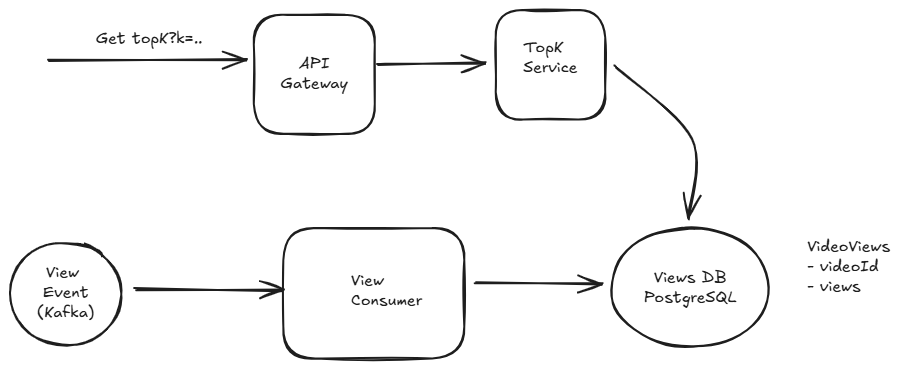
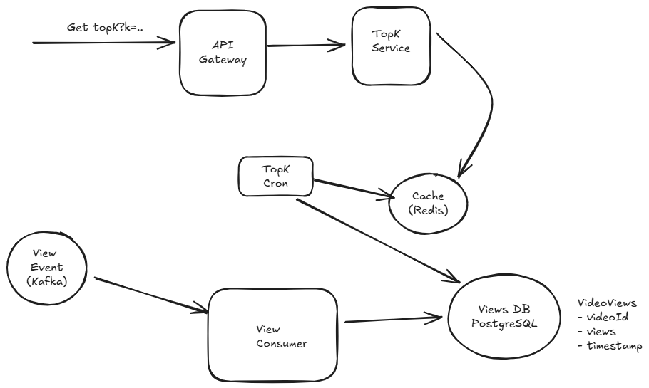
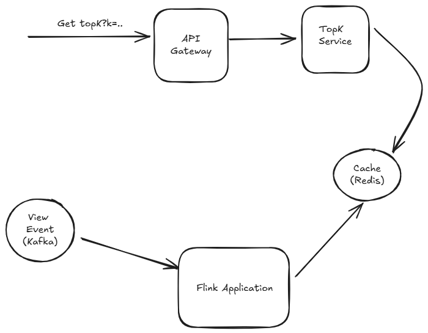

# Design YouTube Top K

Top-K is a classic system design problem which has a ton (!) of different variants. As such, each interview can be a little unique. In this writeup, we'll walk through the problem of designing a top-K system for YouTube video views. In our deep dives, we'll talk through some of the variants and alternatives that interviewers might guide you toward.

**Because top-K questions are so flexible, many interviewers like to change the requirements or shift the scope to test your ability to adapt. Make sure you're asking targeted questions and following the interviewer's lead. Some interviewers will be poor and may have a specific solution in mind. In these cases, you'll want to adjust rather than trying to talk them out of it.**

Let's assume we have a very large stream of views on YouTube (our stream is a firehose of VideoIDs). At any given moment we'd like to be able to query, precisely, the top K most viewed videos for the last 1 hour, 1 day, 1 month, and all time.

Our interviewer might give us some quantities to help us understand the scale of the system: Youtube Shorts had 70 billion views per day and approximately 1 hour of Youtube content is uploaded every second. Big!

## Functional Requirements

Requirements clarifications are important for all system design problems, but in top-K questions in particular small changes to the requirements can have dramatic impacts on the design. We need to nail down the contract we have with our clients: what do they expect our system to be able to do?

This might seem obvious: they want to get the top K videos! But digging in here reveals some interesting wrinkles that your interviewer will be expecting you to discover.

First, to drive the discussion forward, it's helpful to talk a little bit about windowing. When we talk about the last 1 hour, what exactly does that mean? There's two primary types of windows that are used in streaming systems: sliding windows and tumbling windows.

- With sliding windows, the last 1 hour is the time between [T-1 hour] and [T]. If our current time is 10:06, the last 1 hour is the time between 9:06 and 10:06.

- With tumbling windows the window for the last hour is the last full hour that starts and ends on an hour boundary. So the time between [Floor(T - 1 hour, 'hour')] and [Floor(T, 'hour')]. If our current time is 10:06, the last 1 hour is the time between 9:00 and 10:00.

For this problem, we're going to propose to our interviewer that we'll use tumbling windows and give them a moment to object. This shows our foresight (we're anticipating ambiguity in the requirements!) and tumbling windows are easier to handle than sliding windows, making our job easy for now.

Next, it's useful for us to clarify the time periods we're going to support. Designing a system which supports arbitrary time periods (meaning I can query the top K videos for the month of June 2024 in October 2025) means we're not going to be able to precompute much of anything and need to support general time series queries. But that's rarely what interviewers are after. So in this problem, we're going to explicitly propose this as a below the line requirement.

Finally, it's useful to put some constraints on the size of the top K. In any system where your result set might grow unbounded, having practical limits on your clients is a good idea. For almost all applications of top-K, 1k is a reasonable limit. If you want to query the top 1M videos you're likely actually looking for the full dataset which can be provided by another system.

### Core Requirements

- Clients should be able to query the top K videos for all-time (up to a max of 1k results).
- Clients should be able to query tumbling windows of 1 {hour, day, month} and all-time (up to a max of 1k results).

### Below the line (out of scope):

- Arbitrary time periods.
- Arbitrary starting/ending points (we'll assume all queries are looking back from the current moment).

## Non Functional Requirements

Similar to our functional requirements, our non-functional requirements are load bearing for this problem.

One key question is how the top K calculation is actually carried out. Views from YouTube videos are events that happen at a real point in time (like 09:59:55) but in a distributed system there are sometimes delays in transmitting and processing these events. Maybe that view event doesn't arrive to our system until 10:00:55. How long should we wait for these events to be processed? We're going to give ourselves a generous 1 minute buffer here between when a view happens and when it needs to be tabulated and included in our top K calculation.

Another question for us to answer is whether we'll tolerate approximation in results. For large-scale systems, it's common to trade off some precision for performance. Approximate systems can often be more efficient, but are more complex. We're going to start by assuming our system should be precise and tell our interviewer we'll come back to this later in the deep dives if we have time (we cover it in our deep dives below).

Next, we need to think about the expectations of our clients. What should be the latency they'll expect on calls to our system? Let's get ambitious here and aim for our system to respond within 10's of milliseconds. If we can carefully precompute results, serving them out of a cache is entirely possible and should allow us to achieve this latency.

Finally, we'll make some nods to our scaling requirements. We know this system is going to be big, but the exact size matters a lot. Calculating the top K songs played by a single user (e.g. for Spotify) is done trivially on a single CPU. But views on YouTube are going to be massive — we need to have an idea of how many videos are going to be watched and how many views are going to be processed per second so we know how to scale our system.

### Core Requirements

- We'll tolerate at most 1 min delay between when a view occurs and when it should be tabulated.
- Our results must be precise, so we should not approximate.
- We should return results within 10's of milliseconds.
- Our system should be able to handle a massive number (TBD - cover this later) of views per second.
- We should support a massive number (TBD - cover this later) of videos.

## Core Entities

In this problem, we have some basic entities we're going to work with to build our API:

- Video: The video being viewed.
- View: The view event that happened.
- Time Window: The time window associated with the query "all time", "last hour", "last day", "last month".

## API

Our API guides the rest of the interview, but in this case it's really basic too! We simply need an API to retrieve the top K videos.

```text
GET /views/top-k?window={WINDOW}&k={K} -> { videoId: string, views: number }[]
```

Normally, for variable length result sets like this we might want to consider pagination. For this problem, we're explicitly limiting responses to no more than 1k results, so pagination is less of a concern. We already let clients tell us how many results they want.

That's it. We're not going to dawdle here and keep moving on to the meat of the interview.

**Especially for more senior candidates, it's important to focus your efforts on the "interesting" aspects of the interview. Spending too much time on obvious elements both deprives you of time for the more interesting parts of the interview but also signals to the interviewer that you may not be able to distinguish more complex pieces from trivial ones: a critical skill for senior engineers.**

## High Level Design

### Clients should be able to query the top K videos for all-time (up to a max of 1k results)

For keeping track of our all-time top K videos, we need to establish some counters for each video and have a way to query the top videos from a list. Easy enough.

Rather than building a system which accepts a "view" API call, we're going to assume there exists a Kafka stream of view events from which we can consume. Basically: some other system in YouTube is responsible for showing videos to users and when they do they record it to this topic.

This is a reasonable assumption for this system and allows us to skip a lot of boilerplate elements that we might otherwise need to add to our diagram, so we can spend more time on the good stuff! We'll assume this ViewEvent topic is partitioned by video ID and we'll start with a simple consumer service which pulls these view events and updates a Postgres database with the results.

So:

- The view consumer retrieves a view event from the Kafka stream.
- The view consumer updates the counter for the video ID in the Postgres database.

You'll definitely want to acknowledge to your interviewer the elephant in the room here: this is a lot of writes to a single Postgres instance! But remember, we're going to build this system up incrementally.

Next we need a way for users to query for the top K videos. Since our postgres database already has all of the values, we can simply add an index to the table and query from it. A simple top-K service sitting behind a load balancer can handle this.



This isn't necessarily something we'd write down in an interview, but it's good to keep in mind. Because we can create an index on the views column, the query can be very efficient. The query planner will go grab our views index which is basically a sorted list of video IDs by the number of views. It'll then grab the top K videos from that list and return them to the client. This is effectively an O(k) operation!

The cost here is that on every write, we need to update the views index. SQL databases are fairly complex, but you can imagine this taking the write operations from a simple O(1) append to an O(log n) update to the index.

### Clients should be able to query tumbling windows of 1 {hour, day, month} and all-time (up to a max of 1k results)

Next, we need to extend our system to support time window queries like last hour, last day, last month, etc. Again, we're going to go with a simple (even naive) solution first and then use it as a springboard to guide us to a more optimal solution.

First, let's adjust our table schema to include a timestamp column. We can set this column to be the timestamp of the minute of the view event. We'll have one row for each video that has been viewed at least once in a given minute. This necessarily means we'll have many rows for videos that have been viewed multiple times over several minutes.

The number of writes we're making isn't changing because we're still triggering 1 write for every view event that happens. But because we're now having multiple rows per video, the number of rows we're storing is blowing up. We'll have to come back to this later.

On the read side, we'll need to update our top-K service to be able to handle the time window inputs. Because of the powerful nature of SQL, this is "easy": we can just adjust our query. We can also add an index on the timestamp column to further improve performance of the query. Unfortunately, the execution of this query is going to be a lot less efficient.

```sql
SELECT "videoId", SUM("views") as "views", 
FROM VideoViews 
WHERE "timestamp" >= {windowStart} AND "timestamp" <= {windowEnd}
GROUP BY "videoId"
ORDER BY SUM("views") DESC LIMIT {k};
```

The actual execution of this query is going to vary based on statistics and the query optimizer, but we're not going to be able to avoid some scans here. Scans are when the database needs to read every single row in a given segment in order to satisfy a query.

## Deep Dives

### How can we cut down on the number of queries to the database?

The lowest-hanging problem we have is that we make a query to the database for every request that comes in for top K. Per our latest updates, the query for top K is resource intensive! If we have millions of requests for top K coming to our service, we're going to be in trouble.

But remember: our non-functional requirements grant us a 1 minute grace period from when a video view event happens and when it needs to be tabulated in our results. This gives us a great opportunity to utilize caching or precomputation, which should be on top of your mind when thinking about scaling reads.

#### Great Solution

An approach we can utilize is to add a cron to our system which, on fixed intervals, will precompute the top K for each time window and warms our cache in the same way. Then, requests that come to our top-K service are only reading from the cache, never querying the database.



### How can we handle the massive number of writes to the database?

We're expecting to write a lot to the database. Let's quickly check-in on how much we're writing in order to decide whether this is going to work.

In most interviews, we can assume "big" for a lot of quantities and avoid a back-of-the-envelope estimation. As general guidance, the deeper the infra challenge, the more likely you are to encounter an interviewer who wants you to do some estimation. Regardless, the same rule applies for any problem: estimate when you need it and when it might influence your design. And here we really do need it!

The calculation for our throughput is simple:

```text
70B views/day / (100k seconds/day) = 700k tps
```

Woo, that's a lot. While modern RDMSs can handle an impressive 10k+ writes per second per node under the right circumstances, we're still well beyond that.

While we're here, it's probably useful for us to figure out how much storage we're going to need:

```text
Videos/Day = 1 hour content/second / (6 minutes content/video) * (100k seconds/day) = 1M videos/day
Total Videos = 1M videos/day * 365 days/year * 10 years = 3.6B videos
```

With that let's estimate how big a naive table of IDs and counts would be:

```text
Naive Storage = 4B videos * (8 bytes/ID + 8 bytes/count) = 64 GB
```

This 64 GB number will be a useful number to keep in mind. Every time we need to keep a set of views for all videos, we'll need at least 64 GB of storage.

#### Sharding Ingestion

To handle the write throughput, let's start with the big hammer: sharding. Recall earlier that our ViewEvent topic is already partitioned by video ID. This gives us a nice "seam" to split our data throughout the pipeline.

We can scale our view consumers horizontally by spinning up multiple instances to read from each partition of the ViewEvent topic. We'll shard our database by the same scheme, so that each shard has a partial view of only a subset of videos. Each View consumer will be writing to its own shard of the database.

Easy enough.

- When a view comes in, it is assigned to a shard based on the video ID.
- The view consumer for that partition reads the view event from the Kafka topic and fires off a write to the database for that shard.

By sharding the database, we no longer get the benefit of our single SQL query to get the top K. Instead, we need to query each shard and merge the results (either manually or by using something like Citus).

Fortunately, this is an easy enough operation. By grabbing the top K from each shard, we're mathematically guaranteed to have in our final list the "global" top K. So our top K cron is updated to make one call for each shard and merge the results.

#### Batching Ingestion

Even with sharding, having 70 database instances is a bit wasteful for this simple functionality.

One insight we can use is that a lot of our views are happening on a small number of videos. While we may have 3.6B videos, in any given minute a lot of those views are going to be on a small number of popular Mr. Beast and Taylor Swift videos. Instead of making a write to the database for each view, we can batch up the writes for each video and flush these batches periodically to the database.

A great option for doing this is Flink. Flink is a stream processing framework that gives us a bunch of convenient tools for handling batching and aggregation in streaming applications. Flink handles checkpoint and recovery for us, so we don't have to worry about losing data or struggling with itchy problems like event delays.

For this Flink application, we'll use BoundedOutOfOrdernessWatermarkStrategy to handle late events: basically we'll tell Flink that we're ok waiting up to some time (probably 30 seconds here, < 1 minute) for late events to arrive. We'll also use a tumbling window of 1 minute to aggregate the views for each video.

Since Flink is reading from Kafka, if a given host fails or goes down, Flink can rewind to the checkpoint offset in the Kafka topic and resume processing from there.

Now, our Flink job is accepting individual view events and outputting sums of views per video on a 1 minute interval.

Because we're batching, instead of a steady stream of writes we now have a big lump of writes every minute. As long as these are spread across shards, this is acceptable and it can even be more optimal, as databases handle bulk data much more efficiently than individual writes.

### How do we optimize our top K queries?

We've sped up our happy path for reads. When we read from our cache, response are super fast.

But when we don't have a cache entry, we're still making calls to the database and these windowed calls are very inefficient.

Let's imagine the steps the database needs to perform for a top-K query for a 5 minute interval (our minimum is 1 hour, but 5 minutes is easier to draw). We have two steps we need to perform: first, we need to sum up all the views for each video in the window. Then we need to take that aggregated view count and pull the top K out of it.

For completeness, one approach would be to keep the aggregates in Flink, using Flink's native distributed state management instead of reading and writing to the Views DB. We can use an external state storage, like RocksDB to move state off the heap onto disk so that it scales to the large size of data we're dealing with.

By maintaining state inside of our Flink jobs, we can get rid of the Postgres database entirely. We can also have the top-K calculations performed natively in Flink, meaning we write the output directly to our Cache at the conclusion of every minute rather than requiring a top-K cron.

Because our Flink jobs are reading from Kafka, you can think of them like reading off a tape recorder. If things fail, we can always rewind our Kafka offsets to the last good checkpoint and replay processing from there.

The rolling window aggregator is keeping, in memory, the count of views for each window for each video. When the window is complete, it emits a VideoWindowCount object which contains the window and the count of views for each video in that window.

The top-k aggregator is keeping, in memory (likely using a heap), the top K videos for a given window. It receives the VideoWindowCounts and emits a TopKResult object which contains the window and the top K videos for that window.

Finally, that TopKResult is written to Redis using a sink.



This approach is very efficient. We're not writing to a database at all, so we don't have to worry about write throughput. We're also not making any queries to a database, so we don't have to worry about read efficiency. Everything is handled in memory in Flink and written directly to our cache.

### Can we make use of approximations to improve performance?

So far we've been making our job a bit easier by abusing the "precise" requirements of our product. We're forced to provide the absolute correct answer.

But most of the top-K results aren't going to come down to small differences of dozens of views: the top videos will likely differ by a large factor, thousands of views. And product features built on top-K are frequently about trends and direction rather than financial leaderboards. If our users can accept some risk of fuzziness, we can drastically improve the efficiency of our system.

To do this, we'll use a data structure/approach called Count-Min Sketch (CMS). CMS allows us to estimate the number of times an items has been added to the "sketch", the underlying data structure, with substantially less memory required than the hundred-gigabyte full hash table we'd need to maintain otherwise (think: hundreds of megabytes). To do this, CMS uses a set of hash functions to map items to a 2d array of counters. It forgets the actual items, but remembers how many times they've been seen by virtue of their hash.

A traditional CMS supports two operations: add and estimate

- add(item, count): Increment the count for the given item.
- estimate(item): Return an estimate of the count for the given item.

Notice there is not a list operation here, we've lost track of the ID of the item we've added as soon as the operation completes. But we can pair a CMS together with a sorted list or heap to solve our top-K problem.

- When a view comes in, we'll add it to our CMS. This updates our sketch so we can remember this view.

- Immediately after we add, we'll estimate the number of times we've seen it. This gives us an upper bound on the number of views this item has received and a decent approximation.

- We'll add this view count to a sorted list or heap. We'll truncate this list periodically so we're not using excessive memory. Since our users can never query values higher than the top 1000, for all time we can keep the sorted list to 1000 entries.

- When we want to retrieve the top K items, we'll grab the top K items from the sorted list!

In order to solve our tumbling window top-K problem, we just need to keep sketches and sorted lists for each window that we want to query. There's two practical ways for us to do this in our design:

- Redis: Redis natively supports CMS and sorted sets. We can revert back to our View Event Consumer and have each view event trigger a CMS.INCRBY and then a CMS.QUERY. With the result, we can then ZADD the items to our sorted set. We'll keep our sorted set trimmed to 1000 entries, and, as an optimization, avoiding ZADD any item which is already below the top 1000 by keeping a lower bound in our view consumer.

- Flink: Flink also has a library which supports CMS. We can revert back to our Flink job and, instead of keeping a full hash table of counts, we can keep a CMS for each window. When the window closes, we can estimate the counts for each item in our CMS and add them to a sorted list or heap to get the top K.

---