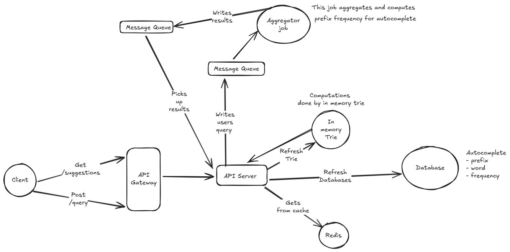

# 🏗️ Phase 2: System Design (Distributed, Scalable Autocomplete)

“Now imagine you have to build this autocomplete feature for Google Search, where billions of queries are made daily and millions of users type simultaneously.”

## High-Level Design Goals

Design a scalable, fault-tolerant, and low-latency system that:

- Supports real-time suggestions as the user types.
- Updates rankings dynamically based on query popularity trends.
- Provides personalized results (optional follow-up).
- Has Strong avaialbility

You should discuss:

- Functional requirements and non-functional requirements
- API design and query flow (frontend → backend → datastore)
- Data model — how queries, frequencies, and user preferences are stored
- Caching and indexing strategy (e.g., Trie, prefix tree, inverted index, etc.)
- Scaling and sharding (how to partition data across servers)
- Failure handling and monitoring

---

## Solution

In this problem we are going to design the autocomplete typeahead system like google search where billions of queries are made daily and millions of users type simultaneously.

We will take a methodical approach to solve this problem. We will begin with requirements analysis - both functional and non functional, look at the data models, define the APIs, have a high level design and then go into the deep dives and describe them

### Functional requirements

We will begin the design by capturing the functional requirements of the app, i.e. what the system is supposed to do, rather than the why and how.

Core requirements

- Users should be able to get real time suggestions based on the words they type.
- System should generate the suggestions based on historical frequency of the words.
- Whatever word the user selects should be captured by the system to improve the frequency of that word for future suggestions.

Out of scope
- Personalized suggestions based on user history and preferences.

### Non functional requirements

After capturing the functional requirements, we will now look at the non functional requirements, i.e. how the system is supposed to perform.

- Low latency: The system should provide suggestions in real time with minimal delay. (< 100ms)
- High availability: The system should be available 99.9% of the time to handle user requests.
- Scalability: The system should be able to handle a large number of concurrent users and scale as needed.
- Consistency: Eventual consistency is acceptable for updating word frequencies.
- Fault tolerance: The system should be able to recover from failures without significant downtime.

### Core Entities and Data Model

Next we will look at the core entities and the data model for our system.

- Query: Represents a search query made by a user. Attributes include query_id, text, frequency, timestamp.
- User: Represents a user of the system. Attributes include user_id, preferences (if we were to implement personalized suggestions).
- Suggestion: Represents a suggested query. Attributes include suggestion_id, text, rank.

### Data characteristics and database choice

The data for this system will primarily consist of search queries and their frequencies. The data will be read-heavy, with frequent reads for suggestions and occasional writes to update frequencies.

Given the read-heavy nature of the data and the need for low latency, we will use a combination of databases:

- NoSQL Database (e.g., Cassandra, DynamoDB): For storing query frequencies and handling high read/write throughput.
- In-Memory Cache (e.g., Redis, Memcached): For caching frequently accessed suggestions to reduce latency.
- In-Memory Trie: For fast prefix-based lookups of suggestions. We will maintain a trie structure in memory to quickly retrieve suggestions based on user input.

### API Design

We will begin by defining basic APIs. These APIs can evolve as we discuss the design and go deep later on.

- `GET /suggestions`: Retrieve autocomplete suggestions based on user input.
  - Request Parameters: `prefix` (string), `limit` (int)
  - Response: List of suggested queries with their ranks.

- `POST /query`: Record a user query to update its frequency.
    - Request Body: `query` (string)
    - Response: Success/Failure status.

### High-Level Architecture

Here is the high level architecture for the system

We will be going through the main components and the flow later in this section.

#### Components

- Client: The frontend application that captures user input and displays suggestions.
- API Gateway: Handles incoming requests and routes them to the appropriate backend services. Also serves as a load balancer.
- API Servers: Handle the business logic for processing requests, generating suggestions, and updating query frequencies.
- In-Memory Trie: A data structure that stores queries in a prefix tree format for fast retrieval of suggestions.
- NoSQL Database: Stores query frequencies and handles high read/write throughput.
- In-Memory Cache: Caches frequently accessed suggestions to reduce latency.
- Message Queues: Facilitates asynchronous communication between services, especially for updating query frequencies. Here they store user queries that need to be processed to update frequencies.
- Aggregator Service: Consumes messages from the queue and updates the NoSQL database and in-memory trie with new frequencies.

#### Autocomplete Query Flow

- User types a prefix in the search box on the client.
- The client sends a `GET /suggestions` request to the API Gateway with the prefix.
- The API Gateway routes the request to an available API Server.
- The API Server first checks the In-Memory Cache for suggestions matching the prefix.
- If suggestions are found in the cache, they are returned to the client.
- If not found in the cache, the API Server queries the In-Memory Trie for suggestions.
- The API Server ranks the suggestions based on their frequencies and returns the top results to the client.

##### Trie Implementation

- The trie will be implemented as an in-memory data structure on each API server.
- Each node in the trie will represent a character and will have pointers to its child nodes. It will also store the top N suggestions (based on frequency) for the prefix represented by the subtree rooted at that node. This will allow for quick retrieval of suggestions without traversing the entire subtree.
- When a user types a prefix, the API server will traverse the trie based on the characters in the prefix to reach the corresponding node. The top N suggestions stored at that node will be returned.

#### Updating Query Frequency flow

- When a user selects a suggestion or submits a query, the client sends a `POST /query` request to the API Gateway with the query text.
- The API Gateway routes the request to an available API Server.
- The API Server places the query into a Message Queue for asynchronous processing.
- The Aggregator Service consumes messages from the queue, updates the query frequency and places the result in another message queue.
- The API Servers listen to this queue and update their In-Memory Trie with the new frequencies.
- The API Servers also update the NoSQL Database with the new frequencies.

### Scaling and Sharding

For scaling, its not always about adding more hardware, but also about optimizing the existing resources and distributing the load effectively.

- We will precompute and store the top-K suggestions for each prefix in the trie nodes. This will allow us to quickly retrieve suggestions without having to traverse the entire subtree.
- We will also cache hot prefix in an memory cache like Redis to reduce latency for frequently accessed prefixes.

Of course, as the system grows, we will need to scale and shard our components to handle the increased load.

To handle the large volume of data and traffic, we will implement scaling and sharding strategies:

- Horizontal Scaling: We will deploy multiple instances of API Servers, In-Memory Trie, and Caches behind load balancers to distribute the load.

- Sharding: We will partition the NoSQL database based on query prefixes to distribute data across multiple servers. Each shard will handle a subset of the data, allowing for parallel processing and reducing contention.
We will also shard the in-memory trie based on the first character of the prefix. Each API server will be responsible for a subset of the trie, allowing for distributed processing of suggestions. 
We key all selection events by prefix/word and push them into Kafka partitions. Each Kafka consumer owns a subset of partitions and therefore becomes the owner for that set of prefixes — it maintains the trie shard / aggregates counts locally and writes aggregated top-K per prefix to the DB partitions that use the same keying.

- Replication: We will replicate the NoSQL database across multiple data centers to ensure high availability and fault tolerance. We will also replicate the in-memory trie across multiple API servers to ensure that suggestions are always available.

### Failure Handling and Monitoring

To ensure the system is robust and can recover from failures, we will implement the following strategies:

- Health Checks: Regular health checks for all components to detect failures early.
- WAL (Write Ahead Logging): Use WAL for the NoSQL database to ensure data durability in case of crashes.
- Retry Mechanisms: Implement retry mechanisms for failed requests to handle transient failures.
- Circuit Breakers: Implement circuit breakers to prevent cascading failures in case of component failures.
- Monitoring and Alerts: Use monitoring tools (e.g., Prometheus, Grafana) to track system performance and set up alerts for critical issues.

---

